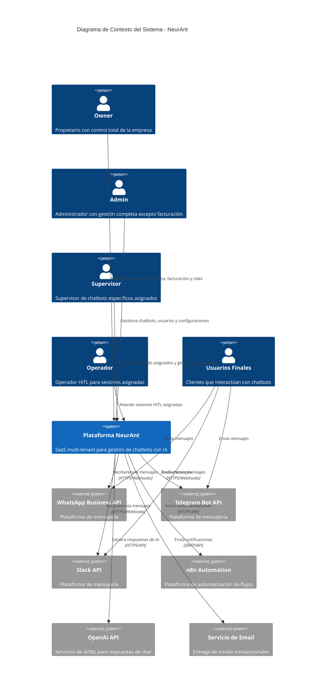
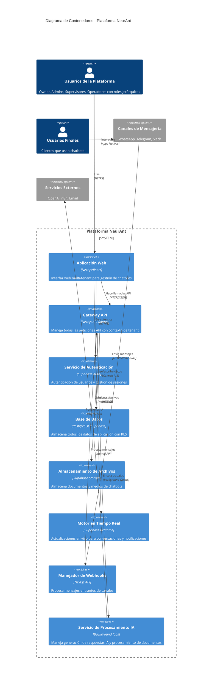
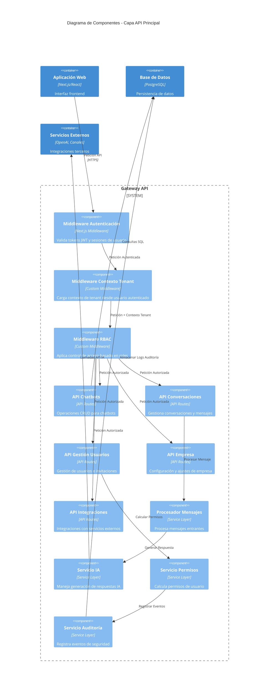
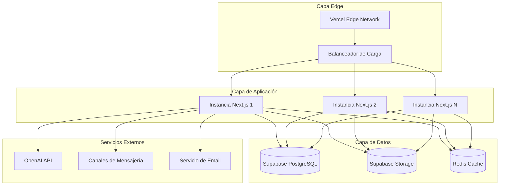
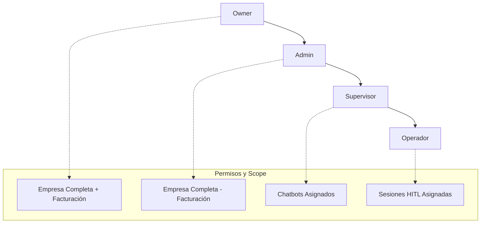
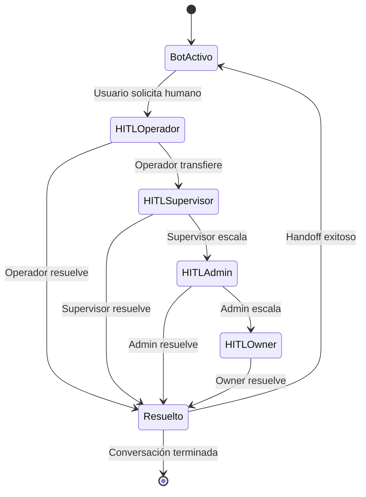

# NeurAnt - Resumen de Arquitectura del Sistema

## Resumen Ejecutivo

NeurAnt es una plataforma SaaS multi-tenant que permite a las empresas crear, desplegar y administrar chatbots con inteligencia artificial a través de múltiples canales de mensajería. El sistema está construido sobre un patrón de **Base de Datos Compartida Multi-tenant** con **Row Level Security (RLS)** para aislamiento de datos y un enfoque de **Dominio Único + Contexto** para identificación de tenants.

## Principios Arquitectónicos

### 1. **Multi-tenancy Primero**
- Cada componente diseñado con aislamiento de tenant en mente
- Código base único sirviendo múltiples clientes
- Infraestructura compartida con separación lógica

### 2. **Seguridad por Diseño**
- Row Level Security (RLS) en la capa de base de datos
- Control de acceso basado en roles (RBAC) en todo el sistema
- Arquitectura de confianza cero para componentes internos

### 3. **Escalabilidad y Rendimiento**
- Capacidades de escalado horizontal
- Compartimiento eficiente de recursos entre tenants
- Aislamiento de rendimiento para prevenir problemas de vecino ruidoso

### 4. **Experiencia del Desarrollador**
- Clara separación de responsabilidades
- Interfaces y contratos con tipado seguro
- Estrategias integrales de testing

## Modelo de Arquitectura C4

### Nivel 1: Diagrama de Contexto del Sistema

### Nivel 2: Diagrama de Contenedores

### Nivel 3: Diagrama de Componentes - API Principal

## Capacidades del Sistema

### 1. **Gestión Multi-Tenant**
- **Aislamiento de Tenants**: Segregación completa de datos usando PostgreSQL RLS
- **Compartimiento de Recursos**: Utilización eficiente de infraestructura entre tenants
- **Contexto de Tenant**: Identificación automática de tenant a través de contexto de usuario autenticado

### 2. **Gestión del Ciclo de Vida de Chatbots**
- **Creación y Configuración**: Configuración de chatbots basada en plantillas con presets específicos por industria
- **Entrenamiento y Base de Conocimiento**: Carga y procesamiento de documentos para respuestas basadas en RAG
- **Integración de Canales**: Despliegue multi-canal (WhatsApp, Telegram, Slack)
- **Monitoreo de Rendimiento**: Analíticas en tiempo real y seguimiento de conversaciones

### 3. **Gestión de Conversaciones**
- **Respuestas IA-First**: Manejo inteligente de conversaciones potenciado por OpenAI
- **Humano-en-el-Bucle (HITL)**: Escalación transparente a operadores humanos
- **Preservación de Contexto**: Gestión de estado de conversación a través de interacciones entre canales
- **Actualizaciones en Tiempo Real**: Monitoreo en vivo de conversaciones y notificaciones

### 4. **Gestión de Usuarios y Acceso**
- **Control de Acceso Basado en Roles**: Jerarquía Propietario → Administrador → Supervisor → Operador
- **Onboarding Auto-servicio**: Configuración de empresa y registro de usuario sin fricción
- **Colaboración de Equipo**: Sistema de invitación de usuarios con límites basados en plan
- **Gestión de Permisos**: Permisos granulares basados en roles de usuario

### 5. **Integración y Automatización**
- **Integraciones Externas**: Automatización de flujos de trabajo n8n para integración de procesos de negocio
- **Diseño API-First**: APIs RESTful para integración con sistemas de terceros
- **Gestión de Webhooks**: Procesamiento de eventos en tiempo real desde plataformas de mensajería
- **Sincronización de Datos**: Flujo de datos bidireccional con sistemas externos

## Atributos de Calidad

### 1. **Escalabilidad**
- **Escalado Horizontal**: Diseño de aplicación sin estado para distribución con balanceador de carga
- **Optimización de Base de Datos**: Indexación eficiente y patrones de consulta para datos multi-tenant
- **Estrategia de Caché**: Caché multi-capa para datos de tenant frecuentemente accedidos
- **Procesamiento en Background**: Procesamiento asíncrono de trabajos para operaciones de IA y documentos

### 2. **Seguridad**
- **Aislamiento de Datos**: Row Level Security asegurando cero acceso de datos entre tenants
- **Autenticación**: Autenticación basada en JWT con integración Supabase Auth
- **Autorización**: RBAC fino con permisos conscientes del contexto
- **Rastro de Auditoría**: Registro completo de todos los eventos relevantes para seguridad

### 3. **Confiabilidad**
- **Manejo de Errores**: Degradación elegante y límites de error integrales
- **Consistencia de Datos**: Transacciones ACID para operaciones críticas del negocio
- **Estrategia de Backup**: Backups automatizados con recuperación point-in-time
- **Monitoreo**: Verificaciones de salud, métricas y alertas para todos los componentes del sistema

### 4. **Rendimiento**
- **Tiempo de Respuesta**: < 200ms tiempos de respuesta API para operaciones estándar
- **Throughput**: Soporte para 1000+ conversaciones concurrentes por tenant
- **Eficiencia de Recursos**: Consultas de base de datos optimizadas con indexación apropiada
- **Integración CDN**: Optimización de entrega de assets estáticos

### 5. **Usabilidad**
- **Interfaz Intuitiva**: Interfaz web limpia y responsiva con patrones UX modernos
- **Capacidades de Auto-servicio**: Curva de aprendizaje mínima para nuevos usuarios
- **Revelación Progresiva**: Complejidad de características revelada basada en necesidades del usuario
- **Responsividad Móvil**: Funcionalidad completa en todos los tipos de dispositivos

## Stack Tecnológico

### **Capa Frontend**
- **Framework**: Next.js 14 con App Router
- **Librería UI**: React 18 con TypeScript
- **Estilos**: Tailwind CSS con componentes shadcn/ui
- **Gestión de Estado**: React Context + TanStack Query
- **Formularios**: React Hook Form con validación Zod

### **Capa Backend**
- **Runtime**: Node.js con Next.js API Routes
- **Base de Datos**: PostgreSQL con Supabase
- **Autenticación**: Supabase Auth (basado en JWT)
- **Tiempo Real**: Supabase Realtime (WebSocket)
- **Almacenamiento de Archivos**: Supabase Storage

### **Capa de Integración**
- **IA/ML**: OpenAI GPT-4 API
- **Mensajería**: WhatsApp Business API, Telegram Bot API, Slack API
- **Automatización**: n8n para integraciones de flujo de trabajo
- **Email**: Servicio de email transaccional (Resend/SendGrid)
- **Monitoreo**: Monitoreo de rendimiento de aplicación

### **Capa de Infraestructura**
- **Hosting**: Vercel para hosting de aplicación
- **Base de Datos**: PostgreSQL gestionado por Supabase
- **CDN**: Vercel Edge Network
- **Seguridad**: Características de seguridad integradas de Supabase
- **Monitoreo**: Stack de observabilidad integrado

## Arquitectura de Despliegue

### **Ambiente de Producción**

## Objetivos de Rendimiento

### **Objetivos de Tiempo de Respuesta**
- **Interfaz Web**: < 100ms para cargas de página, < 50ms para llamadas API
- **Respuestas de Chatbot**: < 2 segundos end-to-end (incluyendo procesamiento IA)
- **Actualizaciones en Tiempo Real**: < 500ms para actualizaciones de conversación
- **Carga de Archivos**: < 5 segundos para procesamiento de documentos

### **Objetivos de Throughput**
- **Usuarios Concurrentes**: 1,000+ usuarios web simultáneos
- **Peticiones API**: 10,000+ peticiones por minuto
- **Procesamiento de Mensajes**: 100+ mensajes por segundo
- **Peticiones IA**: 50+ llamadas API IA concurrentes

### **Objetivos de Disponibilidad**
- **Uptime del Sistema**: 99.9% disponibilidad (< 8.77 horas downtime/año)
- **Disponibilidad de Base de Datos**: 99.95% con failover automático
- **Tolerancia a Servicios Externos**: Degradación elegante cuando servicios no disponibles

## Sistema RBAC Avanzado con HITL Integrado

### **Jerarquía de Roles**
NeurAnt implementa un sistema de Control de Acceso Basado en Roles (RBAC) jerárquico con cuatro niveles:

### **Principios RBAC**
1. **Herencia Jerárquica**: Roles superiores heredan permisos de inferiores
2. **Mínimo Privilegio**: Cada rol tiene exactamente los permisos necesarios
3. **Separación de Responsabilidades**: Tareas críticas limitadas a Owner/Admin
4. **Asignación Granular**: Control específico de acceso por recurso

### **Flujo de Transferencias HITL**
El sistema permite escalamiento estructurado de sesiones entre roles:

### **Asignaciones y Scope**
- **Un Supervisor por Chatbot**: Asignación única para responsabilidad clara
- **Múltiples Operadores por Supervisor**: Escalabilidad del equipo
- **Transferencias Solo Hacia Arriba**: Escalamiento controlado en jerarquía
- **Auditoría Completa**: Tracking de todas las asignaciones y transferencias

## Resumen de Arquitectura de Seguridad

### **Modelo de Seguridad Multi-Capa**
1. **Seguridad de Red**: Encriptación HTTPS/TLS para todas las comunicaciones
2. **Seguridad de Aplicación**: RBAC jerárquico con herencia de permisos
3. **Seguridad de Datos**: Row Level Security con aislamiento de tenant y scope por rol
4. **Seguridad de Integración**: Gestión de API keys y validación de webhooks
5. **Seguridad de Auditoría**: Registro inmutable de eventos RBAC y HITL

### **Consideraciones de Cumplimiento**
- **Privacidad de Datos**: Manejo de datos compatible con GDPR y derechos de usuario
- **Residencia de Datos**: Ubicaciones de almacenamiento de datos configurables
- **Controles de Acceso**: RBAC alineado con SOC 2 Type II y ISO 27001
- **Rastro de Auditoría**: Registro completo para reportes de cumplimiento y forensics
- **Separation of Duties**: Prevención de conflictos de roles y responsabilidades

## Próximos Pasos

1. **Arquitectura de Componentes**: Interfaces detalladas de componentes y contratos
2. **Arquitectura de Base de Datos**: Modelo de datos conceptual y relaciones  
3. **Arquitectura de Seguridad**: Deep-dive en patrones de seguridad y RLS
4. **Arquitectura de API**: Especificaciones OpenAPI y patrones de integración
5. **Guías de Implementación**: Estándares de desarrollo y mejores prácticas

---

*Este documento proporciona el resumen de arquitectura del sistema fundamental. Las especificaciones detalladas de componentes y guías de implementación se cubren en documentos de arquitectura subsecuentes.*