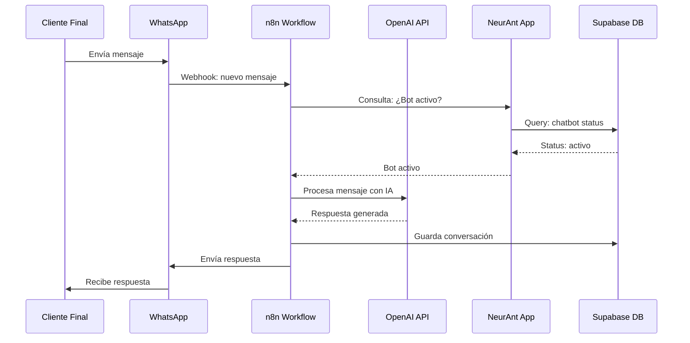
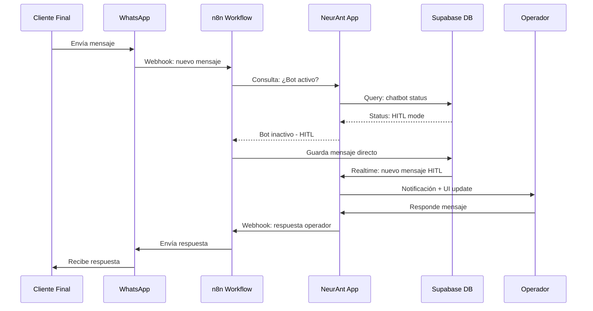
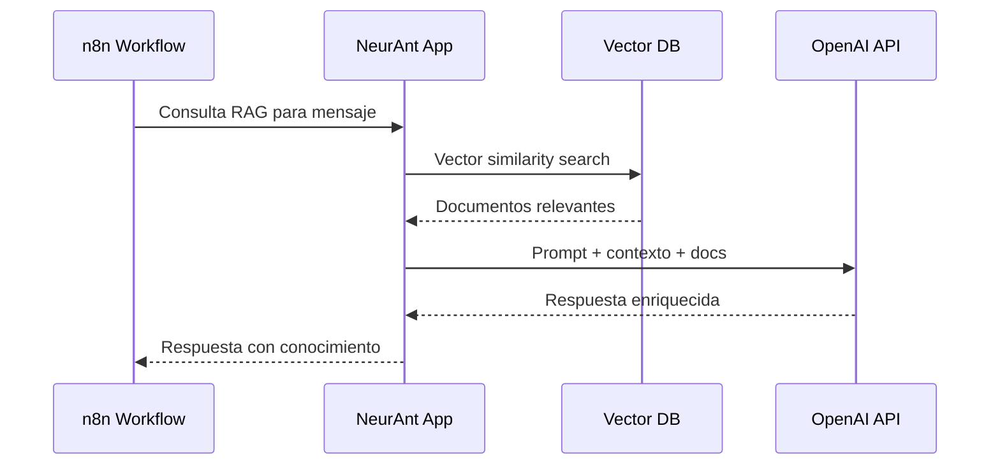

# NeurAnt - Diagramas C4 (Context, Containers, Components)

## Nivel 1: Diagrama de Contexto del Sistema

```mermaid
graph TB
    %% External Users
    Admin[👤 Administrador<br/>Gestiona empresa y usuarios]
    Supervisor[👤 Supervisor<br/>Configura chatbots y asigna operadores]
    Operator[👤 Operador<br/>Maneja conversaciones HITL]
    EndUser[👤 Cliente Final<br/>Interactúa con chatbots]

    %% Core System
    NeurAnt[🏢 Sistema NeurAnt<br/>Plataforma SaaS para<br/>Agentes IA Conversacionales]

    %% External Systems
    WhatsApp[📱 WhatsApp Business API<br/>Canal de mensajería]
    Telegram[📱 Telegram Bot API<br/>Canal de mensajería]
    Slack[📱 Slack API<br/>Canal de mensajería]
    
    N8N[⚙️ n8n Workflows<br/>Orquestación de mensajería<br/>y procesamiento IA]
    
    OpenAI[🤖 OpenAI API<br/>Modelos de IA (GPT)]
    
    GoogleAPIs[🔗 Google Workspace APIs<br/>Docs, Sheets, Calendar, Gmail]
    AirTable[🔗 AirTable API<br/>Base de datos externa]
    ExternalDB[🔗 Bases de Datos Externas<br/>MySQL, PostgreSQL]

    %% Relationships - Users to System
    Admin -.->|Administra plataforma| NeurAnt
    Supervisor -.->|Configura agentes IA| NeurAnt
    Operator -.->|Maneja HITL| NeurAnt
    
    %% Relationships - System to External
    NeurAnt <-.->|Gestiona webhooks| N8N
    N8N <-.->|Envía/recibe mensajes| WhatsApp
    N8N <-.->|Envía/recibe mensajes| Telegram
    N8N <-.->|Envía/recibe mensajes| Slack
    N8N <-.->|Procesa con IA| OpenAI
    
    NeurAnt <-.->|Integra datos| GoogleAPIs
    NeurAnt <-.->|Integra datos| AirTable
    NeurAnt <-.->|Conecta bases| ExternalDB
    
    %% End User interactions
    EndUser <-.->|Chatea| WhatsApp
    EndUser <-.->|Chatea| Telegram
    EndUser <-.->|Chatea| Slack

    %% Styling
    classDef userClass fill:#e1f5fe,stroke:#01579b,stroke-width:2px
    classDef systemClass fill:#f3e5f5,stroke:#4a148c,stroke-width:3px
    classDef externalClass fill:#fff3e0,stroke:#e65100,stroke-width:2px

    class Admin,Supervisor,Operator,EndUser userClass
    class NeurAnt systemClass
    class WhatsApp,Telegram,Slack,N8N,OpenAI,GoogleAPIs,AirTable,ExternalDB externalClass
```

## Nivel 2: Diagrama de Contenedores

```mermaid
graph TB
    %% Users
    Users[👥 Usuarios<br/>Admin, Supervisores, Operadores]
    EndUsers[👥 Clientes Finales<br/>via WhatsApp/Telegram/Slack]

    %% Web Application Container
    subgraph "Aplicación Web NeurAnt"
        WebApp[🖥️ Aplicación Web<br/>Next.js 14 + TypeScript<br/>Puerto: 3000]
        APIRoutes[🔌 API Routes<br/>Next.js API Routes<br/>REST + GraphQL]
    end

    %% Database Container
    subgraph "Capa de Datos"
        MainDB[(🗄️ Base de Datos Principal<br/>Supabase PostgreSQL<br/>Multi-tenant + RLS)]
        VectorDB[(🧠 Base de Datos Vectorial<br/>pgvector<br/>RAG + Embeddings)]
        FileStorage[📁 Almacenamiento<br/>Supabase Storage<br/>PDFs + Media)]
        RealtimeEngine[⚡ Motor Tiempo Real<br/>Supabase Realtime<br/>WebSocket para HITL)]
    end

    %% External Integrations Container
    subgraph "Integraciones Externas"
        N8NWorkflows[⚙️ n8n Workflows<br/>Orquestación de Mensajería<br/>OpenAI + Canales]
        ExternalAPIs[🔗 APIs Externas<br/>Google, AirTable, DBs<br/>OAuth + API Keys]
    end

    %% Authentication & Security
    subgraph "Seguridad"
        AuthService[🔐 Servicio de Autenticación<br/>Supabase Auth<br/>JWT + RBAC]
        AuditService[📋 Servicio de Auditoría<br/>Logs + Compliance<br/>Actividad de usuarios]
    end

    %% Relationships
    Users -->|HTTPS| WebApp
    WebApp <-->|SQL Queries| MainDB
    WebApp <-->|Vector Search| VectorDB
    WebApp <-->|File Upload/Download| FileStorage
    WebApp <-->|Real-time Updates| RealtimeEngine
    
    WebApp <-->|JWT Validation| AuthService
    WebApp -->|Log Activities| AuditService
    
    WebApp <-->|Webhooks| N8NWorkflows
    WebApp <-->|REST/OAuth| ExternalAPIs
    
    N8NWorkflows <-->|Message Routing| EndUsers
    
    %% Database Relationships
    MainDB -.->|Shared Storage| VectorDB
    MainDB -.->|Metadata| FileStorage
    MainDB -.->|Event Source| RealtimeEngine

    %% Styling
    classDef containerClass fill:#e8f5e8,stroke:#2e7d32,stroke-width:2px
    classDef databaseClass fill:#fff8e1,stroke:#f57f17,stroke-width:2px
    classDef externalClass fill:#fce4ec,stroke:#c2185b,stroke-width:2px

    class WebApp,APIRoutes containerClass
    class MainDB,VectorDB,FileStorage,RealtimeEngine databaseClass
    class N8NWorkflows,ExternalAPIs,AuthService,AuditService externalClass
```

## Nivel 3: Diagrama de Componentes - Aplicación Web

```mermaid
graph TB
    %% UI Layer
    subgraph "Capa de Presentación"
        DashboardUI[📊 Dashboard UI<br/>Métricas y Analytics]
        ChatbotUI[🤖 Chatbot Management UI<br/>Configuración de Agentes]
        HITLUI[💬 HITL Interface<br/>Chat en Tiempo Real]
        UserMgmtUI[👥 User Management UI<br/>Roles y Permisos]
        IntegrationUI[🔗 Integrations UI<br/>Conectores Externos]
    end

    %% Business Logic Layer
    subgraph "Capa de Lógica de Negocio"
        ChatbotService[🤖 Chatbot Service<br/>CRUD + Configuration]
        ConversationService[💬 Conversation Service<br/>Historia + Analytics]
        HITLService[🤝 HITL Service<br/>Escalación + Assignment]
        UserService[👤 User Service<br/>Authentication + RBAC]
        IntegrationService[🔌 Integration Service<br/>External APIs]
        AnalyticsService[📈 Analytics Service<br/>Métricas + Reports]
        RAGService[🧠 RAG Service<br/>Vector Search + Embeddings]
        BillingService[💳 Billing Service<br/>Plans + Usage Tracking]
    end

    %% API Layer
    subgraph "Capa de API"
        RestAPI[🔌 REST API<br/>/api/v1/*]
        GraphQLAPI[📡 GraphQL API<br/>/api/graphql]
        WebhookAPI[🔗 Webhook API<br/>/api/webhooks/*]
        RealtimeAPI[⚡ Realtime API<br/>WebSocket Events]
    end

    %% Data Access Layer
    subgraph "Capa de Acceso a Datos"
        SupabaseClient[🗄️ Supabase Client<br/>Database ORM]
        VectorClient[🧠 Vector Client<br/>pgvector Queries]
        StorageClient[📁 Storage Client<br/>File Management]
        CacheClient[⚡ Cache Client<br/>Redis/Memory Cache]
    end

    %% External Clients
    subgraph "Clientes Externos"
        N8NClient[⚙️ n8n Client<br/>Webhook Communication]
        OpenAIClient[🤖 OpenAI Client<br/>GPT API Calls]
        GoogleClient[📊 Google APIs Client<br/>OAuth + REST]
        AirTableClient[🔗 AirTable Client<br/>API Integration]
    end

    %% UI to Business Logic
    DashboardUI --> AnalyticsService
    ChatbotUI --> ChatbotService
    HITLUI --> HITLService
    UserMgmtUI --> UserService
    IntegrationUI --> IntegrationService

    %% Business Logic to API
    ChatbotService --> RestAPI
    ConversationService --> GraphQLAPI
    HITLService --> RealtimeAPI
    IntegrationService --> WebhookAPI

    %% API to Data Access
    RestAPI --> SupabaseClient
    GraphQLAPI --> SupabaseClient
    WebhookAPI --> SupabaseClient
    RealtimeAPI --> SupabaseClient

    %% Business Logic to Data Access
    RAGService --> VectorClient
    ChatbotService --> StorageClient
    AnalyticsService --> CacheClient

    %% Business Logic to External
    ChatbotService --> N8NClient
    RAGService --> OpenAIClient
    IntegrationService --> GoogleClient
    IntegrationService --> AirTableClient

    %% Data Access Relationships
    SupabaseClient -.-> VectorClient
    SupabaseClient -.-> StorageClient

    %% Styling
    classDef uiClass fill:#e3f2fd,stroke:#1976d2,stroke-width:2px
    classDef serviceClass fill:#f1f8e9,stroke:#388e3c,stroke-width:2px
    classDef apiClass fill:#fff3e0,stroke:#f57c00,stroke-width:2px
    classDef dataClass fill:#fce4ec,stroke:#c2185b,stroke-width:2px
    classDef externalClass fill:#f3e5f5,stroke:#7b1fa2,stroke-width:2px

    class DashboardUI,ChatbotUI,HITLUI,UserMgmtUI,IntegrationUI uiClass
    class ChatbotService,ConversationService,HITLService,UserService,IntegrationService,AnalyticsService,RAGService,BillingService serviceClass
    class RestAPI,GraphQLAPI,WebhookAPI,RealtimeAPI apiClass
    class SupabaseClient,VectorClient,StorageClient,CacheClient dataClass
    class N8NClient,OpenAIClient,GoogleClient,AirTableClient externalClass
```



## Flujo de Datos Clave

### 1. Flujo de Conversación Normal (Bot Activo)



### 2. Flujo HITL (Human-in-the-Loop)



### 3. Flujo RAG (Knowledge Base)



## Patrones Arquitectónicos Aplicados

### 1. **Multi-Tenant Architecture**
- **Patrón**: Shared Database, Separate Schema
- **Implementación**: tenant_id + Row Level Security (RLS)
- **Beneficio**: Escalabilidad con aislamiento de datos

### 2. **Event-Driven Architecture**
- **Patrón**: Publisher-Subscriber + Webhooks
- **Implementación**: n8n workflows + Supabase Realtime
- **Beneficio**: Desacoplamiento y procesamiento asíncrono

### 3. **Microservices-like Services**
- **Patrón**: Service Layer + API Gateway
- **Implementación**: Next.js API Routes + Service Classes
- **Beneficio**: Separación de responsabilidades

### 4. **RAG (Retrieval-Augmented Generation)**
- **Patrón**: Vector Database + LLM
- **Implementación**: pgvector + OpenAI API
- **Beneficio**: Respuestas contextualizadas con conocimiento empresarial

### 5. **CQRS-like Pattern**
- **Patrón**: Command Query Responsibility Segregation
- **Implementación**: Write APIs + Read-optimized Views
- **Beneficio**: Optimización para analytics y reportes

## Decisiones de Diseño

### 1. **¿Por qué Next.js Full-Stack?**
- **Ventaja**: Single codebase, SSR, API Routes integradas
- **Trade-off**: Menos flexibilidad vs microservicios puros
- **Justificación**: Equipo pequeño, rapid development

### 2. **¿Por qué Supabase vs Database + Auth separados?**
- **Ventaja**: BaaS completo, RLS nativo, Realtime incluido
- **Trade-off**: Vendor lock-in vs flexibilidad total
- **Justificación**: Time-to-market, features out-of-the-box

### 3. **¿Por qué n8n para mensajería vs desarrollo propio?**
- **Ventaja**: Visual workflows, conectores pre-built
- **Trade-off**: Dependencia externa vs control total
- **Justificación**: Complejidad de integraciones, maintenance

### 4. **¿Por qué pgvector vs Vector DB dedicada?**
- **Ventaja**: Single database, consistency, cost
- **Trade-off**: Performance especializada vs simplicidad
- **Justificación**: Volumen inicial, PostgreSQL performance

## Próximos Pasos

1. ✅ Diagramas C4 completados
2. ⏳ Diseño detallado de base de datos
3. ⏳ Definición de APIs y contratos
4. ⏳ ADRs para decisiones críticas
5. ⏳ Plan de implementación por fases