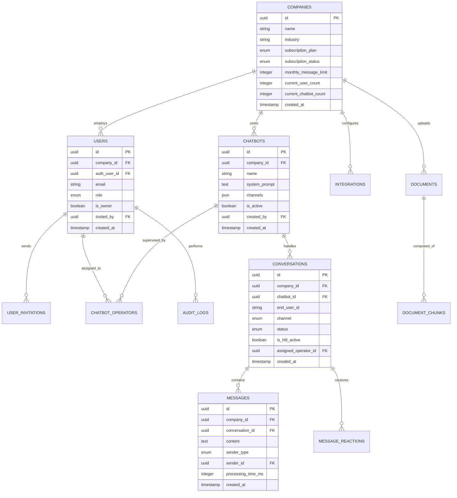
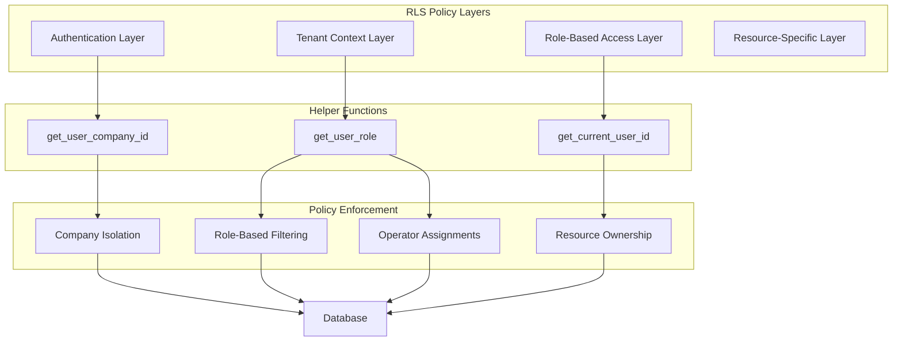
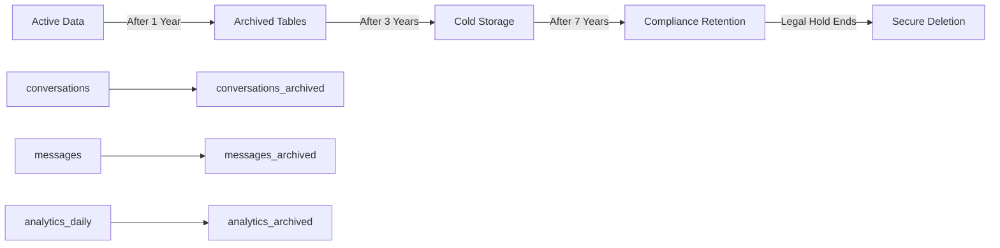
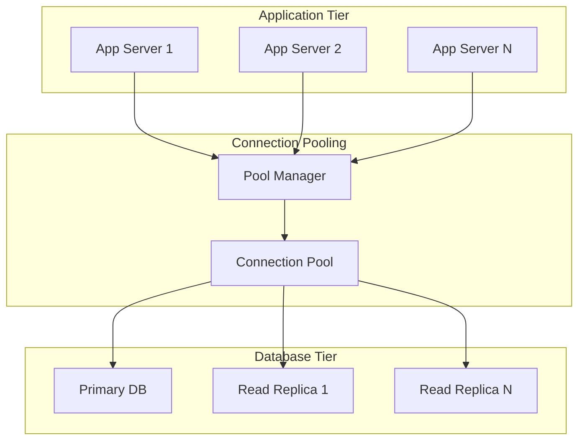

# NeurAnt - Arquitectura de Base de Datos

## Resumen

La arquitectura de base de datos de NeurAnt sigue un patrón de **Base de Datos Compartida Multi-tenant** con **Row Level Security (RLS)** para aislamiento de datos. La arquitectura está optimizada para una plataforma SaaS sirviendo 100+ tenants con segregación completa de datos mientras mantiene simplicidad operacional.

## Principios Arquitectónicos

### 1. **Multi-tenant por Diseño**
- Cada entidad de negocio incluye contexto de tenant (`company_id`)
- Row Level Security (RLS) aplica aislamiento automático de datos
- Índices compartidos optimizan rendimiento entre tenants

### 2. **Seguridad Primero**
- Políticas de seguridad a nivel de base de datos previenen acceso cross-tenant
- Control de acceso basado en roles integrado con autenticación
- Rastro de auditoría integral para requerimientos de cumplimiento

### 3. **Optimizado para Rendimiento**
- Estrategia de indexación eficiente con consultas conscientes de tenant
- Optimizado para cargas OLTP con capacidades analíticas
- Patrones de connection pooling y optimización de consultas

### 4. **Listo para Escalabilidad**
- Patrones de escalado horizontal a través de connection pooling
- Estrategia de archivado para gestión de datos a largo plazo
- Preparación de particionado para requerimientos de crecimiento futuro

## Modelo Conceptual de Datos

### Dominios Centrales de Negocio



## Dominios de Entidades y Relaciones

### 1. **Dominio de Gestión de Tenant**
**Propósito**: Multi-tenancy central y gestión de empresa

**Entidades Clave**:
- **Companies**: Entidad raíz de tenant con suscripción y límites
- **Users**: Miembros de empresa con acceso basado en roles
- **User Invitations**: Flujo de trabajo seguro de onboarding de usuarios

**Relaciones Clave**:
- Uno-a-muchos: Company → Users (con restricción Owner)
- Uno-a-muchos: Users → User Invitations
- Auto-referencial: Users → Users (jerarquía de invitación)

**Reglas de Negocio**:
- Exactamente un Owner por Company (aplicado vía unique constraint)
- Límites de invitación de usuarios basados en plan de suscripción
- Jerarquía de roles: Owner → Administrador → Supervisor → Operador

### 2. **Dominio de Gestión de Chatbots**  
**Propósito**: Configuración de chatbots IA y gestión de ciclo de vida

**Entidades Clave**:
- **Chatbots**: Configuración y ajustes de agente IA
- **Chatbot Templates**: Presets específicos por industria
- **Chatbot Operators**: Asignaciones de chatbot basadas en roles

**Relaciones Clave**:
- Uno-a-muchos: Company → Chatbots
- Muchos-a-muchos: Chatbots ↔ Users (vía Chatbot Operators)
- Uno-a-muchos: Chatbot Templates → Chatbots

**Reglas de Negocio**:
- Límites de creación de chatbots basados en plan de suscripción
- Operadores solo pueden acceder chatbots asignados
- Inicialización basada en template con personalización

### 3. **Dominio de Gestión de Conversaciones**
**Propósito**: Manejo de conversaciones en tiempo real y gestión HITL

**Entidades Clave**:
- **Conversations**: Contenedores de sesión de chat
- **Messages**: Mensajes individuales de conversación
- **Message Reactions**: Feedback y puntuación de calidad

**Relaciones Clave**:
- Uno-a-muchos: Chatbots → Conversations
- Uno-a-muchos: Conversations → Messages  
- Uno-a-muchos: Messages → Message Reactions

**Reglas de Negocio**:
- Seguimiento de conteo de mensajes para límites de suscripción
- Escalación HITL basada en triggers configurables
- Gestión de estado de conversación entre canales

### 4. **Dominio de Gestión de Conocimiento**
**Propósito**: Entrenamiento IA basado en documentos e implementación RAG

**Entidades Clave**:
- **Documents**: Materiales de entrenamiento cargados
- **Document Chunks**: Segmentos de contenido con embedding vectorial
- **Knowledge Queries**: Analíticas de consultas RAG

**Relaciones Clave**:
- Uno-a-muchos: Companies → Documents
- Uno-a-muchos: Documents → Document Chunks
- Muchos-a-muchos: Messages ↔ Document Chunks (vía Knowledge Queries)

**Reglas de Negocio**:
- Límites de almacenamiento de documentos basados en plan de suscripción
- Procesamiento automático de chunking y embedding
- Analíticas de uso para optimización de contenido

### 5. **Dominio de Integración y Sistemas Externos**
**Propósito**: Integraciones de servicios de terceros y automatización

**Entidades Clave**:
- **Integrations**: Configuraciones de servicios externos
- **Integration Logs**: Seguimiento de llamadas API y debugging

**Relaciones Clave**:
- Uno-a-muchos: Companies → Integrations
- Uno-a-muchos: Integrations → Integration Logs

**Reglas de Negocio**:
- Límites de integración basados en plan de suscripción
- Almacenamiento encriptado de credenciales
- Registro integral de llamadas API

### 6. **Dominio de Analíticas y Auditoría**
**Propósito**: Monitoreo de rendimiento y seguimiento de cumplimiento

**Entidades Clave**:
- **Analytics Daily**: Métricas de rendimiento agregadas
- **Audit Logs**: Eventos de seguridad y cumplimiento
- **System Metrics**: Monitoreo de salud de plataforma

**Relaciones Clave**:
- Uno-a-muchos: Companies → Analytics Daily
- Uno-a-muchos: Users → Audit Logs
- Sistema-amplio: System Metrics (sin relación tenant)

**Reglas de Negocio**:
- Agregación diaria de métricas para análisis de rendimiento
- Rastro de auditoría completo para eventos de seguridad
- Políticas de retención para requerimientos de cumplimiento

## Arquitectura de Seguridad

### Estrategia de Row Level Security (RLS)



### Security Policy Patterns

#### 1. **Tenant Isolation Pattern**
```sql
-- Pattern: Basic tenant filtering
company_id = get_user_company_id()
```
**Usage**: All tenant-scoped entities
**Purpose**: Ensures complete data isolation between companies

#### 2. **Role-Based Access Pattern**  
```sql
-- Pattern: Role hierarchy filtering
CASE get_user_role()
    WHEN 'owner' THEN true
    WHEN 'administrador' THEN [admin_conditions]
    WHEN 'supervisor' THEN [supervisor_conditions]  
    WHEN 'operador' THEN [operator_conditions]
END
```
**Usage**: User management, chatbot access, analytics
**Purpose**: Enforces hierarchical access control

#### 3. **Resource Ownership Pattern**
```sql
-- Pattern: Creator or assignee access
created_by = get_current_user_id() OR assigned_to = get_current_user_id()
```
**Usage**: Personal resources, assigned conversations
**Purpose**: Limits access to owned or assigned resources

#### 4. **Operator Assignment Pattern**
```sql
-- Pattern: Chatbot-specific operator access
chatbot_id IN (
    SELECT chatbot_id FROM chatbot_operators 
    WHERE operator_id = get_current_user_id()
)
```
**Usage**: Operator access to conversations and analytics
**Purpose**: Restricts operators to assigned chatbots only

## Performance Architecture

### Indexing Strategy

#### 1. **Tenant-Aware Indexes**
```sql
-- Pattern: Compound indexes with company_id prefix
INDEX idx_entity_company_performance ON entity(company_id, performance_column, created_at)
```
**Purpose**: Optimize tenant-filtered queries with additional filtering

#### 2. **Role-Based Indexes**  
```sql
-- Pattern: Partial indexes for role-specific queries
INDEX idx_users_active_operators ON users(company_id, id) WHERE role = 'operador' AND is_active = true
```
**Purpose**: Optimize role-specific access patterns

#### 3. **Time-Series Indexes**
```sql
-- Pattern: Time-based queries with tenant context
INDEX idx_messages_conversation_time ON messages(conversation_id, created_at DESC)
```
**Purpose**: Optimize conversation and analytics time-series queries

### Query Optimization Patterns

#### 1. **Tenant Context Injection**
All application queries automatically include tenant filtering:
```sql
-- Always include tenant context
WHERE company_id = get_user_company_id()
```

#### 2. **Connection Pooling Strategy**
- **Application Level**: Shared connection pool across all tenants
- **Database Level**: Supabase-managed connection pooling
- **Scaling Pattern**: Horizontal scaling via stateless application servers

#### 3. **Caching Layers**
- **Query Result Caching**: Frequently accessed tenant configurations
- **Context Caching**: User tenant context with TTL expiration
- **Static Data Caching**: Templates, plans, and system configurations

## Data Lifecycle Management

### Archival Strategy



### Retention Policies

#### 1. **Operational Data** (1 Year Active)
- Conversations and messages
- Real-time analytics
- Integration logs

#### 2. **Archived Data** (3 Years Total)
- Historical conversations
- Aggregated analytics
- Audit trails

#### 3. **Compliance Data** (7 Years Legal)
- Financial transactions
- User authentication logs
- Security audit events

### Backup & Recovery Strategy

#### 1. **Continuous Backup**
- Point-in-time recovery capability
- Cross-region replication
- Automated backup verification

#### 2. **Disaster Recovery**
- RTO (Recovery Time Objective): < 4 hours
- RPO (Recovery Point Objective): < 15 minutes
- Multi-region failover capability

## Scalability Patterns

### Horizontal Scaling Strategy



### Partitioning Readiness

#### 1. **Vertical Partitioning**
- Separate analytical workloads to read replicas
- Archive historical data to cold storage
- Isolate heavy processing operations

#### 2. **Horizontal Partitioning (Future)**
- Company-based partitioning when > 1000 tenants
- Time-based partitioning for analytical data
- Geographic distribution for compliance requirements

## Data Quality & Integrity

### Consistency Patterns

#### 1. **ACID Transactions**
- User + Company creation (atomic)
- Message processing with usage tracking
- Invitation acceptance workflow

#### 2. **Eventually Consistent**
- Analytics aggregation
- Cross-tenant metrics
- Search index updates

### Data Validation

#### 1. **Database Constraints**
- Foreign key relationships
- Check constraints for business rules
- Unique constraints for data integrity

#### 2. **Application Validation**
- Business logic validation
- Input sanitization
- Type safety enforcement

## Monitoring & Observability

### Performance Metrics

#### 1. **Query Performance**
- Average query execution time per tenant
- Slow query identification and optimization
- Index usage statistics

#### 2. **Utilización de Recursos**
- Uso de connection pool
- Crecimiento de almacenamiento por tenant
- Patrones de utilización de CPU y memoria

### Monitoreo de Salud

#### 1. **Salud de Base de Datos**
- Disponibilidad de conexiones
- Monitoreo de lag de replicación
- Verificación de éxito de backups

#### 2. **Calidad de Datos**
- Detección de violaciones de constraints
- Verificación de consistencia de datos
- Identificación de registros huérfanos

---

*Esta arquitectura de base de datos proporciona la base para la gestión de datos multi-tenant de NeurAnt. Las especificaciones detalladas de implementación y estrategias de migración se cubren en el documento de guías de implementación.*