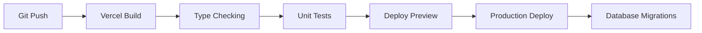

# NeurAnt - Stack Tecnológico Definitivo

## Resumen Ejecutivo

Stack tecnológico optimizado para **desarrollo rápido** y **escalabilidad eficiente** con un equipo de 3 desarrolladores, priorizando **time-to-market** y **mantenibilidad** a largo plazo.

## Arquitectura Core: **Serverless-First + BaaS**

### Filosofía de Stack
- **Serverless-first**: Auto-scaling, pay-per-use, zero-infrastructure management
- **BaaS (Backend-as-a-Service)**: Funcionalidades complejas out-of-the-box
- **TypeScript everywhere**: Type safety desde frontend hasta base de datos
- **Modern tooling**: Developer experience optimizado

## Frontend Stack

### Framework Principal: **Next.js 14+**
```json
{
  "framework": "Next.js 14.0+",
  "features": [
    "App Router (stable)",
    "Server Components",
    "Server Actions",
    "Streaming SSR",
    "Built-in API Routes"
  ],
  "benefits": [
    "Full-stack framework",
    "Excellent DX",
    "Vercel optimization",
    "SEO-friendly SSR"
  ]
}
```

### UI & Styling
```json
{
  "component_library": "shadcn/ui",
  "css_framework": "Tailwind CSS",
  "icons": "Lucide React",
  "charts": "Recharts",
  "animations": "Framer Motion"
}
```

**Justificación shadcn/ui vs Alternativas:**
- ✅ **shadcn/ui**: Copy-paste components, full customization, TypeScript native
- ❌ **Material-UI**: Heavy bundle, design constraints
- ❌ **Chakra UI**: Less modern, smaller ecosystem

### State Management
```json
{
  "server_state": "TanStack Query (React Query)",
  "client_state": "Zustand",
  "forms": "React Hook Form",
  "validation": "Zod"
}
```

**Patrón**: **Server-first state management**
- Server state (API data) → TanStack Query
- Client state (UI state) → Zustand  
- Form state → React Hook Form + Zod validation

### Real-time Features
```json
{
  "realtime_engine": "Supabase Realtime",
  "websockets": "Native WebSocket API",
  "implementation": "useEffect + Supabase subscriptions"
}
```

## Backend Stack

### Runtime: **Next.js API Routes + Vercel Edge Functions**
```json
{
  "api_framework": "Next.js API Routes",
  "runtime": "Node.js 18+ / Vercel Edge Runtime",
  "deployment": "Vercel Serverless Functions",
  "cold_start": "~100-300ms"
}
```

### Database: **Supabase (PostgreSQL)**
```json
{
  "database": "PostgreSQL 15+",
  "provider": "Supabase",
  "features": [
    "Row Level Security (RLS)",
    "Real-time subscriptions",
    "Built-in Auth",
    "pgvector extension",
    "Full-text search",
    "Connection pooling"
  ],
  "benefits": [
    "Multi-tenant ready",
    "Instant APIs",
    "Real-time out of the box",
    "Vector database included"
  ]
}
```

### ORM & Database Client
```json
{
  "orm": "Prisma ORM",
  "database_client": "Supabase JavaScript Client",
  "type_generation": "Supabase CLI + TypeScript"
}
```

**Hybrid Approach:**
- **Prisma**: Schema management, migrations, type safety
- **Supabase Client**: Real-time subscriptions, RLS, auth integration

### Authentication & Authorization
```json
{
  "auth_provider": "Supabase Auth",
  "methods": ["Email/Password", "OAuth (Google)", "Magic Links"],
  "session_management": "JWT tokens",
  "rbac": "Custom role-based system",
  "security": "Row Level Security (RLS)"
}
```

## Storage & File Management

### File Storage: **Supabase Storage**
```json
{
  "storage_provider": "Supabase Storage",
  "supported_formats": ["PDF", "DOCX", "TXT", "Images"],
  "features": [
    "Automatic resizing",
    "CDN distribution",
    "Access control policies",
    "Signed URLs"
  ],
  "integration": "Direct upload from client"
}
```

### Vector Database: **pgvector (PostgreSQL Extension)**
```json
{
  "vector_db": "pgvector",
  "embedding_model": "OpenAI text-embedding-ada-002",
  "dimensions": 1536,
  "similarity_function": "cosine",
  "index_type": "IVFFlat"
}
```

**Justificación pgvector vs Alternativas:**
- ✅ **pgvector**: Same database, ACID compliance, cost-effective
- ❌ **Pinecone**: Additional cost, external dependency
- ❌ **Weaviate**: Complex setup, over-engineering

## External Integrations

### AI & ML Services
```json
{
  "llm_provider": "OpenAI",
  "models": {
    "chat": "gpt-4-turbo",
    "embeddings": "text-embedding-ada-002",
    "fallback": "gpt-3.5-turbo"
  },
  "client": "@openai/openai npm package"
}
```

### Workflow Orchestration: **n8n**
```json
{
  "workflow_engine": "n8n Cloud",
  "use_cases": [
    "WhatsApp/Telegram/Slack messaging",
    "AI model orchestration",
    "External API integrations",
    "Complex business logic"
  ],
  "integration_method": "Webhooks bidirectional"
}
```

**n8n Workflow Examples:**
```yaml
whatsapp_bot_flow:
  trigger: "Webhook from WhatsApp"
  steps:
    - "Check bot status (NeurAnt API)"
    - "If active: Send to OpenAI"
    - "If HITL: Store in database"
    - "Send response back to WhatsApp"

knowledge_base_flow:
  trigger: "Document uploaded"
  steps:
    - "Extract text from PDF"
    - "Generate embeddings (OpenAI)"
    - "Store chunks in pgvector"
    - "Update processing status"
```

### External APIs Integration
```json
{
  "google_workspace": {
    "client": "googleapis npm package",
    "auth": "OAuth 2.0",
    "apis": ["Docs", "Sheets", "Calendar", "Gmail"]
  },
  "airtable": {
    "client": "airtable npm package",
    "auth": "API Key + OAuth"
  },
  "databases": {
    "mysql": "mysql2 npm package",
    "postgresql": "pg npm package"
  }
}
```

## Development & Deployment

### Development Environment
```json
{
  "package_manager": "npm",
  "node_version": "18+",
  "typescript": "5.0+",
  "linting": "ESLint + Prettier",
  "git_hooks": "Husky + lint-staged"
}
```

### Build & Deployment: **Vercel**
```json
{
  "hosting": "Vercel",
  "deployment": "Git-based (automatic)",
  "build_time": "~2-3 minutes",
  "cdn": "Vercel Edge Network",
  "ssl": "Automatic HTTPS",
  "domains": "Custom domain support"
}
```

**Deployment Pipeline:**


### Environment Configuration
```bash
# .env.local
NEXT_PUBLIC_SUPABASE_URL=https://xxx.supabase.co
NEXT_PUBLIC_SUPABASE_ANON_KEY=eyJ...
SUPABASE_SERVICE_ROLE_KEY=eyJ...

OPENAI_API_KEY=sk-...
N8N_WEBHOOK_URL=https://neurant.app.n8n.cloud/webhook/

GOOGLE_CLIENT_ID=xxx.googleusercontent.com
GOOGLE_CLIENT_SECRET=xxx

NEXTAUTH_SECRET=xxx
NEXTAUTH_URL=https://neurant.app
```

## Monitoring & Observability

### Application Monitoring
```json
{
  "analytics": "Vercel Analytics",
  "error_tracking": "Sentry",
  "logging": "Vercel Functions Logs",
  "uptime": "Vercel Monitoring"
}
```

### Database Monitoring
```json
{
  "database_monitoring": "Supabase Dashboard",
  "metrics": [
    "Connection count",
    "Query performance", 
    "Storage usage",
    "API requests"
  ],
  "alerts": "Email + Slack notifications"
}
```

### Custom Metrics
```typescript
// lib/analytics.ts
export const trackEvent = (event: string, properties?: Record<string, any>) => {
  // Vercel Analytics
  analytics.track(event, properties);
  
  // Custom business metrics
  if (event === 'message_sent') {
    updateMessageCount(properties.company_id);
  }
};
```

## Security Stack

### Application Security
```json
{
  "https": "Enforced (Vercel)",
  "cors": "Next.js built-in",
  "csp": "Content Security Policy headers",
  "rate_limiting": "Upstash Redis + Vercel Edge",
  "input_validation": "Zod schemas"
}
```

### Data Security
```json
{
  "encryption_at_rest": "Supabase (AES-256)",
  "encryption_in_transit": "TLS 1.3",
  "database_security": "Row Level Security (RLS)",
  "api_security": "JWT + RBAC",
  "secret_management": "Vercel Environment Variables"
}
```

## Performance Optimization

### Frontend Performance
```json
{
  "code_splitting": "Next.js automatic",
  "image_optimization": "Next.js Image component",
  "caching": "SWR + React Query",
  "cdn": "Vercel Edge Network",
  "bundle_analyzer": "@next/bundle-analyzer"
}
```

### Backend Performance
```json
{
  "database_indexes": "Optimized for multi-tenant queries",
  "connection_pooling": "Supabase built-in",
  "caching": "React Query + SWR",
  "api_optimization": "Edge Functions where possible"
}
```

### Caching Strategy
```typescript
// Multi-layer caching approach
const cachingLayers = {
  level1: "Browser cache (React Query)",
  level2: "CDN cache (Vercel Edge)",
  level3: "Database cache (Supabase)",
  level4: "Application cache (Memory/Redis)"
};
```

## Cost Optimization

### Estimated Monthly Costs (Production)
```json
{
  "vercel_pro": "$20/month",
  "supabase_pro": "$25/month", 
  "n8n_cloud": "$50/month",
  "openai_api": "$200-500/month (variable)",
  "sentry": "$26/month",
  "total_estimated": "$320-620/month"
}
```

### Cost Scaling Strategy
```json
{
  "0-10_companies": "$300-400/month",
  "10-50_companies": "$500-800/month", 
  "50-100_companies": "$800-1200/month",
  "100+_companies": "Enterprise negotiation"
}
```

## Development Workflow

### Git Workflow: **GitHub Flow**
```bash
main branch (production)
├── feature/chatbot-templates
├── feature/hitl-system  
├── feature/analytics-dashboard
└── hotfix/message-bug
```

### Code Quality Gates
```json
{
  "pre_commit": ["ESLint", "Prettier", "TypeScript check"],
  "pre_push": ["Unit tests", "Integration tests"],
  "pr_checks": ["Build", "Tests", "Security scan"],
  "deployment": ["E2E tests", "Performance tests"]
}
```

### Testing Strategy
```json
{
  "unit_tests": "Jest + Testing Library",
  "integration_tests": "Jest + Supertest",
  "e2e_tests": "Playwright",
  "api_tests": "Postman/Newman",
  "coverage_target": "80%+"
}
```

## Package.json Dependencies

### Core Dependencies
```json
{
  "dependencies": {
    "next": "^14.0.0",
    "react": "^18.0.0",
    "typescript": "^5.0.0",
    "@supabase/supabase-js": "^2.38.0",
    "@tanstack/react-query": "^5.0.0",
    "zustand": "^4.4.0",
    "react-hook-form": "^7.47.0",
    "zod": "^3.22.0",
    "tailwindcss": "^3.3.0",
    "lucide-react": "^0.288.0",
    "openai": "^4.17.0",
    "framer-motion": "^10.16.0"
  },
  "devDependencies": {
    "@types/node": "^20.8.0",
    "@types/react": "^18.2.0",
    "eslint": "^8.52.0",
    "prettier": "^3.0.0",
    "jest": "^29.7.0",
    "@testing-library/react": "^13.4.0",
    "playwright": "^1.39.0"
  }
}
```

## Ventajas del Stack Elegido

### 1. **Developer Experience**
- ✅ TypeScript end-to-end
- ✅ Hot reload y fast refresh
- ✅ Integrated tooling
- ✅ Excellent debugging

### 2. **Time to Market**
- ✅ Minimal infrastructure setup
- ✅ Built-in features (auth, realtime, storage)
- ✅ Auto-scaling
- ✅ One-click deployment

### 3. **Scalability**
- ✅ Serverless auto-scaling
- ✅ Multi-tenant architecture ready
- ✅ Performance optimization built-in
- ✅ Cost-efficient scaling

### 4. **Maintenance**
- ✅ Managed services reduce ops overhead
- ✅ Modern stack with active community
- ✅ Security updates handled by providers
- ✅ Monitoring and alerting included

## Riesgos y Mitigaciones

### Vendor Lock-in
- **Riesgo**: Dependencia fuerte en Supabase + Vercel
- **Mitigación**: APIs estándar, migration plan documentado

### Cold Starts
- **Riesgo**: Latencia inicial en serverless functions
- **Mitigación**: Edge functions, warm-up strategies

### Cost Escalation
- **Riesgo**: Costos variables con OpenAI API
- **Mitigación**: Usage monitoring, rate limiting, caching

## Próximos Pasos

1. ✅ Stack tecnológico definido
2. ⏳ ADRs para decisiones críticas
3. ⏳ Setup inicial del proyecto
4. ⏳ Configuración de CI/CD
5. ⏳ Plan de implementación detallado