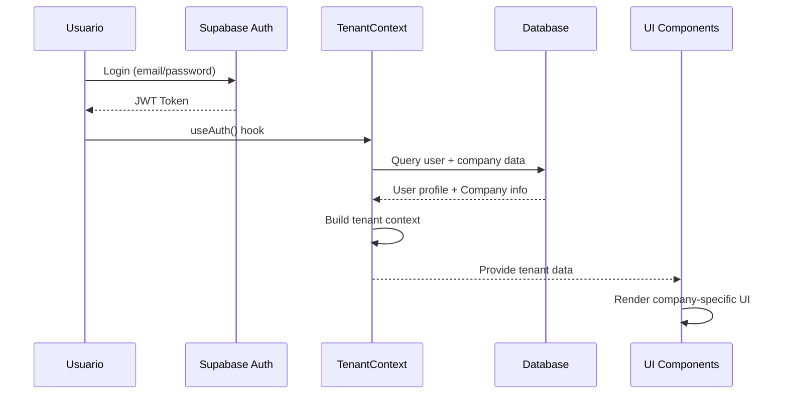

# NeurAnt - Sistema de Gestión de Contexto de Tenant

## Resumen

El sistema de gestión de contexto de tenant es fundamental para la arquitectura multi-tenant de NeurAnt. Implementa la estrategia **Single Domain + Context** donde el tenant se determina por el usuario autenticado, proporcionando acceso seamless y seguro a los datos de la empresa correspondiente.

## Arquitectura del Context Management

### 1. Flujo de Identificación de Tenant



### 2. Estructura del Tenant Context

```typescript
// Tipos base para el contexto de tenant
interface TenantContext {
  // Company Information
  company: Company | null
  
  // Current User
  user: User | null
  
  // Permissions & Role
  permissions: UserPermissions
  role: UserRole
  isOwner: boolean
  
  // Usage & Limits
  usage: UsageData
  limits: PlanLimits
  
  // Loading States
  isLoading: boolean
  error: string | null
  
  // Actions
  refreshContext: () => Promise<void>
  switchUser: (userId: string) => Promise<void> // Para testing
}

interface Company {
  id: string
  name: string
  slug: string
  email: string
  industry: string
  logo_url?: string
  
  // Subscription
  subscription_plan: SubscriptionPlan
  subscription_status: SubscriptionStatus
  
  // Usage tracking
  monthly_message_count: number
  monthly_message_limit: number
  monthly_reset_date: string
  
  // Current counters
  current_user_count: number
  current_chatbot_count: number
  current_integration_count: number
  
  // Plan limits
  max_users: number
  max_chatbots: number
  max_integrations: number
  max_document_characters: number
  max_storage_mb: number
  max_hitl_concurrent: number
}

interface User {
  id: string
  company_id: string
  auth_user_id: string
  
  // Profile
  email: string
  first_name: string
  last_name: string
  avatar_url?: string
  
  // Role & Status
  role: UserRole
  is_owner: boolean
  is_active: boolean
  
  // Invitation tracking
  invited_by?: string
  accepted_invitation_at?: string
  
  // Activity
  last_login_at?: string
  last_seen_at?: string
}

interface UserPermissions {
  // User Management
  canInviteUsers: boolean
  canManageUsers: boolean
  canViewAllUsers: boolean
  
  // Chatbot Management  
  canCreateChatbots: boolean
  canEditChatbots: boolean
  canDeleteChatbots: boolean
  canViewAllChatbots: boolean
  
  // HITL & Conversations
  canViewAllConversations: boolean
  canManageHITL: boolean
  canAssignOperators: boolean
  
  // Analytics & Reports
  canViewAnalytics: boolean
  canExportData: boolean
  
  // Company Settings
  canEditCompanySettings: boolean
  canManageBilling: boolean
  canViewUsage: boolean
  
  // Integrations
  canManageIntegrations: boolean
  canViewIntegrations: boolean
  
  // Documents
  canUploadDocuments: boolean
  canManageDocuments: boolean
}

type UserRole = 'owner' | 'administrador' | 'supervisor' | 'operador'

interface UsageData {
  messages: {
    current: number
    limit: number
    percentage: number
  }
  users: {
    current: number
    limit: number
    canInviteMore: boolean
  }
  chatbots: {
    current: number
    limit: number
    canCreateMore: boolean
  }
  storage: {
    current_mb: number
    limit_mb: number
    percentage: number
  }
}
```

### 3. TenantProvider Implementation

```typescript
// providers/TenantProvider.tsx
import React, { createContext, useContext, useEffect, useState, ReactNode } from 'react'
import { useSupabaseAuth } from './AuthProvider'
import { supabase } from '@/lib/supabase'

const TenantContext = createContext<TenantContext | undefined>(undefined)

interface TenantProviderProps {
  children: ReactNode
}

export const TenantProvider: React.FC<TenantProviderProps> = ({ children }) => {
  const [tenant, setTenant] = useState<TenantContext>({
    company: null,
    user: null,
    permissions: {} as UserPermissions,
    role: 'operador',
    isOwner: false,
    usage: {} as UsageData,
    limits: {} as PlanLimits,
    isLoading: true,
    error: null,
    refreshContext: async () => {},
    switchUser: async () => {}
  })

  const { user: authUser, session } = useSupabaseAuth()

  const loadTenantContext = async (authUserId: string) => {
    try {
      setTenant(prev => ({ ...prev, isLoading: true, error: null }))

      // 1. Get user with company information
      const { data: userData, error: userError } = await supabase
        .from('users')
        .select(`
          *,
          company:companies (*)
        `)
        .eq('auth_user_id', authUserId)
        .single()

      if (userError) throw userError
      if (!userData) throw new Error('User not found')

      // 2. Calculate permissions based on role
      const permissions = calculatePermissions(userData.role, userData.is_owner)

      // 3. Get current usage data
      const usage = await getCurrentUsage(userData.company.id)

      // 4. Update context
      setTenant(prev => ({
        ...prev,
        company: userData.company,
        user: userData,
        permissions,
        role: userData.role,
        isOwner: userData.is_owner,
        usage,
        limits: getPlanLimits(userData.company.subscription_plan),
        isLoading: false
      }))

    } catch (error) {
      console.error('Error loading tenant context:', error)
      setTenant(prev => ({
        ...prev,
        isLoading: false,
        error: error instanceof Error ? error.message : 'Unknown error'
      }))
    }
  }

  const refreshContext = async () => {
    if (authUser?.id) {
      await loadTenantContext(authUser.id)
    }
  }

  const switchUser = async (userId: string) => {
    // Para testing y admin impersonation (futuro)
    if (process.env.NODE_ENV === 'development') {
      await loadTenantContext(userId)
    }
  }

  // Load context when auth user changes
  useEffect(() => {
    if (authUser?.id) {
      loadTenantContext(authUser.id)
    } else {
      // Reset context when user logs out
      setTenant(prev => ({
        ...prev,
        company: null,
        user: null,
        permissions: {} as UserPermissions,
        role: 'operador',
        isOwner: false,
        usage: {} as UsageData,
        limits: {} as PlanLimits,
        isLoading: false,
        error: null
      }))
    }
  }, [authUser?.id])

  // Update context functions
  const contextValue: TenantContext = {
    ...tenant,
    refreshContext,
    switchUser
  }

  return (
    <TenantContext.Provider value={contextValue}>
      {children}
    </TenantContext.Provider>
  )
}

export const useTenant = (): TenantContext => {
  const context = useContext(TenantContext)
  if (context === undefined) {
    throw new Error('useTenant must be used within a TenantProvider')
  }
  return context
}
```

### 4. Permission Calculation System

```typescript
// lib/permissions.ts
export function calculatePermissions(role: UserRole, isOwner: boolean): UserPermissions {
  const basePermissions: UserPermissions = {
    // Default: operador permissions
    canInviteUsers: false,
    canManageUsers: false,
    canViewAllUsers: false,
    canCreateChatbots: false,
    canEditChatbots: false,
    canDeleteChatbots: false,
    canViewAllChatbots: false,
    canViewAllConversations: false,
    canManageHITL: false,
    canAssignOperators: false,
    canViewAnalytics: false,
    canExportData: false,
    canEditCompanySettings: false,
    canManageBilling: false,
    canViewUsage: false,
    canManageIntegrations: false,
    canViewIntegrations: false,
    canUploadDocuments: false,
    canManageDocuments: false
  }

  switch (role) {
    case 'owner':
      // Owner has all permissions
      return Object.keys(basePermissions).reduce((perms, key) => {
        perms[key as keyof UserPermissions] = true
        return perms
      }, {} as UserPermissions)

    case 'administrador':
      return {
        ...basePermissions,
        canInviteUsers: true,
        canManageUsers: true,
        canViewAllUsers: true,
        canCreateChatbots: true,
        canEditChatbots: true,
        canDeleteChatbots: true,
        canViewAllChatbots: true,
        canViewAllConversations: true,
        canManageHITL: true,
        canAssignOperators: true,
        canViewAnalytics: true,
        canExportData: true,
        canEditCompanySettings: true, // Limited compared to owner
        canViewUsage: true,
        canManageIntegrations: true,
        canViewIntegrations: true,
        canUploadDocuments: true,
        canManageDocuments: true
      }

    case 'supervisor':
      return {
        ...basePermissions,
        canCreateChatbots: true,
        canEditChatbots: true,
        canDeleteChatbots: true,
        canViewAllChatbots: true,
        canViewAllConversations: true,
        canManageHITL: true,
        canAssignOperators: true,
        canViewAnalytics: true, // Limited to assigned chatbots
        canViewUsage: true,
        canViewIntegrations: true,
        canUploadDocuments: true,
        canManageDocuments: true
      }

    case 'operador':
      return {
        ...basePermissions,
        canManageHITL: true, // Solo para conversaciones asignadas
        canViewAnalytics: true, // Solo para chatbots asignados
        canViewUsage: true
      }

    default:
      return basePermissions
  }
}

export function getPlanLimits(plan: SubscriptionPlan): PlanLimits {
  const planConfigs = {
    free: {
      maxUsers: 2,
      maxChatbots: 1,
      maxIntegrations: 0,
      maxDocumentCharacters: 0,
      maxStorageMb: 0,
      maxHitlConcurrent: 0,
      monthlyMessageLimit: 500
    },
    starter: {
      maxUsers: 3,
      maxChatbots: 2,
      maxIntegrations: 1,
      maxDocumentCharacters: 50000,
      maxStorageMb: 5,
      maxHitlConcurrent: 1,
      monthlyMessageLimit: 3000
    },
    professional: {
      maxUsers: 8,
      maxChatbots: 3,
      maxIntegrations: 3,
      maxDocumentCharacters: 250000,
      maxStorageMb: 20,
      maxHitlConcurrent: 3,
      monthlyMessageLimit: 8000
    },
    business: {
      maxUsers: 15,
      maxChatbots: 6,
      maxIntegrations: 6,
      maxDocumentCharacters: 750000,
      maxStorageMb: 50,
      maxHitlConcurrent: 6,
      monthlyMessageLimit: 20000
    },
    enterprise: {
      maxUsers: -1, // Unlimited
      maxChatbots: -1,
      maxIntegrations: -1,
      maxDocumentCharacters: -1,
      maxStorageMb: -1,
      maxHitlConcurrent: 25,
      monthlyMessageLimit: -1
    }
  }

  return planConfigs[plan] || planConfigs.free
}

async function getCurrentUsage(companyId: string): Promise<UsageData> {
  const { data: company } = await supabase
    .from('companies')
    .select('*')
    .eq('id', companyId)
    .single()

  if (!company) throw new Error('Company not found')

  const limits = getPlanLimits(company.subscription_plan)

  return {
    messages: {
      current: company.monthly_message_count,
      limit: limits.monthlyMessageLimit,
      percentage: limits.monthlyMessageLimit > 0 
        ? (company.monthly_message_count / limits.monthlyMessageLimit) * 100 
        : 0
    },
    users: {
      current: company.current_user_count,
      limit: limits.maxUsers,
      canInviteMore: limits.maxUsers === -1 || company.current_user_count < limits.maxUsers
    },
    chatbots: {
      current: company.current_chatbot_count,
      limit: limits.maxChatbots,
      canCreateMore: limits.maxChatbots === -1 || company.current_chatbot_count < limits.maxChatbots
    },
    storage: {
      current_mb: company.current_storage_mb || 0,
      limit_mb: limits.maxStorageMb,
      percentage: limits.maxStorageMb > 0 
        ? ((company.current_storage_mb || 0) / limits.maxStorageMb) * 100 
        : 0
    }
  }
}
```

### 5. Usage in Components

```typescript
// components/dashboard/DashboardHeader.tsx
import { useTenant } from '@/providers/TenantProvider'

export const DashboardHeader: React.FC = () => {
  const { company, user, permissions, usage } = useTenant()

  if (!company || !user) return <LoadingHeader />

  return (
    <header className="bg-white border-b border-gray-200">
      <div className="px-6 py-4">
        {/* Company Info */}
        <div className="flex items-center justify-between">
          <div className="flex items-center space-x-4">
            {company.logo_url && (
              
            )}
            <div>
              <h1 className="text-xl font-semibold text-gray-900">{company.name}</h1>
              <p className="text-sm text-gray-500">{company.subscription_plan}</p>
            </div>
          </div>

          {/* User Info */}
          <div className="flex items-center space-x-4">
            {/* Usage Indicators */}
            {permissions.canViewUsage && (
              <div className="flex items-center space-x-2 text-sm text-gray-600">
                <span>Messages: {usage.messages.current}/{usage.messages.limit}</span>
                <span>Users: {usage.users.current}/{usage.users.limit}</span>
              </div>
            )}
            
            {/* User Menu */}
            <UserMenu user={user} />
          </div>
        </div>
      </div>
    </header>
  )
}

// components/chatbots/ChatbotList.tsx
export const ChatbotList: React.FC = () => {
  const { company, permissions, usage } = useTenant()
  
  const { data: chatbots } = useQuery({
    queryKey: ['chatbots', company?.id],
    queryFn: () => fetchChatbots(company!.id),
    enabled: !!company?.id
  })

  return (
    <div className="space-y-4">
      <div className="flex items-center justify-between">
        <h2 className="text-lg font-medium">Chatbots</h2>
        
        {/* Create button with permission check */}
        {permissions.canCreateChatbots && usage.chatbots.canCreateMore && (
          <CreateChatbotButton />
        )}
        
        {/* Limit warning */}
        {!usage.chatbots.canCreateMore && (
          <div className="text-sm text-amber-600">
            Chatbot limit reached ({usage.chatbots.current}/{usage.chatbots.limit})
          </div>
        )}
      </div>

      <div className="grid gap-4 md:grid-cols-2 lg:grid-cols-3">
        {chatbots?.map(chatbot => (
          <ChatbotCard 
            key={chatbot.id} 
            chatbot={chatbot}
            canEdit={permissions.canEditChatbots}
            canDelete={permissions.canDeleteChatbots}
          />
        ))}
      </div>
    </div>
  )
}
```

### 6. API Middleware Integration

```typescript
// middleware/withTenant.ts
import { NextRequest, NextResponse } from 'next/server'
import { createServerSupabaseClient } from '@/lib/supabase-server'

export function withTenant(handler: (req: NextRequest, context: TenantContext) => Promise<NextResponse>) {
  return async (req: NextRequest) => {
    try {
      const supabase = createServerSupabaseClient(req)
      
      // Get current user from session
      const { data: { session }, error: sessionError } = await supabase.auth.getSession()
      
      if (sessionError || !session) {
        return NextResponse.json({ error: 'Unauthorized' }, { status: 401 })
      }

      // Get user with company information
      const { data: userData, error: userError } = await supabase
        .from('users')
        .select(`
          *,
          company:companies (*)
        `)
        .eq('auth_user_id', session.user.id)
        .single()

      if (userError || !userData) {
        return NextResponse.json({ error: 'User not found' }, { status: 404 })
      }

      // Build tenant context for API
      const tenantContext: TenantContext = {
        company: userData.company,
        user: userData,
        permissions: calculatePermissions(userData.role, userData.is_owner),
        role: userData.role,
        isOwner: userData.is_owner,
        usage: await getCurrentUsage(userData.company.id),
        limits: getPlanLimits(userData.company.subscription_plan),
        isLoading: false,
        error: null,
        refreshContext: async () => {},
        switchUser: async () => {}
      }

      return handler(req, tenantContext)
    } catch (error) {
      console.error('Tenant middleware error:', error)
      return NextResponse.json({ error: 'Internal server error' }, { status: 500 })
    }
  }
}

// Usage in API routes
// app/api/chatbots/route.ts
import { withTenant } from '@/middleware/withTenant'

export const GET = withTenant(async (req, { company, permissions }) => {
  if (!permissions.canViewAllChatbots) {
    return NextResponse.json({ error: 'Forbidden' }, { status: 403 })
  }

  const chatbots = await getChatbotsByCompany(company.id)
  return NextResponse.json(chatbots)
})
```

### 7. Context Persistence & Caching

```typescript
// lib/tenant-cache.ts
import { LRUCache } from 'lru-cache'

// Cache tenant contexts to reduce database queries
const tenantCache = new LRUCache<string, TenantContext>({
  max: 1000, // Max 1000 cached contexts
  ttl: 1000 * 60 * 15, // 15 minutes TTL
})

export function getCachedTenant(userId: string): TenantContext | undefined {
  return tenantCache.get(userId)
}

export function setCachedTenant(userId: string, context: TenantContext): void {
  tenantCache.set(userId, context)
}

export function invalidateTenantCache(userId: string): void {
  tenantCache.delete(userId)
}

export function invalidateCompanyCache(companyId: string): void {
  // Invalidate all users from a company
  for (const [userId, context] of tenantCache.entries()) {
    if (context.company?.id === companyId) {
      tenantCache.delete(userId)
    }
  }
}
```

### 8. Error Handling & Fallbacks

```typescript
// components/TenantGuard.tsx
interface TenantGuardProps {
  children: ReactNode
  fallback?: ReactNode
  requiredPermissions?: (keyof UserPermissions)[]
}

export const TenantGuard: React.FC<TenantGuardProps> = ({ 
  children, 
  fallback,
  requiredPermissions = []
}) => {
  const { company, user, permissions, isLoading, error } = useTenant()

  if (isLoading) {
    return <TenantLoadingSpinner />
  }

  if (error) {
    return <TenantErrorBoundary error={error} />
  }

  if (!company || !user) {
    return fallback || <TenantNotFound />
  }

  // Check required permissions
  const hasRequiredPermissions = requiredPermissions.every(
    permission => permissions[permission]
  )

  if (!hasRequiredPermissions) {
    return <AccessDenied requiredPermissions={requiredPermissions} />
  }

  return <>{children}</>
}

// Usage
<TenantGuard requiredPermissions={['canManageUsers']}>
  <UserManagementPanel />
</TenantGuard>
```

## Benefits del Sistema

### 1. **Seamless User Experience**
- Single domain, no tenant complexity visible
- Automatic context loading on authentication
- Smooth transitions between different areas

### 2. **Security by Design**
- Row Level Security enforcement
- Permission-based UI rendering
- API-level tenant validation

### 3. **Performance Optimized**
- Context caching to reduce DB queries
- Efficient permission calculations
- Lazy loading of non-critical data

### 4. **Developer Experience**
- Type-safe context access
- Reusable permission patterns
- Clear separation of concerns

### 5. **Scalability Ready**
- Efficient caching strategies
- Minimal database overhead
- Easy to extend with new roles/permissions

## Próximos Pasos

1. ✅ Diseño de sistema de contexto completado
2. ⏳ Implementación del sistema de invitaciones
3. ⏳ Documentación del flujo de onboarding
4. ⏳ Testing de aislamiento multi-tenant
5. ⏳ Integración con componentes UI