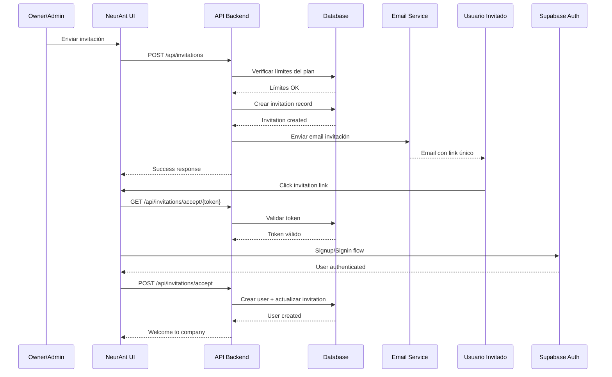

# NeurAnt - Sistema de Invitaciones

## Resumen

El sistema de invitaciones permite a Owners y Administradores invitar usuarios adicionales a su empresa, respetando los límites del plan de suscripción. Implementa un flujo completo de invitación por email con tokens seguros, validación de límites y experiencia de usuario optimizada.

## Arquitectura del Sistema de Invitaciones

### 1. Flujo Completo de Invitaciones



### 2. Database Schema (Ya definido anteriormente)

```sql
-- Tabla de invitaciones definida en 03-database-design.md
CREATE TABLE user_invitations (
    id UUID PRIMARY KEY DEFAULT gen_random_uuid(),
    company_id UUID NOT NULL REFERENCES companies(id) ON DELETE CASCADE,
    
    -- Invitation Details
    email VARCHAR(255) NOT NULL,
    first_name VARCHAR(100),
    last_name VARCHAR(100),
    role user_role_enum NOT NULL DEFAULT 'operador',
    
    -- Invitation Metadata  
    invited_by UUID NOT NULL REFERENCES users(id),
    invitation_token VARCHAR(255) UNIQUE NOT NULL,
    expires_at TIMESTAMPTZ NOT NULL DEFAULT (NOW() + INTERVAL '7 days'),
    
    -- Status Tracking
    status invitation_status_enum NOT NULL DEFAULT 'pending',
    accepted_at TIMESTAMPTZ,
    accepted_by_user_id UUID REFERENCES users(id),
    
    -- Email Tracking
    sent_at TIMESTAMPTZ NOT NULL DEFAULT NOW(),
    reminder_sent_at TIMESTAMPTZ,
    reminder_count INTEGER NOT NULL DEFAULT 0,
    
    -- Metadata
    created_at TIMESTAMPTZ NOT NULL DEFAULT NOW(),
    updated_at TIMESTAMPTZ NOT NULL DEFAULT NOW(),
    
    -- Constraints
    UNIQUE(company_id, email),
    CHECK (expires_at > created_at),
    CHECK (reminder_count >= 0)
);
```

### 3. API Endpoints

#### 3.1 Crear Invitación

```typescript
// app/api/invitations/route.ts
interface CreateInvitationRequest {
  email: string
  first_name?: string
  last_name?: string
  role: 'administrador' | 'supervisor' | 'operador'
  send_email?: boolean // Default: true
}

interface CreateInvitationResponse {
  id: string
  invitation_token: string
  expires_at: string
  invitation_url: string
}

export const POST = withTenant(async (req, { company, user, permissions, usage }) => {
  // 1. Verificar permisos
  if (!permissions.canInviteUsers) {
    return NextResponse.json({ error: 'Insufficient permissions' }, { status: 403 })
  }

  const body: CreateInvitationRequest = await req.json()
  
  // 2. Validar datos de entrada
  const validation = createInvitationSchema.safeParse(body)
  if (!validation.success) {
    return NextResponse.json({ error: 'Invalid data', details: validation.error }, { status: 400 })
  }

  // 3. Verificar límites del plan
  if (!usage.users.canInviteMore) {
    return NextResponse.json({ 
      error: 'User limit reached', 
      current: usage.users.current,
      limit: usage.users.limit 
    }, { status: 409 })
  }

  // 4. Verificar que el email no esté ya invitado o registrado
  const existingUser = await supabase
    .from('users')
    .select('id')
    .eq('company_id', company.id)
    .eq('email', body.email)
    .single()

  if (existingUser.data) {
    return NextResponse.json({ error: 'User already exists in company' }, { status: 409 })
  }

  const existingInvitation = await supabase
    .from('user_invitations')
    .select('id, status')
    .eq('company_id', company.id)
    .eq('email', body.email)
    .single()

  if (existingInvitation.data?.status === 'pending') {
    return NextResponse.json({ error: 'Invitation already sent' }, { status: 409 })
  }

  // 5. Crear invitación
  const invitationToken = generateSecureToken()
  const expiresAt = new Date(Date.now() + 7 * 24 * 60 * 60 * 1000) // 7 días

  const { data: invitation, error } = await supabase
    .from('user_invitations')
    .insert({
      company_id: company.id,
      email: body.email,
      first_name: body.first_name,
      last_name: body.last_name,
      role: body.role,
      invited_by: user.id,
      invitation_token: invitationToken,
      expires_at: expiresAt.toISOString(),
      status: 'pending'
    })
    .select()
    .single()

  if (error) {
    return NextResponse.json({ error: 'Failed to create invitation' }, { status: 500 })
  }

  // 6. Enviar email de invitación
  if (body.send_email !== false) {
    await sendInvitationEmail({
      to: body.email,
      inviter_name: `${user.first_name} ${user.last_name}`,
      company_name: company.name,
      invitation_token: invitationToken,
      expires_at: expiresAt
    })
  }

  // 7. Log de auditoría
  await logAuditEvent({
    company_id: company.id,
    user_id: user.id,
    action: 'user_invited',
    resource_type: 'invitation',
    resource_id: invitation.id,
    details: { 
      invitee_email: body.email, 
      role: body.role 
    }
  })

  const invitationUrl = `${process.env.NEXT_PUBLIC_APP_URL}/accept-invitation?token=${invitationToken}`

  return NextResponse.json({
    id: invitation.id,
    invitation_token: invitationToken,
    expires_at: expiresAt.toISOString(),
    invitation_url: invitationUrl
  })
})

function generateSecureToken(): string {
  return crypto.randomBytes(32).toString('hex')
}
```

#### 3.2 Listar Invitaciones

```typescript
// app/api/invitations/route.ts
export const GET = withTenant(async (req, { company, permissions }) => {
  if (!permissions.canManageUsers) {
    return NextResponse.json({ error: 'Insufficient permissions' }, { status: 403 })
  }

  const { searchParams } = new URL(req.url)
  const status = searchParams.get('status') // pending, accepted, expired, cancelled
  const page = parseInt(searchParams.get('page') || '1')
  const limit = parseInt(searchParams.get('limit') || '10')

  let query = supabase
    .from('user_invitations')
    .select(`
      *,
      inviter:users!invited_by (
        first_name,
        last_name,
        email
      )
    `)
    .eq('company_id', company.id)

  if (status) {
    query = query.eq('status', status)
  }

  const { data: invitations, error, count } = await query
    .range((page - 1) * limit, page * limit - 1)
    .order('created_at', { ascending: false })

  if (error) {
    return NextResponse.json({ error: 'Failed to fetch invitations' }, { status: 500 })
  }

  return NextResponse.json({
    invitations,
    pagination: {
      page,
      limit,
      total: count || 0,
      pages: Math.ceil((count || 0) / limit)
    }
  })
})
```

#### 3.3 Validar Token de Invitación

```typescript
// app/api/invitations/validate/[token]/route.ts
interface ValidateInvitationResponse {
  valid: boolean
  invitation?: {
    id: string
    email: string
    first_name?: string
    last_name?: string
    role: string
    company_name: string
    company_logo?: string
    inviter_name: string
    expires_at: string
  }
  error?: string
}

export async function GET(
  req: Request,
  { params }: { params: { token: string } }
): Promise<NextResponse<ValidateInvitationResponse>> {
  
  const { token } = params

  if (!token) {
    return NextResponse.json({ 
      valid: false, 
      error: 'Token is required' 
    }, { status: 400 })
  }

  try {
    // Buscar invitación por token
    const { data: invitation, error } = await supabase
      .from('user_invitations')
      .select(`
        *,
        company:companies (
          name,
          logo_url
        ),
        inviter:users!invited_by (
          first_name,
          last_name
        )
      `)
      .eq('invitation_token', token)
      .eq('status', 'pending')
      .single()

    if (error || !invitation) {
      return NextResponse.json({ 
        valid: false, 
        error: 'Invalid or expired invitation' 
      }, { status: 404 })
    }

    // Verificar expiración
    const now = new Date()
    const expiresAt = new Date(invitation.expires_at)
    
    if (expiresAt < now) {
      // Marcar como expirada
      await supabase
        .from('user_invitations')
        .update({ status: 'expired' })
        .eq('id', invitation.id)

      return NextResponse.json({ 
        valid: false, 
        error: 'Invitation has expired' 
      }, { status: 410 })
    }

    return NextResponse.json({
      valid: true,
      invitation: {
        id: invitation.id,
        email: invitation.email,
        first_name: invitation.first_name,
        last_name: invitation.last_name,
        role: invitation.role,
        company_name: invitation.company.name,
        company_logo: invitation.company.logo_url,
        inviter_name: `${invitation.inviter.first_name} ${invitation.inviter.last_name}`,
        expires_at: invitation.expires_at
      }
    })

  } catch (error) {
    console.error('Error validating invitation:', error)
    return NextResponse.json({ 
      valid: false, 
      error: 'Internal server error' 
    }, { status: 500 })
  }
}
```

#### 3.4 Aceptar Invitación

```typescript
// app/api/invitations/accept/route.ts
interface AcceptInvitationRequest {
  invitation_token: string
  user_data: {
    first_name: string
    last_name: string
    password: string
    // auth_user_id se obtiene del usuario autenticado
  }
}

export const POST = async (req: Request) => {
  try {
    const body: AcceptInvitationRequest = await req.json()
    
    // 1. Obtener usuario autenticado
    const supabase = createServerSupabaseClient(req)
    const { data: { session }, error: sessionError } = await supabase.auth.getSession()
    
    if (sessionError || !session) {
      return NextResponse.json({ error: 'Authentication required' }, { status: 401 })
    }

    // 2. Validar invitación
    const { data: invitation, error: invitationError } = await supabase
      .from('user_invitations')
      .select('*')
      .eq('invitation_token', body.invitation_token)
      .eq('status', 'pending')
      .single()

    if (invitationError || !invitation) {
      return NextResponse.json({ error: 'Invalid invitation' }, { status: 404 })
    }

    // 3. Verificar que el email coincida
    if (invitation.email !== session.user.email) {
      return NextResponse.json({ 
        error: 'Email mismatch. Please sign in with the invited email address.' 
      }, { status: 400 })
    }

    // 4. Verificar expiración
    if (new Date(invitation.expires_at) < new Date()) {
      await supabase
        .from('user_invitations')
        .update({ status: 'expired' })
        .eq('id', invitation.id)

      return NextResponse.json({ error: 'Invitation has expired' }, { status: 410 })
    }

    // 5. Verificar límites del plan (por si acaso)
    const { data: company } = await supabase
      .from('companies')
      .select('*')
      .eq('id', invitation.company_id)
      .single()

    const limits = getPlanLimits(company!.subscription_plan)
    if (limits.maxUsers !== -1 && company!.current_user_count >= limits.maxUsers) {
      return NextResponse.json({ error: 'Company user limit reached' }, { status: 409 })
    }

    // 6. Crear usuario en la empresa
    const { data: newUser, error: userError } = await supabase
      .from('users')
      .insert({
        company_id: invitation.company_id,
        auth_user_id: session.user.id,
        email: invitation.email,
        first_name: body.user_data.first_name,
        last_name: body.user_data.last_name,
        role: invitation.role,
        is_owner: false,
        invited_by: invitation.invited_by,
        accepted_invitation_at: new Date().toISOString()
      })
      .select()
      .single()

    if (userError) {
      console.error('Error creating user:', userError)
      return NextResponse.json({ error: 'Failed to create user' }, { status: 500 })
    }

    // 7. Actualizar invitación como aceptada
    await supabase
      .from('user_invitations')
      .update({
        status: 'accepted',
        accepted_at: new Date().toISOString(),
        accepted_by_user_id: newUser.id
      })
      .eq('id', invitation.id)

    // 8. Actualizar contador de usuarios en empresa
    await supabase
      .from('companies')
      .update({
        current_user_count: company!.current_user_count + 1
      })
      .eq('id', invitation.company_id)

    // 9. Log de auditoría
    await logAuditEvent({
      company_id: invitation.company_id,
      user_id: newUser.id,
      action: 'invitation_accepted',
      resource_type: 'user',
      resource_id: newUser.id,
      details: { 
        invitation_id: invitation.id,
        invited_by: invitation.invited_by 
      }
    })

    // 10. Enviar email de bienvenida
    await sendWelcomeEmail({
      to: newUser.email,
      user_name: `${newUser.first_name} ${newUser.last_name}`,
      company_name: company!.name
    })

    return NextResponse.json({
      user: {
        id: newUser.id,
        email: newUser.email,
        first_name: newUser.first_name,
        last_name: newUser.last_name,
        role: newUser.role,
        company_id: newUser.company_id
      },
      company: {
        id: company!.id,
        name: company!.name
      }
    })

  } catch (error) {
    console.error('Error accepting invitation:', error)
    return NextResponse.json({ error: 'Internal server error' }, { status: 500 })
  }
}
```

### 4. Frontend Components

#### 4.1 Formulario de Invitación

```typescript
// components/invitations/InviteUserForm.tsx
import { useTenant } from '@/providers/TenantProvider'
import { useForm } from 'react-hook-form'
import { zodResolver } from '@hookform/resolvers/zod'
import { z } from 'zod'

const inviteUserSchema = z.object({
  email: z.string().email('Invalid email address'),
  first_name: z.string().min(1, 'First name is required'),
  last_name: z.string().min(1, 'Last name is required'),
  role: z.enum(['administrador', 'supervisor', 'operador'])
})

type InviteUserFormData = z.infer<typeof inviteUserSchema>

export const InviteUserForm: React.FC = () => {
  const { company, permissions, usage } = useTenant()
  const [isSubmitting, setIsSubmitting] = useState(false)

  const form = useForm<InviteUserFormData>({
    resolver: zodResolver(inviteUserSchema),
    defaultValues: {
      role: 'operador'
    }
  })

  const onSubmit = async (data: InviteUserFormData) => {
    try {
      setIsSubmitting(true)
      
      const response = await fetch('/api/invitations', {
        method: 'POST',
        headers: { 'Content-Type': 'application/json' },
        body: JSON.stringify(data)
      })

      if (!response.ok) {
        const error = await response.json()
        throw new Error(error.error || 'Failed to send invitation')
      }

      toast.success('Invitation sent successfully!')
      form.reset()
      
    } catch (error) {
      toast.error(error instanceof Error ? error.message : 'Failed to send invitation')
    } finally {
      setIsSubmitting(false)
    }
  }

  if (!permissions.canInviteUsers) {
    return <AccessDenied message="You don't have permission to invite users" />
  }

  return (
    <Card>
      <CardHeader>
        <CardTitle>Invite New User</CardTitle>
        <CardDescription>
          Invite a new team member to {company?.name}
          {usage.users && (
            <span className="block mt-1 text-sm">
              {usage.users.current}/{usage.users.limit === -1 ? '∞' : usage.users.limit} users
            </span>
          )}
        </CardDescription>
      </CardHeader>

      <CardContent>
        {!usage.users.canInviteMore && (
          <Alert className="mb-4">
            <AlertCircle className="h-4 w-4" />
            <AlertTitle>User limit reached</AlertTitle>
            <AlertDescription>
              You've reached the maximum number of users for your plan. 
              <Link href="/settings/billing" className="underline ml-1">
                Upgrade your plan
              </Link> to invite more users.
            </AlertDescription>
          </Alert>
        )}

        <form onSubmit={form.handleSubmit(onSubmit)} className="space-y-4">
          <div className="grid grid-cols-2 gap-4">
            <div>
              <Label htmlFor="first_name">First Name</Label>
              <Input
                id="first_name"
                {...form.register('first_name')}
                placeholder="John"
              />
              {form.formState.errors.first_name && (
                <p className="text-sm text-red-600 mt-1">
                  {form.formState.errors.first_name.message}
                </p>
              )}
            </div>

            <div>
              <Label htmlFor="last_name">Last Name</Label>
              <Input
                id="last_name"
                {...form.register('last_name')}
                placeholder="Doe"
              />
              {form.formState.errors.last_name && (
                <p className="text-sm text-red-600 mt-1">
                  {form.formState.errors.last_name.message}
                </p>
              )}
            </div>
          </div>

          <div>
            <Label htmlFor="email">Email Address</Label>
            <Input
              id="email"
              type="email"
              {...form.register('email')}
              placeholder="john.doe@company.com"
            />
            {form.formState.errors.email && (
              <p className="text-sm text-red-600 mt-1">
                {form.formState.errors.email.message}
              </p>
            )}
          </div>

          <div>
            <Label htmlFor="role">Role</Label>
            <Select onValueChange={(value) => form.setValue('role', value as any)}>
              <SelectTrigger>
                <SelectValue placeholder="Select a role" />
              </SelectTrigger>
              <SelectContent>
                <SelectItem value="operador">Operador</SelectItem>
                <SelectItem value="supervisor">Supervisor</SelectItem>
                {(permissions.canManageUsers) && (
                  <SelectItem value="administrador">Administrador</SelectItem>
                )}
              </SelectContent>
            </Select>
            {form.formState.errors.role && (
              <p className="text-sm text-red-600 mt-1">
                {form.formState.errors.role.message}
              </p>
            )}
          </div>

          <Button 
            type="submit" 
            disabled={isSubmitting || !usage.users.canInviteMore}
            className="w-full"
          >
            {isSubmitting ? (
              <>
                <Loader2 className="mr-2 h-4 w-4 animate-spin" />
                Sending Invitation...
              </>
            ) : (
              'Send Invitation'
            )}
          </Button>
        </form>
      </CardContent>
    </Card>
  )
}
```

#### 4.2 Lista de Invitaciones

```typescript
// components/invitations/InvitationsList.tsx
export const InvitationsList: React.FC = () => {
  const { permissions } = useTenant()
  const [statusFilter, setStatusFilter] = useState<string>('all')

  const { data: invitations, isLoading } = useQuery({
    queryKey: ['invitations', statusFilter],
    queryFn: () => fetchInvitations({ status: statusFilter === 'all' ? undefined : statusFilter }),
    enabled: permissions.canManageUsers
  })

  const resendInvitation = async (invitationId: string) => {
    try {
      await fetch(`/api/invitations/${invitationId}/resend`, { method: 'POST' })
      toast.success('Invitation resent successfully')
    } catch (error) {
      toast.error('Failed to resend invitation')
    }
  }

  const cancelInvitation = async (invitationId: string) => {
    try {
      await fetch(`/api/invitations/${invitationId}`, { method: 'DELETE' })
      toast.success('Invitation cancelled')
      // Refetch data
    } catch (error) {
      toast.error('Failed to cancel invitation')
    }
  }

  if (!permissions.canManageUsers) {
    return <AccessDenied />
  }

  return (
    <Card>
      <CardHeader>
        <div className="flex items-center justify-between">
          <CardTitle>Pending Invitations</CardTitle>
          <Select value={statusFilter} onValueChange={setStatusFilter}>
            <SelectTrigger className="w-32">
              <SelectValue />
            </SelectTrigger>
            <SelectContent>
              <SelectItem value="all">All</SelectItem>
              <SelectItem value="pending">Pending</SelectItem>
              <SelectItem value="accepted">Accepted</SelectItem>
              <SelectItem value="expired">Expired</SelectItem>
            </SelectContent>
          </Select>
        </div>
      </CardHeader>

      <CardContent>
        {isLoading ? (
          <div className="flex justify-center py-8">
            <Loader2 className="h-6 w-6 animate-spin" />
          </div>
        ) : invitations?.length === 0 ? (
          <div className="text-center py-8 text-gray-500">
            No invitations found
          </div>
        ) : (
          <div className="space-y-4">
            {invitations?.map((invitation) => (
              <div key={invitation.id} className="flex items-center justify-between p-4 border rounded-lg">
                <div className="flex-1">
                  <div className="flex items-center space-x-3">
                    <Avatar className="h-8 w-8">
                      <AvatarFallback>
                        {invitation.first_name?.[0]}{invitation.last_name?.[0]}
                      </AvatarFallback>
                    </Avatar>
                    <div>
                      <p className="font-medium">
                        {invitation.first_name} {invitation.last_name}
                      </p>
                      <p className="text-sm text-gray-500">{invitation.email}</p>
                    </div>
                  </div>
                  <div className="mt-2 flex items-center space-x-4 text-sm text-gray-500">
                    <span className="capitalize">{invitation.role}</span>
                    <span>•</span>
                    <span>Invited {formatDistanceToNow(new Date(invitation.created_at))} ago</span>
                    <span>•</span>
                    <InvitationStatusBadge status={invitation.status} />
                  </div>
                </div>

                <div className="flex items-center space-x-2">
                  {invitation.status === 'pending' && (
                    <>
                      <Button
                        variant="outline"
                        size="sm"
                        onClick={() => resendInvitation(invitation.id)}
                      >
                        Resend
                      </Button>
                      <Button
                        variant="outline"
                        size="sm"
                        onClick={() => cancelInvitation(invitation.id)}
                      >
                        Cancel
                      </Button>
                    </>
                  )}
                </div>
              </div>
            ))}
          </div>
        )}
      </CardContent>
    </Card>
  )
}
```

#### 4.3 Página de Aceptación de Invitación

```typescript
// app/accept-invitation/page.tsx
'use client'

export default function AcceptInvitationPage() {
  const [invitation, setInvitation] = useState(null)
  const [isLoading, setIsLoading] = useState(true)
  const [error, setError] = useState('')
  const router = useRouter()
  const searchParams = useSearchParams()
  const token = searchParams.get('token')

  useEffect(() => {
    if (token) {
      validateInvitation(token)
    } else {
      setError('Invalid invitation link')
      setIsLoading(false)
    }
  }, [token])

  const validateInvitation = async (token: string) => {
    try {
      const response = await fetch(`/api/invitations/validate/${token}`)
      const data = await response.json()

      if (data.valid) {
        setInvitation(data.invitation)
      } else {
        setError(data.error || 'Invalid invitation')
      }
    } catch (error) {
      setError('Failed to validate invitation')
    } finally {
      setIsLoading(false)
    }
  }

  if (isLoading) {
    return <InvitationLoadingPage />
  }

  if (error || !invitation) {
    return <InvitationErrorPage error={error} />
  }

  return <InvitationAcceptPage invitation={invitation} />
}

const InvitationAcceptPage: React.FC<{ invitation: any }> = ({ invitation }) => {
  const [isProcessing, setIsProcessing] = useState(false)
  const { user, signIn, signUp } = useSupabaseAuth()
  const router = useRouter()

  // Si el usuario ya está autenticado con el email correcto
  useEffect(() => {
    if (user && user.email === invitation.email) {
      handleAcceptInvitation()
    }
  }, [user])

  const handleAcceptInvitation = async () => {
    try {
      setIsProcessing(true)

      const response = await fetch('/api/invitations/accept', {
        method: 'POST',
        headers: { 'Content-Type': 'application/json' },
        body: JSON.stringify({
          invitation_token: invitation.token,
          user_data: {
            first_name: invitation.first_name,
            last_name: invitation.last_name
          }
        })
      })

      if (!response.ok) {
        const error = await response.json()
        throw new Error(error.error)
      }

      toast.success('Welcome to the team!')
      router.push('/dashboard')

    } catch (error) {
      toast.error(error instanceof Error ? error.message : 'Failed to accept invitation')
    } finally {
      setIsProcessing(false)
    }
  }

  return (
    <div className="min-h-screen flex items-center justify-center bg-gray-50">
      <Card className="w-full max-w-md">
        <CardHeader className="text-center">
          {invitation.company_logo && (
            
          )}
          <CardTitle>You're invited!</CardTitle>
          <CardDescription>
            {invitation.inviter_name} has invited you to join{' '}
            <strong>{invitation.company_name}</strong> as a{' '}
            <strong>{invitation.role}</strong>
          </CardDescription>
        </CardContent>

        <CardContent className="space-y-4">
          <div className="bg-gray-50 p-4 rounded-lg">
            <h4 className="font-medium mb-2">Invitation Details</h4>
            <div className="space-y-1 text-sm text-gray-600">
              <p><strong>Email:</strong> {invitation.email}</p>
              <p><strong>Role:</strong> {invitation.role}</p>
              <p>
                <strong>Expires:</strong>{' '}
                {formatDistanceToNow(new Date(invitation.expires_at))} from now
              </p>
            </div>
          </div>

          {!user ? (
            <div className="space-y-3">
              <p className="text-sm text-gray-600 text-center">
                Sign in or create an account with <strong>{invitation.email}</strong> to accept this invitation
              </p>
              
              <div className="grid grid-cols-2 gap-3">
                <Button 
                  variant="outline" 
                  onClick={() => signIn({ email: invitation.email })}
                  className="w-full"
                >
                  Sign In
                </Button>
                <Button 
                  onClick={() => signUp({ email: invitation.email })}
                  className="w-full"
                >
                  Sign Up
                </Button>
              </div>
            </div>
          ) : user.email === invitation.email ? (
            <Button 
              onClick={handleAcceptInvitation} 
              disabled={isProcessing}
              className="w-full"
            >
              {isProcessing ? (
                <>
                  <Loader2 className="mr-2 h-4 w-4 animate-spin" />
                  Joining team...
                </>
              ) : (
                'Accept Invitation'
              )}
            </Button>
          ) : (
            <Alert>
              <AlertCircle className="h-4 w-4" />
              <AlertTitle>Email mismatch</AlertTitle>
              <AlertDescription>
                You're signed in as <strong>{user.email}</strong>, but this invitation is for{' '}
                <strong>{invitation.email}</strong>. Please sign out and sign in with the correct email.
              </AlertDescription>
            </Alert>
          )}
        </CardContent>
      </Card>
    </div>
  )
}
```

### 5. Email Templates

```typescript
// lib/email-templates.ts
export const invitationEmailTemplate = (data: {
  to: string
  inviter_name: string
  company_name: string
  invitation_token: string
  expires_at: Date
}) => {
  const invitationUrl = `${process.env.NEXT_PUBLIC_APP_URL}/accept-invitation?token=${data.invitation_token}`
  const expiresText = formatDistanceToNow(data.expires_at)

  return {
    to: data.to,
    subject: `You're invited to join ${data.company_name} on NeurAnt`,
    html: `
      <div style="font-family: Arial, sans-serif; max-width: 600px; margin: 0 auto;">
        <div style="background: #f8f9fa; padding: 40px 20px; text-align: center;">
          <h1 style="color: #333; margin: 0;">You're Invited!</h1>
        </div>
        
        <div style="padding: 40px 20px;">
          <p>Hi there,</p>
          
          <p>
            <strong>${data.inviter_name}</strong> has invited you to join 
            <strong>${data.company_name}</strong> on NeurAnt, our AI chatbot platform.
          </p>
          
          <div style="background: #f8f9fa; padding: 20px; border-radius: 8px; margin: 30px 0;">
            <h3 style="margin: 0 0 15px 0; color: #333;">What's NeurAnt?</h3>
            <p style="margin: 0; color: #666;">
              NeurAnt helps teams create and manage AI chatbots for WhatsApp, Telegram, 
              and Slack. You'll be able to configure chatbots, handle customer conversations, 
              and analyze performance metrics.
            </p>
          </div>
          
          <div style="text-align: center; margin: 40px 0;">
            <a href="${invitationUrl}" 
               style="background: #007bff; color: white; padding: 15px 30px; 
                      text-decoration: none; border-radius: 5px; display: inline-block;">
              Accept Invitation
            </a>
          </div>
          
          <p style="color: #888; font-size: 14px;">
            This invitation expires in ${expiresText}. If you can't click the button, 
            copy and paste this link into your browser:<br>
            <a href="${invitationUrl}">${invitationUrl}</a>
          </p>
          
          <hr style="border: none; border-top: 1px solid #eee; margin: 40px 0;">
          
          <p style="color: #888; font-size: 12px;">
            If you didn't expect this invitation, you can safely ignore this email.
          </p>
        </div>
      </div>
    `
  }
}

export const welcomeEmailTemplate = (data: {
  to: string
  user_name: string  
  company_name: string
}) => ({
  to: data.to,
  subject: `Welcome to ${data.company_name}!`,
  html: `
    <div style="font-family: Arial, sans-serif; max-width: 600px; margin: 0 auto;">
      <div style="background: #f8f9fa; padding: 40px 20px; text-align: center;">
        <h1 style="color: #333; margin: 0;">Welcome to the team!</h1>
      </div>
      
      <div style="padding: 40px 20px;">
        <p>Hi ${data.user_name},</p>
        
        <p>
          Welcome to <strong>${data.company_name}</strong>! You're now part of the team 
          and can start using NeurAnt to manage AI chatbots and customer conversations.
        </p>
        
        <div style="background: #f8f9fa; padding: 20px; border-radius: 8px; margin: 30px 0;">
          <h3 style="margin: 0 0 15px 0; color: #333;">Getting Started</h3>
          <ul style="margin: 0; padding-left: 20px; color: #666;">
            <li>Explore the dashboard to see your company's chatbots</li>
            <li>Check out the analytics to understand customer interactions</li>
            <li>Start handling HITL conversations when customers need human support</li>
          </ul>
        </div>
        
        <div style="text-align: center; margin: 40px 0;">
          <a href="${process.env.NEXT_PUBLIC_APP_URL}/dashboard" 
             style="background: #007bff; color: white; padding: 15px 30px; 
                    text-decoration: none; border-radius: 5px; display: inline-block;">
            Go to Dashboard
          </a>
        </div>
        
        <p>
          If you have any questions, don't hesitate to reach out to your team members 
          or check our help documentation.
        </p>
        
        <p>Happy chatbot managing!</p>
      </div>
    </div>
  `
})
```

### 6. Servicios de Email

```typescript
// lib/email-service.ts
import { Resend } from 'resend'

const resend = new Resend(process.env.RESEND_API_KEY)

export async function sendInvitationEmail(data: {
  to: string
  inviter_name: string
  company_name: string
  invitation_token: string
  expires_at: Date
}) {
  try {
    const template = invitationEmailTemplate(data)
    
    const result = await resend.emails.send({
      from: 'NeurAnt <invitations@neurant.app>',
      to: template.to,
      subject: template.subject,
      html: template.html
    })

    console.log('Invitation email sent:', result.id)
    return result
  } catch (error) {
    console.error('Failed to send invitation email:', error)
    throw error
  }
}

export async function sendWelcomeEmail(data: {
  to: string
  user_name: string
  company_name: string
}) {
  try {
    const template = welcomeEmailTemplate(data)
    
    const result = await resend.emails.send({
      from: 'NeurAnt <welcome@neurant.app>',
      to: template.to,
      subject: template.subject,
      html: template.html
    })

    console.log('Welcome email sent:', result.id)
    return result
  } catch (error) {
    console.error('Failed to send welcome email:', error)
    throw error
  }
}

export async function sendReminderEmail(invitation: any) {
  const reminderTemplate = {
    to: invitation.email,
    subject: `Reminder: Your invitation to join ${invitation.company.name} expires soon`,
    html: `
      <p>Hi there,</p>
      <p>This is a friendly reminder that your invitation to join ${invitation.company.name} will expire soon.</p>
      <p>
        <a href="${process.env.NEXT_PUBLIC_APP_URL}/accept-invitation?token=${invitation.invitation_token}">
          Accept your invitation
        </a>
      </p>
    `
  }

  await resend.emails.send({
    from: 'NeurAnt <reminders@neurant.app>',
    ...reminderTemplate
  })
}
```

## Características Clave del Sistema

### 1. **Seguridad**
- Tokens seguros generados criptográficamente
- Validación de expiración automática
- Verificación de email matching
- Límites de plan enforced

### 2. **User Experience**
- Email templates profesionales
- Proceso de aceptación fluido
- Manejo de estados de error
- Feedback visual claro

### 3. **Reliability**
- Transacciones atómicas para crear usuarios
- Rollback en caso de error
- Retry logic para emails
- Audit logging completo

### 4. **Flexibility**
- Soporte para múltiples roles
- Invitaciones con expiración configurable
- Sistema de recordatorios
- Cancelación de invitaciones

## Próximos Pasos

1. ✅ Diseño del sistema de invitaciones completado
2. ⏳ Documentación del flujo de onboarding  
3. ⏳ Testing de integración completa
4. ⏳ Implementación de sistema de recordatorios
5. ⏳ Analytics de adopción de invitaciones