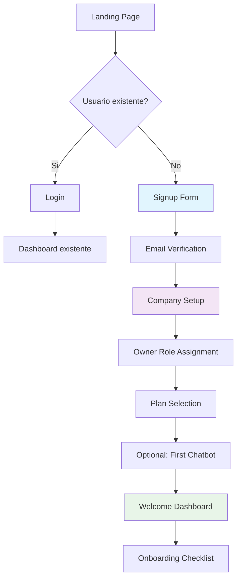

# NeurAnt - Flujo de Onboarding Self-Service

## Resumen

El flujo de onboarding self-service permite a nuevos usuarios registrarse en NeurAnt, crear su empresa y convertirse automáticamente en Owner, todo en un proceso fluido y sin fricción. Este diseño optimiza la conversión de visitantes a usuarios activos.

## Objetivos del Onboarding

### 1. **Conversion Optimization**
- Zero friction para empezar
- Time-to-value más rápido posible
- Clear value proposition en cada paso

### 2. **User Success**
- Guided setup process
- Sensible defaults para comenzar rápido
- Educational elements sin overwhelming

### 3. **Business Goals**
- High conversion rate (visitante → usuario activo)
- Collect minimum viable data para sales/marketing
- Set up for long-term engagement

## Flujo Completo de Onboarding



### Paso 1: Landing Page & Signup

```typescript
// app/signup/page.tsx
'use client'

export default function SignupPage() {
  const [step, setStep] = useState<'signup' | 'verify' | 'company'>('signup')
  const [userData, setUserData] = useState(null)

  return (
    <div className="min-h-screen bg-gradient-to-br from-blue-50 to-indigo-100">
      <div className="container mx-auto px-4 py-12">
        <div className="max-w-md mx-auto">
          {step === 'signup' && (
            <SignupForm 
              onSuccess={(data) => {
                setUserData(data)
                setStep('verify')
              }}
            />
          )}
          
          {step === 'verify' && (
            <EmailVerificationStep 
              email={userData.email}
              onVerified={() => setStep('company')}
            />
          )}
          
          {step === 'company' && (
            <CompanySetupForm 
              userData={userData}
              onComplete={(company) => {
                router.push('/onboarding/welcome')
              }}
            />
          )}
        </div>
      </div>
    </div>
  )
}
```

#### 1.1 Formulario de Registro

```typescript
// components/onboarding/SignupForm.tsx
const signupSchema = z.object({
  first_name: z.string().min(1, 'First name is required'),
  last_name: z.string().min(1, 'Last name is required'),
  email: z.string().email('Invalid email address'),
  password: z.string().min(8, 'Password must be at least 8 characters'),
  agree_terms: z.boolean().refine(val => val, 'You must agree to the terms')
})

export const SignupForm: React.FC<{
  onSuccess: (data: any) => void
}> = ({ onSuccess }) => {
  const [isSubmitting, setIsSubmitting] = useState(false)
  const { signUp } = useSupabaseAuth()

  const form = useForm<SignupFormData>({
    resolver: zodResolver(signupSchema)
  })

  const onSubmit = async (data: SignupFormData) => {
    try {
      setIsSubmitting(true)

      // 1. Create auth user
      const { data: authData, error } = await signUp({
        email: data.email,
        password: data.password,
        options: {
          data: {
            first_name: data.first_name,
            last_name: data.last_name
          }
        }
      })

      if (error) throw error

      // 2. Track signup event
      analytics.track('user_signup_started', {
        email: data.email,
        source: 'direct'
      })

      onSuccess({
        auth_user_id: authData.user?.id,
        email: data.email,
        first_name: data.first_name,
        last_name: data.last_name
      })

    } catch (error) {
      toast.error(error instanceof Error ? error.message : 'Signup failed')
    } finally {
      setIsSubmitting(false)
    }
  }

  return (
    <Card>
      <CardHeader className="text-center">
        <div className="mx-auto mb-4">
          <Logo className="h-8 w-auto" />
        </div>
        <CardTitle>Create your NeurAnt account</CardTitle>
        <CardDescription>
          Start creating AI chatbots for your business in minutes
        </CardDescription>
      </CardHeader>

      <CardContent>
        <form onSubmit={form.handleSubmit(onSubmit)} className="space-y-4">
          <div className="grid grid-cols-2 gap-4">
            <div>
              <Label htmlFor="first_name">First Name</Label>
              <Input
                id="first_name"
                {...form.register('first_name')}
                placeholder="John"
              />
              <FormError error={form.formState.errors.first_name} />
            </div>

            <div>
              <Label htmlFor="last_name">Last Name</Label>  
              <Input
                id="last_name"
                {...form.register('last_name')}
                placeholder="Doe"
              />
              <FormError error={form.formState.errors.last_name} />
            </div>
          </div>

          <div>
            <Label htmlFor="email">Work Email</Label>
            <Input
              id="email"
              type="email"
              {...form.register('email')}
              placeholder="john@company.com"
            />
            <FormError error={form.formState.errors.email} />
          </div>

          <div>
            <Label htmlFor="password">Password</Label>
            <PasswordInput
              id="password"
              {...form.register('password')}
              placeholder="Create a strong password"
            />
            <FormError error={form.formState.errors.password} />
            <p className="text-xs text-gray-500 mt-1">
              Must be at least 8 characters long
            </p>
          </div>

          <div className="flex items-center space-x-2">
            <Checkbox 
              id="agree_terms"
              {...form.register('agree_terms')}
            />
            <Label htmlFor="agree_terms" className="text-sm">
              I agree to the{' '}
              <Link href="/terms" className="text-blue-600 hover:underline">
                Terms of Service
              </Link>{' '}
              and{' '}
              <Link href="/privacy" className="text-blue-600 hover:underline">
                Privacy Policy
              </Link>
            </Label>
          </div>
          <FormError error={form.formState.errors.agree_terms} />

          <Button type="submit" disabled={isSubmitting} className="w-full">
            {isSubmitting ? (
              <>
                <Loader2 className="mr-2 h-4 w-4 animate-spin" />
                Creating account...
              </>
            ) : (
              'Create Account'
            )}
          </Button>
        </form>

        <div className="mt-6 text-center">
          <p className="text-sm text-gray-600">
            Already have an account?{' '}
            <Link href="/login" className="text-blue-600 hover:underline">
              Sign in
            </Link>
          </p>
        </div>
      </CardContent>
    </Card>
  )
}
```

#### 1.2 Verificación de Email

```typescript
// components/onboarding/EmailVerificationStep.tsx
export const EmailVerificationStep: React.FC<{
  email: string
  onVerified: () => void
}> = ({ email, onVerified }) => {
  const [isResending, setIsResending] = useState(false)
  const [countdown, setCountdown] = useState(0)

  // Check verification status periodically
  useEffect(() => {
    const checkVerification = async () => {
      const { data: { session } } = await supabase.auth.getSession()
      if (session?.user?.email_confirmed_at) {
        analytics.track('email_verified', { email })
        onVerified()
      }
    }

    const interval = setInterval(checkVerification, 2000)
    return () => clearInterval(interval)
  }, [onVerified])

  const resendVerification = async () => {
    try {
      setIsResending(true)
      
      const { error } = await supabase.auth.resend({
        type: 'signup',
        email: email
      })

      if (error) throw error

      toast.success('Verification email sent!')
      setCountdown(60)
      
      // Countdown timer
      const timer = setInterval(() => {
        setCountdown(prev => {
          if (prev <= 1) {
            clearInterval(timer)
            return 0
          }
          return prev - 1
        })
      }, 1000)

    } catch (error) {
      toast.error('Failed to resend verification email')
    } finally {
      setIsResending(false)
    }
  }

  return (
    <Card>
      <CardHeader className="text-center">
        <div className="mx-auto mb-4 p-3 bg-blue-100 rounded-full">
          <Mail className="h-6 w-6 text-blue-600" />
        </div>
        <CardTitle>Check your email</CardTitle>
        <CardDescription>
          We sent a verification link to<br />
          <strong>{email}</strong>
        </CardDescription>
      </CardHeader>

      <CardContent className="text-center space-y-4">
        <div className="bg-gray-50 p-4 rounded-lg">
          <h4 className="font-medium mb-2">What to do next:</h4>
          <ol className="text-sm text-gray-600 space-y-1 text-left">
            <li>1. Check your inbox (and spam folder)</li>
            <li>2. Click the verification link in the email</li>
            <li>3. Return to this page - we'll automatically continue</li>
          </ol>
        </div>

        <div className="flex items-center justify-center space-x-2 text-sm text-gray-500">
          <Loader2 className="h-4 w-4 animate-spin" />
          <span>Waiting for email verification...</span>
        </div>

        <div className="pt-4 border-t">
          <p className="text-sm text-gray-600 mb-3">
            Didn't receive the email?
          </p>
          
          <Button
            variant="outline"
            onClick={resendVerification}
            disabled={isResending || countdown > 0}
            className="w-full"
          >
            {isResending ? (
              <>
                <Loader2 className="mr-2 h-4 w-4 animate-spin" />
                Sending...
              </>
            ) : countdown > 0 ? (
              `Resend in ${countdown}s`
            ) : (
              'Resend verification email'
            )}
          </Button>
        </div>
      </CardContent>
    </Card>
  )
}
```

### Paso 2: Company Setup

```typescript
// components/onboarding/CompanySetupForm.tsx
const companySetupSchema = z.object({
  company_name: z.string().min(1, 'Company name is required'),
  industry: z.string().min(1, 'Please select an industry'),
  company_size: z.string().min(1, 'Please select company size'),
  website: z.string().url('Invalid URL').optional().or(z.literal('')),
  phone: z.string().optional()
})

export const CompanySetupForm: React.FC<{
  userData: any
  onComplete: (company: any) => void
}> = ({ userData, onComplete }) => {
  const [isSubmitting, setIsSubmitting] = useState(false)

  const form = useForm<CompanySetupFormData>({
    resolver: zodResolver(companySetupSchema),
    defaultValues: {
      // Pre-fill company name from email domain
      company_name: getCompanyNameFromEmail(userData.email)
    }
  })

  const onSubmit = async (data: CompanySetupFormData) => {
    try {
      setIsSubmitting(true)

      // Call atomic function to create user + company
      const response = await fetch('/api/onboarding/setup-company', {
        method: 'POST',
        headers: { 'Content-Type': 'application/json' },
        body: JSON.stringify({
          user_data: userData,
          company_data: data
        })
      })

      if (!response.ok) {
        const error = await response.json()
        throw new Error(error.error || 'Setup failed')
      }

      const result = await response.json()

      // Track successful company creation
      analytics.track('company_created', {
        company_id: result.company_id,
        industry: data.industry,
        company_size: data.company_size,
        user_id: result.user_id
      })

      onComplete(result)

    } catch (error) {
      toast.error(error instanceof Error ? error.message : 'Setup failed')
    } finally {
      setIsSubmitting(false)
    }
  }

  return (
    <Card>
      <CardHeader className="text-center">
        <CardTitle>Tell us about your company</CardTitle>
        <CardDescription>
          This helps us customize NeurAnt for your business needs
        </CardDescription>
      </CardHeader>

      <CardContent>
        <form onSubmit={form.handleSubmit(onSubmit)} className="space-y-4">
          <div>
            <Label htmlFor="company_name">Company Name</Label>
            <Input
              id="company_name"
              {...form.register('company_name')}
              placeholder="Acme Corp"
            />
            <FormError error={form.formState.errors.company_name} />
          </div>

          <div>
            <Label htmlFor="industry">Industry</Label>
            <Select onValueChange={(value) => form.setValue('industry', value)}>
              <SelectTrigger>
                <SelectValue placeholder="Select your industry" />
              </SelectTrigger>
              <SelectContent>
                <SelectItem value="technology">Technology</SelectItem>
                <SelectItem value="retail">Retail & E-commerce</SelectItem>
                <SelectItem value="healthcare">Healthcare</SelectItem>
                <SelectItem value="finance">Finance & Banking</SelectItem>
                <SelectItem value="education">Education</SelectItem>
                <SelectItem value="real-estate">Real Estate</SelectItem>
                <SelectItem value="hospitality">Hospitality</SelectItem>
                <SelectItem value="consulting">Consulting</SelectItem>
                <SelectItem value="other">Other</SelectItem>
              </SelectContent>
            </Select>
            <FormError error={form.formState.errors.industry} />
          </div>

          <div>
            <Label htmlFor="company_size">Company Size</Label>
            <Select onValueChange={(value) => form.setValue('company_size', value)}>
              <SelectTrigger>
                <SelectValue placeholder="How many employees?" />
              </SelectTrigger>
              <SelectContent>
                <SelectItem value="1">Just me</SelectItem>
                <SelectItem value="2-10">2-10 employees</SelectItem>
                <SelectItem value="11-50">11-50 employees</SelectItem>
                <SelectItem value="51-200">51-200 employees</SelectItem>
                <SelectItem value="201-1000">201-1000 employees</SelectItem>
                <SelectItem value="1000+">1000+ employees</SelectItem>
              </SelectContent>
            </Select>
            <FormError error={form.formState.errors.company_size} />
          </div>

          <div>
            <Label htmlFor="website">Website (Optional)</Label>
            <Input
              id="website"
              {...form.register('website')}
              placeholder="https://www.yourcompany.com"
            />
            <FormError error={form.formState.errors.website} />
          </div>

          <div>
            <Label htmlFor="phone">Phone (Optional)</Label>
            <Input
              id="phone"
              {...form.register('phone')}
              placeholder="+1 (555) 123-4567"
            />
            <FormError error={form.formState.errors.phone} />
          </div>

          <Button type="submit" disabled={isSubmitting} className="w-full">
            {isSubmitting ? (
              <>
                <Loader2 className="mr-2 h-4 w-4 animate-spin" />
                Setting up your company...
              </>
            ) : (
              'Continue'
            )}
          </Button>
        </form>
      </CardContent>
    </Card>
  )
}

function getCompanyNameFromEmail(email: string): string {
  const domain = email.split('@')[1]
  if (!domain) return ''
  
  // Remove common email providers
  const commonProviders = ['gmail.com', 'yahoo.com', 'hotmail.com', 'outlook.com']
  if (commonProviders.includes(domain)) return ''
  
  // Extract company name from domain
  return domain.split('.')[0].replace(/[-_]/g, ' ').replace(/\b\w/g, l => l.toUpperCase())
}
```

### Paso 3: API de Setup de Empresa

```typescript
// app/api/onboarding/setup-company/route.ts
interface SetupCompanyRequest {
  user_data: {
    auth_user_id: string
    email: string
    first_name: string
    last_name: string
  }
  company_data: {
    company_name: string
    industry: string
    company_size: string
    website?: string
    phone?: string
  }
}

export async function POST(req: Request) {
  try {
    const body: SetupCompanyRequest = await req.json()

    // Validate input
    const validation = setupCompanySchema.safeParse(body)
    if (!validation.success) {
      return NextResponse.json({ 
        error: 'Invalid data', 
        details: validation.error 
      }, { status: 400 })
    }

    // Create company and user atomically
    const { data: result, error } = await supabase.rpc('create_user_and_company', {
      user_data: {
        auth_user_id: body.user_data.auth_user_id,
        email: body.user_data.email,
        first_name: body.user_data.first_name,
        last_name: body.user_data.last_name
      },
      company_data: {
        name: body.company_data.company_name,
        industry: body.company_data.industry,
        website: body.company_data.website,
        phone: body.company_data.phone
      }
    })

    if (error) {
      console.error('Error creating user and company:', error)
      return NextResponse.json({ 
        error: 'Failed to setup company' 
      }, { status: 500 })
    }

    // Log successful onboarding
    await logAuditEvent({
      company_id: result.company_id,
      user_id: result.user_id,
      action: 'company_created',
      resource_type: 'company',
      resource_id: result.company_id,
      details: {
        industry: body.company_data.industry,
        company_size: body.company_data.company_size,
        onboarding_flow: 'self_service'
      }
    })

    // Track for analytics
    analytics.track('onboarding_company_setup_completed', {
      company_id: result.company_id,
      user_id: result.user_id,
      industry: body.company_data.industry,
      company_size: body.company_data.company_size
    })

    return NextResponse.json({
      success: true,
      company_id: result.company_id,
      user_id: result.user_id,
      company: {
        id: result.company_id,
        name: body.company_data.company_name,
        industry: body.company_data.industry
      }
    })

  } catch (error) {
    console.error('Setup company error:', error)
    return NextResponse.json({ 
      error: 'Internal server error' 
    }, { status: 500 })
  }
}
```

### Paso 4: Welcome Dashboard

```typescript
// app/onboarding/welcome/page.tsx
'use client'

export default function WelcomePage() {
  const { company, user } = useTenant()
  const [currentStep, setCurrentStep] = useState(0)

  const onboardingSteps = [
    {
      id: 'welcome',
      title: 'Welcome to NeurAnt!',
      description: 'Let\'s get you set up with your first AI chatbot',
      component: <WelcomeStep />
    },
    {
      id: 'plan',
      title: 'Choose Your Plan',
      description: 'Select the plan that fits your needs',
      component: <PlanSelectionStep />
    },
    {
      id: 'chatbot',
      title: 'Create Your First Chatbot',
      description: 'Set up an AI assistant for your customers',
      component: <FirstChatbotStep />
    },
    {
      id: 'complete',
      title: 'You\'re All Set!',
      description: 'Your chatbot is ready to handle customer conversations',
      component: <OnboardingCompleteStep />
    }
  ]

  return (
    <div className="min-h-screen bg-gray-50">
      <div className="container mx-auto px-4 py-8">
        <div className="max-w-2xl mx-auto">
          {/* Progress Bar */}
          <div className="mb-8">
            <div className="flex items-center justify-between mb-2">
              <span className="text-sm font-medium">Setup Progress</span>
              <span className="text-sm text-gray-500">
                {currentStep + 1} of {onboardingSteps.length}
              </span>
            </div>
            <Progress value={((currentStep) / (onboardingSteps.length - 1)) * 100} />
          </div>

          {/* Current Step */}
          <Card>
            <CardHeader className="text-center">
              <CardTitle>{onboardingSteps[currentStep].title}</CardTitle>
              <CardDescription>
                {onboardingSteps[currentStep].description}
              </CardDescription>
            </CardHeader>
            <CardContent>
              {onboardingSteps[currentStep].component}
            </CardContent>
          </Card>

          {/* Navigation */}
          <div className="flex justify-between mt-6">
            <Button
              variant="outline"
              onClick={() => setCurrentStep(prev => Math.max(0, prev - 1))}
              disabled={currentStep === 0}
            >
              Previous
            </Button>

            {currentStep < onboardingSteps.length - 1 ? (
              <Button onClick={() => setCurrentStep(prev => prev + 1)}>
                Next
              </Button>
            ) : (
              <Button onClick={() => router.push('/dashboard')}>
                Go to Dashboard
              </Button>
            )}
          </div>
        </div>
      </div>
    </div>
  )
}
```

#### 4.1 Step de Bienvenida

```typescript
// components/onboarding/WelcomeStep.tsx
export const WelcomeStep: React.FC = () => {
  const { company, user } = useTenant()

  return (
    <div className="text-center space-y-6">
      <div className="mx-auto w-16 h-16 bg-blue-100 rounded-full flex items-center justify-center">
        <Sparkles className="h-8 w-8 text-blue-600" />
      </div>

      <div>
        <h2 className="text-2xl font-bold mb-2">
          Welcome to NeurAnt, {user?.first_name}!
        </h2>
        <p className="text-gray-600">
          You're now the Owner of <strong>{company?.name}</strong> and ready to 
          create AI chatbots that will revolutionize your customer support.
        </p>
      </div>

      <div className="bg-blue-50 p-6 rounded-lg">
        <h3 className="font-semibold mb-3">What you can do with NeurAnt:</h3>
        <div className="grid md:grid-cols-2 gap-4 text-sm">
          <div className="flex items-start space-x-2">
            <Bot className="h-4 w-4 text-blue-600 mt-0.5" />
            <span>Create AI chatbots for WhatsApp, Telegram & Slack</span>
          </div>
          <div className="flex items-start space-x-2">
            <Users className="h-4 w-4 text-blue-600 mt-0.5" />
            <span>Handle customer conversations with Human-in-the-Loop</span>
          </div>
          <div className="flex items-start space-x-2">
            <FileText className="h-4 w-4 text-blue-600 mt-0.5" />
            <span>Train chatbots with your company documents</span>
          </div>
          <div className="flex items-start space-x-2">
            <BarChart className="h-4 w-4 text-blue-600 mt-0.5" />
            <span>Analyze performance with detailed analytics</span>
          </div>
        </div>
      </div>

      <div className="bg-yellow-50 border border-yellow-200 p-4 rounded-lg">
        <div className="flex items-center space-x-2">
          <Crown className="h-4 w-4 text-yellow-600" />
          <span className="font-medium text-yellow-800">You're the Owner!</span>
        </div>
        <p className="text-sm text-yellow-700 mt-1">
          As the Owner, you have full control over your company's NeurAnt account. 
          You can invite team members, manage settings, and upgrade plans.
        </p>
      </div>
    </div>
  )
}
```

#### 4.2 Selección de Plan

```typescript
// components/onboarding/PlanSelectionStep.tsx
export const PlanSelectionStep: React.FC = () => {
  const { company } = useTenant()
  const [selectedPlan, setSelectedPlan] = useState('free')
  const [isUpgrading, setIsUpgrading] = useState(false)

  const plans = [
    {
      id: 'free',
      name: 'Free',
      price: '$0',
      description: 'Perfect for getting started',
      features: [
        '1 chatbot',
        '500 messages/month',
        '2 users total',
        'WhatsApp only',
        'Email support'
      ],
      recommended: false
    },
    {
      id: 'starter',
      name: 'Starter',
      price: '$39',
      priceNote: '/month',
      description: 'Great for small businesses',
      features: [
        '2 chatbots',
        '3,000 messages/month',
        '3 users total',
        'WhatsApp + Telegram',
        'Document training (50K chars)',
        'HITL support',
        'Email support'
      ],
      recommended: true
    },
    {
      id: 'professional',
      name: 'Professional',
      price: '$89',
      priceNote: '/month',
      description: 'Ideal for growing teams',
      features: [
        '3 chatbots',
        '8,000 messages/month',
        '8 users total',
        'All channels',
        'Document training (250K chars)',
        'Advanced HITL',
        '3 integrations',
        'Priority email support'
      ],
      recommended: false
    }
  ]

  const handlePlanSelect = async (planId: string) => {
    if (planId === 'free') {
      // Free plan is already set by default
      analytics.track('onboarding_plan_selected', { 
        plan: 'free',
        company_id: company?.id 
      })
      return
    }

    try {
      setIsUpgrading(true)
      
      // Here you would integrate with your billing system
      // For now, we'll just track the selection
      analytics.track('onboarding_plan_selected', { 
        plan: planId,
        company_id: company?.id 
      })

      toast.success('Plan selected! You can upgrade later from settings.')
      
    } catch (error) {
      toast.error('Failed to select plan')
    } finally {
      setIsUpgrading(false)
    }
  }

  return (
    <div className="space-y-6">
      <div className="text-center">
        <h3 className="text-lg font-semibold mb-2">Choose Your Plan</h3>
        <p className="text-gray-600">
          Start with our free plan and upgrade anytime as you grow
        </p>
      </div>

      <div className="grid gap-4">
        {plans.map((plan) => (
          <div
            key={plan.id}
            className={`relative border-2 rounded-lg p-4 cursor-pointer transition-colors ${
              selectedPlan === plan.id
                ? 'border-blue-500 bg-blue-50'
                : 'border-gray-200 hover:border-gray-300'
            }`}
            onClick={() => setSelectedPlan(plan.id)}
          >
            {plan.recommended && (
              <div className="absolute -top-2 left-4 bg-blue-600 text-white text-xs px-2 py-1 rounded">
                Recommended
              </div>
            )}

            <div className="flex items-center justify-between mb-3">
              <div>
                <h4 className="font-semibold">{plan.name}</h4>
                <p className="text-sm text-gray-600">{plan.description}</p>
              </div>
              <div className="text-right">
                <div className="text-2xl font-bold">
                  {plan.price}
                  {plan.priceNote && (
                    <span className="text-sm font-normal text-gray-500">
                      {plan.priceNote}
                    </span>
                  )}
                </div>
              </div>
            </div>

            <ul className="space-y-1 text-sm text-gray-600">
              {plan.features.map((feature, index) => (
                <li key={index} className="flex items-center space-x-2">
                  <Check className="h-4 w-4 text-green-500" />
                  <span>{feature}</span>
                </li>
              ))}
            </ul>

            <Radio
              className="absolute top-4 right-4"
              checked={selectedPlan === plan.id}
              onChange={() => setSelectedPlan(plan.id)}
            />
          </div>
        ))}
      </div>

      <Button
        onClick={() => handlePlanSelect(selectedPlan)}
        disabled={isUpgrading}
        className="w-full"
      >
        {isUpgrading ? (
          <>
            <Loader2 className="mr-2 h-4 w-4 animate-spin" />
            Setting up plan...
          </>
        ) : selectedPlan === 'free' ? (
          'Continue with Free Plan'
        ) : (
          `Start with ${plans.find(p => p.id === selectedPlan)?.name} Plan`
        )}
      </Button>

      <p className="text-xs text-gray-500 text-center">
        You can upgrade, downgrade, or cancel your plan at any time from your account settings.
      </p>
    </div>
  )
}
```

#### 4.3 Primer Chatbot (Opcional)

```typescript
// components/onboarding/FirstChatbotStep.tsx
export const FirstChatbotStep: React.FC = () => {
  const { company } = useTenant()
  const [skipChatbot, setSkipChatbot] = useState(false)
  const [selectedTemplate, setSelectedTemplate] = useState('')
  const [isCreating, setIsCreating] = useState(false)

  const templates = [
    {
      id: 'customer-service',
      name: 'Customer Service Assistant',
      description: 'Help customers with common questions and support requests',
      icon: <HeadphonesIcon className="h-6 w-6" />,
      suitable_for: ['retail', 'technology', 'other']
    },
    {
      id: 'sales-assistant',
      name: 'Sales Assistant',
      description: 'Qualify leads and provide product information',
      icon: <TrendingUp className="h-6 w-6" />,
      suitable_for: ['retail', 'real-estate', 'consulting']
    },
    {
      id: 'appointment-booking',
      name: 'Appointment Booking',
      description: 'Help customers schedule appointments and consultations',
      icon: <Calendar className="h-6 w-6" />,
      suitable_for: ['healthcare', 'consulting', 'hospitality']
    }
  ]

  // Filter templates based on company industry
  const relevantTemplates = templates.filter(template => 
    template.suitable_for.includes(company?.industry || 'other')
  )

  const createFirstChatbot = async () => {
    try {
      setIsCreating(true)

      const template = templates.find(t => t.id === selectedTemplate)
      
      const response = await fetch('/api/chatbots', {
        method: 'POST',
        headers: { 'Content-Type': 'application/json' },
        body: JSON.stringify({
          name: `${company?.name} Assistant`,
          description: template?.description,
          template_id: selectedTemplate,
          channels: ['whatsapp'], // Start with WhatsApp
          is_active: false // Start inactive until they set it up
        })
      })

      if (!response.ok) throw new Error('Failed to create chatbot')

      const chatbot = await response.json()

      analytics.track('onboarding_first_chatbot_created', {
        company_id: company?.id,
        chatbot_id: chatbot.id,
        template: selectedTemplate
      })

      toast.success('Your first chatbot has been created!')

    } catch (error) {
      toast.error('Failed to create chatbot')
    } finally {
      setIsCreating(false)
    }
  }

  return (
    <div className="space-y-6">
      <div className="text-center">
        <h3 className="text-lg font-semibold mb-2">Create Your First Chatbot</h3>
        <p className="text-gray-600">
          Choose a template that matches your business needs, or skip this step and create one later
        </p>
      </div>

      {!skipChatbot ? (
        <>
          <div className="space-y-3">
            {relevantTemplates.map((template) => (
              <div
                key={template.id}
                className={`border-2 rounded-lg p-4 cursor-pointer transition-colors ${
                  selectedTemplate === template.id
                    ? 'border-blue-500 bg-blue-50'
                    : 'border-gray-200 hover:border-gray-300'
                }`}
                onClick={() => setSelectedTemplate(template.id)}
              >
                <div className="flex items-center space-x-3">
                  <div className="p-2 bg-white rounded-lg border">
                    {template.icon}
                  </div>
                  <div className="flex-1">
                    <h4 className="font-medium">{template.name}</h4>
                    <p className="text-sm text-gray-600">{template.description}</p>
                  </div>
                  <Radio
                    checked={selectedTemplate === template.id}
                    onChange={() => setSelectedTemplate(template.id)}
                  />
                </div>
              </div>
            ))}
          </div>

          <div className="flex space-x-3">
            <Button
              onClick={createFirstChatbot}
              disabled={!selectedTemplate || isCreating}
              className="flex-1"
            >
              {isCreating ? (
                <>
                  <Loader2 className="mr-2 h-4 w-4 animate-spin" />
                  Creating chatbot...
                </>
              ) : (
                'Create My First Chatbot'
              )}
            </Button>
          </div>

          <div className="text-center">
            <Button
              variant="ghost"
              onClick={() => setSkipChatbot(true)}
              className="text-sm"
            >
              Skip for now - I'll create it later
            </Button>
          </div>
        </>
      ) : (
        <div className="text-center space-y-4">
          <div className="mx-auto w-16 h-16 bg-gray-100 rounded-full flex items-center justify-center">
            <ArrowRight className="h-8 w-8 text-gray-400" />
          </div>
          <div>
            <h4 className="font-medium mb-2">No problem!</h4>
            <p className="text-gray-600">
              You can create your first chatbot anytime from the dashboard. 
              We'll have everything ready for you.
            </p>
          </div>
          <Button
            variant="outline"
            onClick={() => setSkipChatbot(false)}
          >
            Actually, let me create one now
          </Button>
        </div>
      )}
    </div>
  )
}
```

### Paso 5: Onboarding Checklist

```typescript
// components/dashboard/OnboardingChecklist.tsx
export const OnboardingChecklist: React.FC = () => {
  const { company, user } = useTenant()
  const [checklist, setChecklist] = useState([
    {
      id: 'create_chatbot',
      title: 'Create your first chatbot',
      description: 'Set up an AI assistant for your customers',
      completed: false,
      action: () => router.push('/chatbots/new')
    },
    {
      id: 'connect_whatsapp',
      title: 'Connect WhatsApp Business',
      description: 'Link your WhatsApp Business account',
      completed: false,
      action: () => router.push('/integrations/whatsapp')
    },
    {
      id: 'upload_documents',
      title: 'Upload training documents',
      description: 'Add company documents to improve responses',
      completed: false,
      action: () => router.push('/knowledge-base')
    },
    {
      id: 'invite_team',
      title: 'Invite team members',
      description: 'Add colleagues to help manage conversations',
      completed: false,
      action: () => router.push('/settings/team')
    },
    {
      id: 'test_chatbot',
      title: 'Test your chatbot',
      description: 'Send a test message to see how it responds',
      completed: false,
      action: () => router.push('/chatbots')
    }
  ])

  const completedCount = checklist.filter(item => item.completed).length
  const progress = (completedCount / checklist.length) * 100

  // Check completion status periodically
  useEffect(() => {
    checkCompletionStatus()
  }, [])

  const checkCompletionStatus = async () => {
    // Check if user has created chatbots
    const { data: chatbots } = await supabase
      .from('chatbots')
      .select('id')
      .eq('company_id', company?.id)

    // Update checklist based on actual data
    setChecklist(prev => prev.map(item => {
      switch (item.id) {
        case 'create_chatbot':
          return { ...item, completed: (chatbots?.length || 0) > 0 }
        // Add other checks...
        default:
          return item
      }
    }))
  }

  if (progress === 100) {
    return null // Hide when completed
  }

  return (
    <Card>
      <CardHeader>
        <div className="flex items-center justify-between">
          <div>
            <CardTitle className="text-lg">Get Started with NeurAnt</CardTitle>
            <CardDescription>
              Complete these steps to get the most out of your AI chatbots
            </CardDescription>
          </div>
          <div className="text-right">
            <div className="text-2xl font-bold text-blue-600">
              {completedCount}/{checklist.length}
            </div>
            <div className="text-xs text-gray-500">completed</div>
          </div>
        </div>
        <Progress value={progress} className="mt-3" />
      </CardHeader>

      <CardContent>
        <div className="space-y-3">
          {checklist.map((item) => (
            <div
              key={item.id}
              className={`flex items-center space-x-3 p-3 rounded-lg border ${
                item.completed 
                  ? 'bg-green-50 border-green-200' 
                  : 'bg-gray-50 border-gray-200 hover:bg-gray-100'
              }`}
            >
              <div className="flex-shrink-0">
                {item.completed ? (
                  <div className="w-6 h-6 bg-green-500 rounded-full flex items-center justify-center">
                    <Check className="h-4 w-4 text-white" />
                  </div>
                ) : (
                  <div className="w-6 h-6 border-2 border-gray-300 rounded-full" />
                )}
              </div>

              <div className="flex-1">
                <h4 className={`font-medium ${item.completed ? 'text-green-800' : ''}`}>
                  {item.title}
                </h4>
                <p className={`text-sm ${item.completed ? 'text-green-600' : 'text-gray-600'}`}>
                  {item.description}
                </p>
              </div>

              {!item.completed && (
                <Button
                  size="sm"
                  variant="outline"
                  onClick={item.action}
                >
                  Start
                </Button>
              )}
            </div>
          ))}
        </div>

        {completedCount > 0 && completedCount < checklist.length && (
          <div className="mt-4 p-3 bg-blue-50 rounded-lg">
            <p className="text-sm text-blue-700">
              🎉 Great progress! Complete {checklist.length - completedCount} more steps 
              to unlock the full potential of NeurAnt.
            </p>
          </div>
        )}
      </CardContent>
    </Card>
  )
}
```

## Analytics y Tracking

```typescript
// lib/onboarding-analytics.ts
export const trackOnboardingEvent = (event: string, properties?: Record<string, any>) => {
  analytics.track(`onboarding_${event}`, {
    ...properties,
    timestamp: new Date().toISOString(),
    user_agent: navigator.userAgent,
    referrer: document.referrer
  })
}

// Events to track:
const onboardingEvents = [
  'signup_started',
  'signup_completed', 
  'email_verified',
  'company_setup_started',
  'company_setup_completed',
  'plan_selected',
  'first_chatbot_created',
  'onboarding_completed',
  'checklist_item_completed'
]
```

## Métricas de Éxito

### Conversion Funnel
1. **Landing Page → Signup**: Target 15%+ conversion
2. **Signup → Email Verified**: Target 80%+ conversion  
3. **Email Verified → Company Setup**: Target 90%+ conversion
4. **Company Setup → First Login**: Target 95%+ conversion
5. **First Login → Active Usage (7 days)**: Target 60%+ conversion

### Time-to-Value Metrics
- **Signup to company setup**: < 5 minutes
- **Company setup to first chatbot**: < 10 minutes
- **First chatbot to first message**: < 24 hours

### Engagement Metrics
- **Onboarding completion rate**: Target 70%+
- **Checklist completion rate**: Target 50%+
- **30-day retention**: Target 40%+

## Optimizaciones Futuras

### A/B Tests Candidates
1. **Signup form length**: Short vs detailed
2. **Company setup timing**: Immediate vs delayed
3. **Template selection**: Industry-specific vs generic
4. **Plan selection**: During onboarding vs post-setup

### Personalization Opportunities
1. **Industry-specific templates**
2. **Company size-based recommendations**
3. **Role-based onboarding paths**
4. **Progressive disclosure of features**

<function_calls>
<invoke name="TodoWrite">
<parameter name="todos">[{"id": "multi_tenant_refinement", "content": "Refinar y clarificar arquitectura multi-tenant con detalles espec\u00edficos", "status": "completed", "priority": "high"}, {"id": "update_adr_001", "content": "Actualizar ADR-001 con estrategia Single Domain + Context y rol Owner", "status": "completed", "priority": "high"}, {"id": "refine_database_schema", "content": "Refinar schema con campos Owner, invitaciones y l\u00edmites por plan", "status": "completed", "priority": "high"}, {"id": "enhance_rls_policies", "content": "Mejorar pol\u00edticas RLS con permisos granulares por rol", "status": "completed", "priority": "high"}, {"id": "design_context_management", "content": "Dise\u00f1ar sistema de gesti\u00f3n de contexto de tenant", "status": "completed", "priority": "medium"}, {"id": "create_invitation_system", "content": "Crear dise\u00f1o completo del sistema de invitaciones", "status": "completed", "priority": "medium"}, {"id": "document_onboarding_flow", "content": "Documentar flujo detallado de onboarding self-service", "status": "completed", "priority": "medium"}]