# NeurAnt - Arquitectura RBAC-HITL Integrada

## Resumen

Este documento especifica la arquitectura integrada del sistema RBAC (Control de Acceso Basado en Roles) con el módulo HITL (Human-in-the-Loop) de NeurAnt. Define la estructura jerárquica de roles, patrones de autorización, y flujos de transferencia de sesiones entre roles.

## Arquitectura de Componentes C4

### 1. Diagrama de Contexto - RBAC-HITL


### 2. Diagrama de Contenedores - RBAC-HITL


### 3. Diagrama de Componentes - Servicio RBAC


## Flujos de Transferencia HITL por Roles

### 1. Flujo Completo de Escalamiento HITL


### 2. Matriz de Transferencias Permitidas


### 3. Estados de Sesión HITL Extendidos


## Arquitectura de Asignaciones y Scope

### 1. Modelo de Asignación Jerárquica


### 2. Scope de Acceso por Rol


## Patrones de Autorización

### 1. Patrón de Herencia Jerárquica


### 2. Patrón de Verificación de Permisos


## Políticas de Seguridad RLS Extendidas

### 1. Política de Acceso a Chatbots por Rol

```sql
-- Política conceptual para acceso a chatbots
CREATE POLICY chatbot_access_by_role ON chatbots
FOR ALL USING (
  CASE get_user_role(auth.uid())
    WHEN 'owner' THEN company_id = get_user_company_id(auth.uid())
    WHEN 'administrador' THEN company_id = get_user_company_id(auth.uid())
    WHEN 'supervisor' THEN 
      id IN (
        SELECT chatbot_id FROM chatbot_supervisors 
        WHERE supervisor_id = get_current_user_id(auth.uid())
      )
    WHEN 'operador' THEN 
      id IN (
        SELECT chatbot_id FROM chatbot_operators 
        WHERE operator_id = get_current_user_id(auth.uid()) 
        AND is_active = true
      )
    ELSE false
  END
);
```

### 2. Política de Transferencias HITL

```sql
-- Política conceptual para transferencias HITL
CREATE POLICY hitl_transfer_access ON hitl_transfers
FOR ALL USING (
  CASE get_user_role(auth.uid())
    WHEN 'owner' THEN 
      session_id IN (
        SELECT id FROM hitl_sessions 
        WHERE company_id = get_user_company_id(auth.uid())
      )
    WHEN 'administrador' THEN 
      session_id IN (
        SELECT id FROM hitl_sessions 
        WHERE company_id = get_user_company_id(auth.uid())
      )
    WHEN 'supervisor' THEN 
      (from_user_id = get_current_user_id(auth.uid()) OR 
       to_user_id = get_current_user_id(auth.uid()) OR
       session_id IN (
         SELECT hs.id FROM hitl_sessions hs
         JOIN conversations c ON hs.conversation_id = c.id
         JOIN chatbot_supervisors cs ON c.chatbot_id = cs.chatbot_id
         WHERE cs.supervisor_id = get_current_user_id(auth.uid())
       ))
    WHEN 'operador' THEN 
      (from_user_id = get_current_user_id(auth.uid()) OR 
       to_user_id = get_current_user_id(auth.uid()))
    ELSE false
  END
);
```

## Métricas y Observabilidad RBAC-HITL

### 1. Dashboard de Métricas por Rol


### 2. Alertas de Seguridad RBAC

```mermaid
graph LR
    subgraph "Eventos de Seguridad"
        FailedAuth[Intentos Fallidos<br/>de Autenticación]
        PrivEscalation[Intentos de Escalación<br/>de Privilegios]
        UnauthorizedAccess[Acceso No Autorizado<br/>a Recursos]
        SuspiciousTransfer[Transferencias<br/>Sospechosas]
        RoleViolation[Violaciones de<br/>Separación de Roles]
    end
    
    subgraph "Respuestas Automáticas"
        Alert[Alerta Inmediata]
        Block[Bloqueo Temporal]
        Log[Log Detallado]
        Escalate[Escalamiento a Admin]
    end
    
    FailedAuth --> Alert
    PrivEscalation --> Block
    UnauthorizedAccess --> Log
    SuspiciousTransfer --> Escalate
    RoleViolation --> Alert
```



## Integración con Módulos Existentes

### 1. Integración con Sistema de Invitaciones


### 2. Integración con Analytics y Reportes


## Próximos Pasos de Implementación

### Fase 1: Foundation (Sprint 1-2)
1. ✅ Implementar jerarquía de roles en base de datos
2. ✅ Crear motor de permisos jerárquico
3. ✅ Actualizar políticas RLS para nuevos flujos
4. ✅ Sistema básico de auditoría RBAC

### Fase 2: Asignaciones (Sprint 3)
1. ⏳ Tabla `chatbot_supervisors` con constraint único
2. ⏳ API de gestión de asignaciones supervisor-chatbot
3. ⏳ API de gestión de asignaciones operador por supervisor
4. ⏳ Validaciones de scope en todas las operaciones

### Fase 3: Transferencias HITL (Sprint 4-5)
1. ⏳ Sistema completo de transferencias entre roles
2. ⏳ Notificaciones real-time de transferencias
3. ⏳ Estados de sesión extendidos para transferencias
4. ⏳ Dashboard de gestión de transferencias

### Fase 4: UI y Optimización (Sprint 6)
1. ⏳ Interfaces de usuario adaptadas por rol
2. ⏳ Cache de permisos para optimización
3. ⏳ Testing exhaustivo de seguridad
4. ⏳ Documentación de usuario final

---

*Esta arquitectura RBAC-HITL integrada proporciona la base para un control de acceso granular y flujos de escalamiento humano eficientes en la plataforma NeurAnt.*