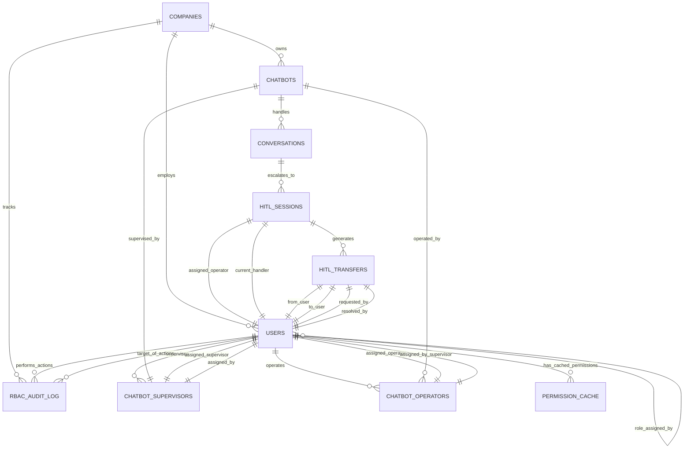

# NeurAnt - Modelo de Datos RBAC Extendido

## Resumen

Este documento especifica el modelo conceptual de datos extendido para soportar el sistema RBAC avanzado con HITL integrado. Define las entidades, relaciones y constraits necesarios para implementar la jerarquía de roles, asignaciones granulares y transferencias HITL.

## Principios del Modelo de Datos

### 1. **Integridad Referencial Estricta**
- Constraints para garantizar consistencia de asignaciones
- Validaciones de jerarquía de roles a nivel de datos
- Prevención de estados inconsistentes mediante constraints

### 2. **Escalabilidad Multi-tenant**
- Todas las entidades incluyen contexto de empresa (`company_id`)
- Índices optimizados para consultas tenant-aware
- Particionado preparado para crecimiento futuro

### 3. **Auditabilidad Completa**
- Tracking de cambios en asignaciones críticas
- Historial inmutable de transferencias HITL
- Metadatos de auditoría en todas las entidades principales

### 4. **Rendimiento Optimizado**
- Desnormalización estratégica para consultas frecuentes
- Cache-friendly design para permisos
- Índices específicos para patrones de acceso por rol

## Extensiones al Modelo Existente

### 1. Entidades Principales Extendidas

#### Users (Extendida)
```
Tabla: users
Propósito: Información de usuarios con roles jerárquicos

Campos Existentes:
├── id: uuid (PK)
├── company_id: uuid (FK → companies.id)
├── auth_user_id: uuid (FK → auth.users.id)
├── email: string
├── first_name: string
├── last_name: string
├── role: enum('owner', 'administrador', 'supervisor', 'operador')
├── is_owner: boolean
├── is_active: boolean
└── created_at: timestamp

Campos Nuevos (Extensión RBAC):
├── permissions_cache: jsonb
├── last_permission_update: timestamp
├── role_assigned_by: uuid (FK → users.id)
├── role_assigned_at: timestamp
├── can_assign_roles: string[] (roles que puede asignar)
├── login_attempts: integer
├── last_failed_login: timestamp
└── account_locked_until: timestamp

Índices Estratégicos:
├── idx_users_company_role (company_id, role, is_active)
├── idx_users_permissions_cache (company_id, (permissions_cache->'lastUpdated'))
└── idx_users_active_operators (company_id, id) WHERE role = 'operador' AND is_active = true

Constraints de Negocio:
├── unique_owner_per_company: UNIQUE(company_id) WHERE is_owner = true
├── role_hierarchy_validation: Validar que role_assigned_by tenga permisos
└── permissions_cache_ttl: Validar freshness de cache de permisos
```

#### Chatbots (Extendida)
```
Tabla: chatbots
Propósito: Chatbots con asignaciones de supervisión

Campos Existentes:
├── id: uuid (PK)
├── company_id: uuid (FK → companies.id)
├── name: string
├── system_prompt: text
├── is_active: boolean
└── created_at: timestamp

Campos Nuevos (Extensión RBAC):
├── assigned_supervisor_id: uuid (FK → users.id)
├── supervisor_assigned_by: uuid (FK → users.id)
├── supervisor_assigned_at: timestamp
├── requires_supervisor: boolean DEFAULT true
├── operator_assignment_strategy: enum('round_robin', 'least_busy', 'skill_based')
├── max_concurrent_hitl: integer DEFAULT 5
└── hitl_escalation_timeout_minutes: integer DEFAULT 30

Índices Estratégicos:
├── idx_chatbots_supervisor (company_id, assigned_supervisor_id)
├── idx_chatbots_active (company_id, is_active)
└── idx_chatbots_hitl_config (company_id, requires_supervisor, is_active)

Constraints de Negocio:
├── supervisor_role_validation: assigned_supervisor_id debe tener role 'supervisor'
├── supervisor_same_company: assigned_supervisor_id.company_id = company_id
└── valid_hitl_config: max_concurrent_hitl > 0 AND hitl_escalation_timeout_minutes > 0
```

### 2. Nuevas Entidades RBAC

#### Chatbot_Supervisors
```
Tabla: chatbot_supervisors
Propósito: Asignación única de supervisor por chatbot

Schema Conceptual:
├── id: uuid (PK)
├── company_id: uuid (FK → companies.id)
├── chatbot_id: uuid (FK → chatbots.id) [UNIQUE]
├── supervisor_id: uuid (FK → users.id)
├── assigned_by: uuid (FK → users.id)
├── assigned_at: timestamp
├── is_active: boolean DEFAULT true
├── assignment_notes: text
├── created_at: timestamp
└── updated_at: timestamp

Relaciones:
├── UNIQUE constraint en (chatbot_id) - Un supervisor por chatbot
├── FK constraint en supervisor_id → users(id) WHERE role = 'supervisor'
├── FK constraint en assigned_by → users(id) WHERE role IN ('owner', 'administrador')
└── Mismo company_id para chatbot, supervisor y assigner

Índices Estratégicos:
├── idx_chatbot_supervisors_unique (chatbot_id) UNIQUE
├── idx_chatbot_supervisors_supervisor (company_id, supervisor_id, is_active)
└── idx_chatbot_supervisors_assigned_by (company_id, assigned_by, assigned_at)

Reglas de Negocio:
├── Un chatbot solo puede tener un supervisor activo
├── Un supervisor puede manejar múltiples chatbots
├── Solo Owner/Admin pueden asignar supervisores
└── Supervisor debe estar en la misma empresa que el chatbot
```

#### Chatbot_Operators (Extendida)
```
Tabla: chatbot_operators
Propósito: Asignación de operadores a chatbots específicos por supervisor

Schema Extendido:
├── id: uuid (PK)
├── company_id: uuid (FK → companies.id)
├── chatbot_id: uuid (FK → chatbots.id)
├── operator_id: uuid (FK → users.id)
├── assigned_by_supervisor: uuid (FK → users.id)
├── assigned_at: timestamp
├── is_active: boolean DEFAULT true
├── can_transfer_to: uuid[] (FK → users.id)
├── max_concurrent_sessions: integer DEFAULT 3
├── skill_tags: string[]
├── assignment_notes: text
├── last_activity_at: timestamp
├── created_at: timestamp
└── updated_at: timestamp

Relaciones:
├── FK constraint en operator_id → users(id) WHERE role = 'operador'
├── FK constraint en assigned_by_supervisor → users(id) WHERE role = 'supervisor'
├── UNIQUE constraint en (chatbot_id, operator_id) - No duplicados
└── FK constraint en can_transfer_to[] → users(id) WHERE role IN ('supervisor', 'administrador', 'owner')

Índices Estratégicos:
├── idx_chatbot_operators_operator (company_id, operator_id, is_active)
├── idx_chatbot_operators_chatbot (company_id, chatbot_id, is_active)
├── idx_chatbot_operators_supervisor (company_id, assigned_by_supervisor)
└── idx_chatbot_operators_skills (company_id, skill_tags) USING GIN

Reglas de Negocio:
├── Operador solo puede ser asignado por supervisor del chatbot
├── can_transfer_to solo incluye roles superiores al operador
├── max_concurrent_sessions debe ser > 0
└── skill_tags son opcionales pero útiles para asignación inteligente
```

### 3. Entidades HITL Extendidas

#### HITL_Sessions (Extendida)
```
Tabla: hitl_sessions
Propósito: Sesiones HITL con soporte completo para transferencias

Schema Extendido:
├── id: uuid (PK)
├── company_id: uuid (FK → companies.id)
├── conversation_id: uuid (FK → conversations.id)
├── chatbot_id: uuid (FK → chatbots.id)

// Asignación y Handling
├── assigned_operator_id: uuid (FK → users.id)
├── current_handler_id: uuid (FK → users.id)
├── assigned_at: timestamp
├── handler_changed_at: timestamp

// Estado de Transferencias
├── transfer_pending: boolean DEFAULT false
├── transfer_requested_at: timestamp
├── transfer_requested_by: uuid (FK → users.id)
├── transfer_target_user: uuid (FK → users.id)
├── transfer_reason: text
├── transfer_notes: text

// Estados y Métricas
├── status: enum('pending', 'active', 'transferred', 'resolved', 'abandoned')
├── started_at: timestamp
├── resolved_at: timestamp
├── first_response_time_seconds: integer
├── total_response_time_seconds: integer
├── total_operator_messages: integer
├── total_transfers: integer

// Resolución
├── resolution_type: enum('resolved_by_operator', 'resolved_by_supervisor', 'resolved_by_admin', 'customer_left', 'timeout')
├── resolution_notes: text
├── handoff_successful: boolean DEFAULT false
├── customer_satisfaction_rating: integer CHECK (rating BETWEEN 1 AND 5)

├── created_at: timestamp
└── updated_at: timestamp

Índices Estratégicos:
├── idx_hitl_sessions_operator (company_id, assigned_operator_id, status)
├── idx_hitl_sessions_handler (company_id, current_handler_id, status)
├── idx_hitl_sessions_chatbot (company_id, chatbot_id, created_at)
├── idx_hitl_sessions_transfer (company_id, transfer_pending, transfer_requested_at)
└── idx_hitl_sessions_metrics (company_id, resolved_at, resolution_type)

Constraints de Negocio:
├── handler_is_assigned_or_transferred: current_handler_id debe ser assigned_operator_id o target de transferencia
├── transfer_target_higher_role: transfer_target_user debe tener rol superior al solicitante
├── same_company_all_users: Todos los user_ids deben ser de la misma empresa
└── valid_timestamps: assigned_at <= handler_changed_at <= resolved_at
```

#### HITL_Transfers (Nueva)
```
Tabla: hitl_transfers
Propósito: Historial detallado de todas las transferencias HITL

Schema Conceptual:
├── id: uuid (PK)
├── company_id: uuid (FK → companies.id)
├── session_id: uuid (FK → hitl_sessions.id)
├── conversation_id: uuid (FK → conversations.id)

// Participantes de la Transferencia
├── from_user_id: uuid (FK → users.id)
├── to_user_id: uuid (FK → users.id)
├── requested_by: uuid (FK → users.id)
├── resolved_by: uuid (FK → users.id)

// Detalles de la Transferencia
├── transfer_reason: text NOT NULL
├── transfer_type: enum('escalation', 'skill_based', 'workload_distribution', 'emergency')
├── priority: enum('low', 'medium', 'high', 'urgent') DEFAULT 'medium'
├── urgency_notes: text

// Estado y Timing
├── status: enum('pending', 'accepted', 'rejected', 'expired', 'cancelled')
├── requested_at: timestamp NOT NULL
├── responded_at: timestamp
├── resolved_at: timestamp
├── expires_at: timestamp
├── response_time_seconds: integer

// Resolución
├── resolution_notes: text
├── rejection_reason: text
├── auto_expired: boolean DEFAULT false

// Metadatos
├── notification_sent: boolean DEFAULT false
├── notification_methods: string[] (email, push, in_app)
├── created_at: timestamp
└── updated_at: timestamp

Índices Estratégicos:
├── idx_hitl_transfers_session (session_id, created_at)
├── idx_hitl_transfers_from_user (company_id, from_user_id, status)
├── idx_hitl_transfers_to_user (company_id, to_user_id, status)
├── idx_hitl_transfers_pending (company_id, status, expires_at) WHERE status = 'pending'
└── idx_hitl_transfers_metrics (company_id, resolved_at, transfer_type)

Constraints de Negocio:
├── from_to_different: from_user_id != to_user_id
├── valid_role_hierarchy: to_user_id debe tener rol superior o igual a from_user_id
├── same_company_users: Todos los usuarios deben ser de la misma empresa
├── valid_status_transitions: Solo transiciones válidas de estado
└── response_before_resolution: responded_at <= resolved_at
```

### 4. Entidades de Auditoría RBAC

#### RBAC_Audit_Log (Nueva)
```
Tabla: rbac_audit_log
Propósito: Registro completo de todas las acciones RBAC críticas

Schema Conceptual:
├── id: uuid (PK)
├── company_id: uuid (FK → companies.id)
├── user_id: uuid (FK → users.id)
├── target_user_id: uuid (FK → users.id) [NULLABLE]
├── target_resource_type: enum('user', 'chatbot', 'session', 'assignment')
├── target_resource_id: uuid
├── action: enum('create', 'update', 'delete', 'assign', 'unassign', 'transfer', 'permission_check')
├── action_details: jsonb
├── old_values: jsonb
├── new_values: jsonb
├── success: boolean
├── failure_reason: text
├── ip_address: inet
├── user_agent: text
├── session_id: uuid
├── request_id: uuid
├── performed_at: timestamp NOT NULL
├── created_at: timestamp
└── severity: enum('low', 'medium', 'high', 'critical') DEFAULT 'medium'

Índices Estratégicos:
├── idx_rbac_audit_company_time (company_id, performed_at)
├── idx_rbac_audit_user (company_id, user_id, performed_at)
├── idx_rbac_audit_action (company_id, action, performed_at)
├── idx_rbac_audit_target (company_id, target_resource_type, target_resource_id)
├── idx_rbac_audit_severity (company_id, severity, performed_at)
└── idx_rbac_audit_failures (company_id, success, performed_at) WHERE success = false

Retención de Datos:
├── Datos críticos (severity = 'critical'): 7 años
├── Datos importantes (severity = 'high'): 3 años
├── Datos estándar (severity = 'medium'): 1 año
└── Datos rutinarios (severity = 'low'): 6 meses
```

#### Permission_Cache (Nueva)
```
Tabla: permission_cache
Propósito: Cache de permisos calculados para optimización de rendimiento

Schema Conceptual:
├── id: uuid (PK)
├── company_id: uuid (FK → companies.id)
├── user_id: uuid (FK → users.id)
├── permissions_hash: string (hash de la configuración de permisos)
├── permissions_data: jsonb (permisos calculados)
├── scope_chatbots: uuid[] (chatbots a los que tiene acceso)
├── scope_users: uuid[] (usuarios que puede gestionar)
├── calculated_at: timestamp
├── expires_at: timestamp
├── cache_version: integer
├── is_valid: boolean DEFAULT true
└── invalidation_reason: text

Índices Estratégicos:
├── idx_permission_cache_user (user_id, is_valid, expires_at)
├── idx_permission_cache_company (company_id, is_valid, expires_at)
├── idx_permission_cache_expiry (expires_at) WHERE is_valid = true
└── idx_permission_cache_hash (permissions_hash)

Estrategia de Cache:
├── TTL por defecto: 15 minutos
├── Invalidación en cambios de rol
├── Invalidación en cambios de asignación
└── Refresh automático antes de expiración
```

## Relaciones y Dependencias

### 1. Diagrama de Relaciones Extendido



### 2. Dependencias de Integridad

#### Constraints Críticos de Negocio
```
1. Jerarquía de Roles:
   - Owner: Único por empresa
   - Admin: Puede gestionar Supervisor y Operador
   - Supervisor: Puede gestionar solo Operador
   - Operador: No puede gestionar otros roles

2. Asignaciones de Chatbot:
   - Un chatbot = un supervisor máximo
   - Un supervisor = múltiples chatbots
   - Un operador = múltiples chatbots (vía supervisor)

3. Transferencias HITL:
   - Solo transferir a roles superiores o iguales
   - No transferencias circulares
   - Timeout automático de transferencias pendientes

4. Scope de Acceso:
   - Supervisor: Solo chatbots asignados
   - Operador: Solo sesiones HITL asignadas
   - Admin/Owner: Sin restricciones de scope
```

#### Validaciones de Consistencia
```
1. Referential Integrity:
   - Todos los user_ids deben existir y estar activos
   - Todos los chatbot_ids deben pertenecer a la misma empresa
   - Todas las asignaciones deben respetar company_id

2. Business Logic Integrity:
   - assigned_by debe tener permisos para la asignación
   - transfer_target debe tener rol apropiado
   - session timeouts deben ser razonables

3. Temporal Integrity:
   - assigned_at <= started_at <= resolved_at
   - expires_at > requested_at para transferencias
   - Cache expiry debe ser futuro
```

## Patrones de Consulta Optimizados

### 1. Consultas Frecuentes por Rol

#### Owner/Admin - Vista Global
```
Patrón: Consultas agregadas a nivel empresa
Índices: (company_id, timestamp, status)
Ejemplo: Dashboard con métricas globales de HITL
```

#### Supervisor - Vista de Chatbots Asignados
```
Patrón: Consultas filtradas por asignación
Índices: (company_id, supervisor_id, is_active)
Ejemplo: HITL sessions de chatbots supervisados
```

#### Operador - Vista de Sesiones Asignadas
```
Patrón: Consultas muy específicas por usuario
Índices: (company_id, operator_id, status)
Ejemplo: Cola personal de sesiones HITL
```

### 2. Estrategias de Desnormalización

#### Información de Contexto en Sessions
```
Campos desnormalizados en hitl_sessions:
├── chatbot_id (evita JOIN con conversations)
├── company_id (evita múltiples JOINs)
├── current_handler_id (evita lookup en transfers)
└── total_transfers (contador para métricas)
```

#### Cache de Permisos en Users
```
Campos desnormalizados en users:
├── permissions_cache (permisos calculados)
├── last_permission_update (validación de cache)
└── can_assign_roles (roles que puede asignar)
```

## Estrategias de Rendimiento

### 1. Índices Estratégicos

#### Índices Compuestos por Patrón de Acceso
```
Por Rol y Empresa:
- (company_id, role, is_active)
- (company_id, assigned_supervisor_id, is_active)
- (company_id, operator_id, status)

Por Tiempo y Estado:
- (company_id, created_at, status)
- (company_id, resolved_at, resolution_type)
- (expires_at) WHERE status = 'pending'

Por Búsqueda y Filtrado:
- (company_id, skill_tags) USING GIN
- (company_id, transfer_type, resolved_at)
```

#### Índices Parciales para Eficiencia
```
Solo Registros Activos:
- WHERE is_active = true
- WHERE status IN ('pending', 'active')
- WHERE transfer_pending = true

Solo Datos Recientes:
- WHERE created_at > (NOW() - INTERVAL '90 days')
- WHERE expires_at > NOW()
```

### 2. Particionado Preparado

#### Particionado por Tiempo (Futuro)
```
Tablas Candidatas:
├── rbac_audit_log (por performed_at)
├── hitl_transfers (por created_at)
└── hitl_sessions (por started_at)

Estrategia:
├── Particiones mensuales para datos activos
├── Particiones anuales para datos históricos
└── Archivado automático de particiones antiguas
```

#### Particionado por Empresa (Escalabilidad)
```
Consideración Futura (1000+ empresas):
├── Distribución por company_id hash
├── Particiones por tier de plan
└── Isolation físico para enterprise clients
```

## Migración y Evolución

### 1. Estrategia de Migración

#### Fase 1: Extensiones Compatibles
```
1. Agregar nuevos campos a tablas existentes
2. Crear nuevas tablas sin afectar existentes
3. Poblar datos históricos gradualmente
4. Validar integridad en background
```

#### Fase 2: Migración de Datos
```
1. Migrar asignaciones existentes a nuevo modelo
2. Crear registros de auditoría para datos históricos
3. Generar cache inicial de permisos
4. Activar nuevas validaciones gradualmente
```

### 3. Evolución Futura

#### Extensibilidad Planificada
```
Posibles Extensiones:
├── Roles personalizados por empresa
├── Permisos granulares por feature
├── Delegación temporal de permisos
├── Audit trail con firma digital
└── Integración con SSO empresarial
```

#### Escalabilidad Considerada
```
Preparación para Crecimiento:
├── Sharding por empresa grande
├── Read replicas por región
├── Cache distribuido para permisos
└── Event sourcing para auditoría
```

---

*Este modelo de datos extendido proporciona la base sólida para implementar el sistema RBAC avanzado con HITL integrado, manteniendo rendimiento, escalabilidad y auditabilidad en la plataforma NeurAnt.*