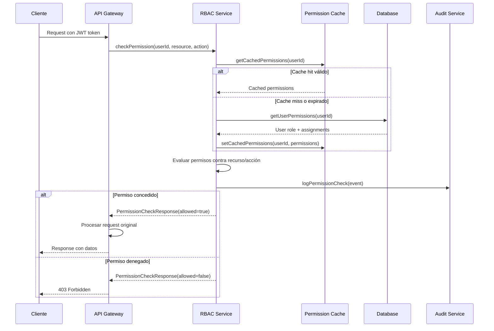
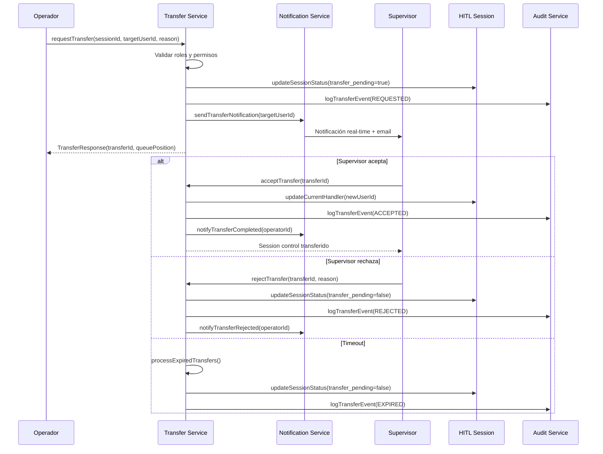

# NeurAnt - Interfaces y Contratos RBAC-HITL

## Resumen

Este documento especifica las interfaces de programación y contratos entre componentes del sistema RBAC-HITL integrado. Define las APIs de servicios, eventos, y protocolos de comunicación necesarios para implementar la arquitectura de roles jerárquicos con transferencias HITL.

## Principios de Diseño de Interfaces

### 1. **Separation of Concerns**
- Interfaces específicas por dominio de responsabilidad
- Servicios cohesivos con propósito único
- Acoplamiento mínimo entre componentes

### 2. **Contract-First Design**
- Especificaciones de interfaz antes de implementación
- Versionado de contratos para evolución
- Validación automática de contratos

### 3. **Fail-Fast Validation**
- Validación de permisos en el punto de entrada
- Respuestas de error consistentes y descriptivas
- Logging automático de violaciones de contrato

### 4. **Idempotency & Safety**
- Operaciones idempotentes donde sea posible
- Transacciones atómicas para operaciones críticas
- Estado consistente ante fallos

## Servicios Principales y Interfaces

### 1. Servicio de Autorización RBAC

#### Interface: `IRBACAuthorizationService`

```typescript
interface IRBACAuthorizationService {
  // Verificación de Permisos
  checkPermission(request: PermissionCheckRequest): Promise<PermissionCheckResponse>
  checkMultiplePermissions(request: MultiPermissionCheckRequest): Promise<MultiPermissionCheckResponse>
  getUserPermissions(userId: string): Promise<UserPermissions>
  getUserScopeAccess(userId: string): Promise<UserScopeAccess>
  
  // Gestión de Roles
  assignRole(request: RoleAssignmentRequest): Promise<RoleAssignmentResponse>
  revokeRole(request: RoleRevocationRequest): Promise<RoleRevocationResponse>
  getUserRole(userId: string): Promise<UserRole>
  getRoleHierarchy(): Promise<RoleHierarchy>
  
  // Cache y Optimización
  invalidatePermissionsCache(userId: string): Promise<void>
  refreshPermissionsCache(userId: string): Promise<UserPermissions>
  warmupCache(userIds: string[]): Promise<CacheWarmupResult>
}
```

#### Contratos de Datos

```typescript
// Request/Response Types
interface PermissionCheckRequest {
  userId: string
  resource: ResourceIdentifier
  action: string
  context?: PermissionContext
}

interface PermissionCheckResponse {
  allowed: boolean
  reason?: string
  metadata?: PermissionMetadata
  cacheTtl: number
}

interface ResourceIdentifier {
  type: 'chatbot' | 'conversation' | 'user' | 'company' | 'hitl_session'
  id: string
  companyId: string
}

interface PermissionContext {
  ipAddress?: string
  userAgent?: string
  sessionId?: string
  requestId?: string
  timestamp: string
}

interface UserPermissions {
  userId: string
  role: UserRole
  permissions: Record<string, boolean>
  scopeAccess: UserScopeAccess
  lastUpdated: string
  expiresAt: string
}

interface UserScopeAccess {
  chatbots: string[]  // IDs de chatbots accesibles
  users: string[]     // IDs de usuarios gestionables
  companies: string[] // IDs de empresas accesibles
  restrictions: ScopeRestrictions
}

interface ScopeRestrictions {
  canCreateChatbots: boolean
  canAssignRoles: string[]
  canViewAnalytics: 'all' | 'assigned' | 'none'
  canManageHITL: 'all' | 'assigned' | 'none'
  maxConcurrentHITL: number
}
```

### 2. Servicio de Gestión de Asignaciones

#### Interface: `IRBACAssignmentService`

```typescript
interface IRBACAssignmentService {
  // Asignaciones de Supervisor
  assignSupervisorToChatbot(request: SupervisorAssignmentRequest): Promise<SupervisorAssignmentResponse>
  removeSupervisorFromChatbot(chatbotId: string, reason: string): Promise<void>
  getSupervisorAssignments(supervisorId: string): Promise<SupervisorAssignment[]>
  getChatbotSupervisor(chatbotId: string): Promise<SupervisorAssignment | null>
  
  // Asignaciones de Operador
  assignOperatorToChatbot(request: OperatorAssignmentRequest): Promise<OperatorAssignmentResponse>
  removeOperatorFromChatbot(request: OperatorRemovalRequest): Promise<void>
  getOperatorAssignments(operatorId: string): Promise<OperatorAssignment[]>
  getChatbotOperators(chatbotId: string): Promise<OperatorAssignment[]>
  
  // Gestión de Capacidades
  updateOperatorCapacity(request: CapacityUpdateRequest): Promise<void>
  getOperatorWorkload(operatorId: string): Promise<OperatorWorkload>
  findAvailableOperators(chatbotId: string): Promise<AvailableOperator[]>
  
  // Auditoría de Asignaciones
  getAssignmentHistory(resourceId: string, resourceType: string): Promise<AssignmentHistory[]>
  validateAssignmentIntegrity(companyId: string): Promise<AssignmentValidationResult>
}
```

#### Contratos de Datos

```typescript
interface SupervisorAssignmentRequest {
  chatbotId: string
  supervisorId: string
  assignedBy: string
  assignmentNotes?: string
  effectiveDate?: string
}

interface SupervisorAssignmentResponse {
  assignmentId: string
  chatbotId: string
  supervisorId: string
  assignedAt: string
  previousSupervisor?: {
    userId: string
    unassignedAt: string
  }
}

interface OperatorAssignmentRequest {
  chatbotId: string
  operatorId: string
  assignedBySupervisor: string
  maxConcurrentSessions?: number
  skillTags?: string[]
  canTransferTo?: string[]
}

interface OperatorWorkload {
  operatorId: string
  activeSessions: number
  maxConcurrentSessions: number
  averageResponseTime: number
  isAvailable: boolean
  lastActivity: string
}

interface AvailableOperator {
  operatorId: string
  name: string
  currentLoad: number
  skillTags: string[]
  averageResponseTime: number
  rating: number
}
```

### 3. Servicio de Transferencias HITL

#### Interface: `IHITLTransferService`

```typescript
interface IHITLTransferService {
  // Gestión de Transferencias
  requestTransfer(request: TransferRequest): Promise<TransferResponse>
  acceptTransfer(transferId: string, acceptedBy: string, notes?: string): Promise<TransferAcceptanceResponse>
  rejectTransfer(transferId: string, rejectedBy: string, reason: string): Promise<void>
  cancelTransfer(transferId: string, cancelledBy: string, reason: string): Promise<void>
  
  // Consultas de Estado
  getTransfersByUser(userId: string, status?: TransferStatus[]): Promise<Transfer[]>
  getPendingTransfersForUser(userId: string): Promise<Transfer[]>
  getTransferHistory(sessionId: string): Promise<Transfer[]>
  getTransferDetails(transferId: string): Promise<TransferDetails>
  
  // Gestión de Colas
  getTransferQueue(userId: string): Promise<TransferQueueItem[]>
  updateTransferPriority(transferId: string, priority: TransferPriority): Promise<void>
  getQueueStatistics(companyId: string): Promise<QueueStatistics>
  
  // Automatización
  processExpiredTransfers(): Promise<ExpiredTransferResult[]>
  suggestTransferTarget(sessionId: string, reason: string): Promise<TransferSuggestion[]>
  
  // Notificaciones
  sendTransferNotification(transferId: string, method: NotificationMethod[]): Promise<NotificationResult>
  subscribeToTransferEvents(userId: string): Promise<EventSubscription>
}
```

#### Contratos de Datos

```typescript
interface TransferRequest {
  sessionId: string
  fromUserId: string
  toUserId: string
  transferReason: string
  transferType: TransferType
  priority: TransferPriority
  urgencyNotes?: string
  expiresInMinutes?: number
  notificationMethods: NotificationMethod[]
}

interface TransferResponse {
  transferId: string
  sessionId: string
  status: TransferStatus
  estimatedResponseTime: number
  expiresAt: string
  queuePosition?: number
}

interface Transfer {
  id: string
  sessionId: string
  conversationId: string
  fromUser: UserSummary
  toUser: UserSummary
  transferReason: string
  transferType: TransferType
  priority: TransferPriority
  status: TransferStatus
  requestedAt: string
  expiresAt: string
  respondedAt?: string
  resolvedAt?: string
  responseTimeSeconds?: number
  resolutionNotes?: string
}

interface TransferSuggestion {
  userId: string
  userName: string
  role: UserRole
  matchScore: number
  availability: 'available' | 'busy' | 'offline'
  estimatedResponseTime: number
  reason: string
}

enum TransferType {
  ESCALATION = 'escalation',
  SKILL_BASED = 'skill_based',
  WORKLOAD_DISTRIBUTION = 'workload_distribution',
  EMERGENCY = 'emergency'
}

enum TransferPriority {
  LOW = 'low',
  MEDIUM = 'medium',
  HIGH = 'high',
  URGENT = 'urgent'
}

enum TransferStatus {
  PENDING = 'pending',
  ACCEPTED = 'accepted',
  REJECTED = 'rejected',
  EXPIRED = 'expired',
  CANCELLED = 'cancelled'
}
```

### 4. Servicio de Auditoría RBAC

#### Interface: `IRBACauditService`

```typescript
interface IRBACAuditService {
  // Logging de Eventos
  logPermissionCheck(event: PermissionCheckEvent): Promise<void>
  logRoleChange(event: RoleChangeEvent): Promise<void>
  logAssignmentChange(event: AssignmentChangeEvent): Promise<void>
  logTransferEvent(event: TransferEvent): Promise<void>
  logSecurityViolation(event: SecurityViolationEvent): Promise<void>
  
  // Consultas de Auditoría
  getAuditTrail(request: AuditTrailRequest): Promise<AuditTrailResponse>
  getSecurityEvents(request: SecurityEventsRequest): Promise<SecurityEventsResponse>
  getUserActivity(userId: string, dateRange: DateRange): Promise<UserActivity[]>
  getPermissionViolations(companyId: string, timeframe: string): Promise<PermissionViolation[]>
  
  // Análisis y Reportes
  generateSecurityReport(companyId: string, reportType: SecurityReportType): Promise<SecurityReport>
  detectAnomalousActivity(companyId: string): Promise<AnomalousActivity[]>
  getComplianceReport(companyId: string, standard: ComplianceStandard): Promise<ComplianceReport>
  
  // Retención y Archivado
  archiveOldLogs(olderThan: string): Promise<ArchiveResult>
  exportAuditLogs(request: ExportRequest): Promise<ExportResult>
}
```

#### Contratos de Datos

```typescript
interface PermissionCheckEvent {
  userId: string
  companyId: string
  resource: ResourceIdentifier
  action: string
  result: 'allowed' | 'denied'
  reason?: string
  context: PermissionContext
  timestamp: string
}

interface RoleChangeEvent {
  targetUserId: string
  changedBy: string
  companyId: string
  oldRole: UserRole
  newRole: UserRole
  reason?: string
  context: AuditContext
  timestamp: string
}

interface SecurityViolationEvent {
  userId: string
  companyId: string
  violationType: SecurityViolationType
  severity: SecuritySeverity
  description: string
  attemptedAction: string
  blockedReason: string
  context: SecurityContext
  timestamp: string
}

interface AuditTrailRequest {
  companyId: string
  userId?: string
  resourceId?: string
  actions?: string[]
  dateRange: DateRange
  limit?: number
  offset?: number
}

interface SecurityReport {
  companyId: string
  reportPeriod: DateRange
  summary: SecuritySummary
  violations: SecurityViolation[]
  recommendations: SecurityRecommendation[]
  riskScore: number
  generatedAt: string
}

enum SecurityViolationType {
  UNAUTHORIZED_ACCESS = 'unauthorized_access',
  PRIVILEGE_ESCALATION = 'privilege_escalation',
  ROLE_VIOLATION = 'role_violation',
  SUSPICIOUS_PATTERN = 'suspicious_pattern',
  FAILED_AUTHENTICATION = 'failed_authentication'
}
```

## Eventos del Sistema

### 1. Eventos de RBAC

```typescript
// Eventos de Roles y Permisos
interface RBACEventTypes {
  'rbac.role.assigned': RoleAssignedEvent
  'rbac.role.revoked': RoleRevokedEvent
  'rbac.permission.granted': PermissionGrantedEvent
  'rbac.permission.denied': PermissionDeniedEvent
  'rbac.assignment.created': AssignmentCreatedEvent
  'rbac.assignment.removed': AssignmentRemovedEvent
}

interface RoleAssignedEvent {
  userId: string
  companyId: string
  role: UserRole
  assignedBy: string
  reason?: string
  effectiveDate: string
  metadata: EventMetadata
}

interface AssignmentCreatedEvent {
  assignmentType: 'supervisor' | 'operator'
  chatbotId: string
  userId: string
  assignedBy: string
  companyId: string
  metadata: EventMetadata
}
```

### 2. Eventos de Transferencias HITL

```typescript
// Eventos de Transferencias
interface HITLTransferEventTypes {
  'hitl.transfer.requested': TransferRequestedEvent
  'hitl.transfer.accepted': TransferAcceptedEvent
  'hitl.transfer.rejected': TransferRejectedEvent
  'hitl.transfer.expired': TransferExpiredEvent
  'hitl.transfer.cancelled': TransferCancelledEvent
  'hitl.session.transferred': SessionTransferredEvent
}

interface TransferRequestedEvent {
  transferId: string
  sessionId: string
  fromUserId: string
  toUserId: string
  transferReason: string
  priority: TransferPriority
  expiresAt: string
  metadata: EventMetadata
}

interface SessionTransferredEvent {
  sessionId: string
  conversationId: string
  fromUserId: string
  toUserId: string
  transferId: string
  completedAt: string
  handoffSuccessful: boolean
  metadata: EventMetadata
}
```

### 3. Eventos de Seguridad

```typescript
// Eventos de Seguridad
interface SecurityEventTypes {
  'security.violation.detected': SecurityViolationDetectedEvent
  'security.access.denied': AccessDeniedEvent
  'security.suspicious.activity': SuspiciousActivityEvent
  'security.authentication.failed': AuthenticationFailedEvent
}

interface SecurityViolationDetectedEvent {
  userId: string
  companyId: string
  violationType: SecurityViolationType
  severity: SecuritySeverity
  description: string
  evidence: Record<string, any>
  automaticActions: string[]
  metadata: EventMetadata
}
```

## Protocolos de Comunicación

### 1. Protocolo de Autorización



### 2. Protocolo de Transferencia HITL



## Patrones de Integración

### 1. Middleware de Autorización

```typescript
// Patrón de Middleware para APIs
interface AuthorizationMiddleware {
  // Middleware principal
  requirePermission(resource: string, action: string): MiddlewareFunction
  requireRole(role: UserRole | UserRole[]): MiddlewareFunction
  requireScope(scopeType: ScopeType, scopeId: string): MiddlewareFunction
  
  // Middleware compuesto
  requireChatbotAccess(): MiddlewareFunction
  requireHITLAccess(): MiddlewareFunction
  requireAdminAccess(): MiddlewareFunction
  
  // Utilidades
  extractUserContext(request: Request): Promise<UserContext>
  validateResourceAccess(userContext: UserContext, resourceId: string): Promise<boolean>
}

// Uso en endpoints
app.get('/api/chatbots/:id', 
  requirePermission('chatbot', 'read'),
  requireScope('chatbot', ':id'),
  getChatbotHandler
)

app.post('/api/hitl/transfer',
  requirePermission('hitl_session', 'transfer'),
  requireHITLAccess(),
  createTransferHandler
)
```

### 2. Patrón de Event Sourcing para Auditoría

```typescript
// Event Store para Auditoría
interface EventStore {
  append(streamId: string, events: DomainEvent[]): Promise<void>
  getEvents(streamId: string, fromVersion?: number): Promise<DomainEvent[]>
  getEventsByType(eventType: string, dateRange?: DateRange): Promise<DomainEvent[]>
  
  // Projections para consultas optimizadas
  buildProjection(projectionName: string, events: DomainEvent[]): Promise<any>
  getProjection(projectionName: string, key: string): Promise<any>
}

// Ejemplo de uso
await eventStore.append(`user-${userId}`, [
  new RoleAssignedEvent(userId, newRole, assignedBy),
  new PermissionsCacheInvalidatedEvent(userId)
])

// Reconstruir estado desde eventos
const userEvents = await eventStore.getEvents(`user-${userId}`)
const currentUserState = replayEvents(userEvents)
```

### 3. Patrón de Circuit Breaker para Servicios Críticos

```typescript
// Circuit Breaker para resiliencia
interface CircuitBreaker {
  execute<T>(operation: () => Promise<T>): Promise<T>
  getState(): CircuitBreakerState
  getMetrics(): CircuitBreakerMetrics
}

// Uso en servicios críticos
const rbacServiceWithBreaker = new CircuitBreaker({
  timeout: 5000,
  errorThreshold: 50,
  resetTimeout: 30000
})

async function checkPermissionWithFallback(request: PermissionCheckRequest): Promise<PermissionCheckResponse> {
  try {
    return await rbacServiceWithBreaker.execute(() => 
      rbacService.checkPermission(request)
    )
  } catch (error) {
    // Fallback a permisos básicos o denegar acceso
    return { allowed: false, reason: 'Service unavailable' }
  }
}
```

## Métricas y Observabilidad

### 1. Métricas de Rendimiento de Interfaces

```typescript
interface ServiceMetrics {
  // Latencia de operaciones
  operationLatency: {
    checkPermission: LatencyMetrics
    requestTransfer: LatencyMetrics
    assignRole: LatencyMetrics
  }
  
  // Throughput de servicios
  operationThroughput: {
    permissionChecksPerSecond: number
    transfersPerMinute: number
    roleAssignmentsPerHour: number
  }
  
  // Error rates
  errorRates: {
    permissionDeniedRate: number
    transferFailureRate: number
    serviceErrorRate: number
  }
  
  // Cache performance
  cacheMetrics: {
    hitRate: number
    missRate: number
    evictionRate: number
    averageTtl: number
  }
}
```

### 2. SLAs y SLIs para Interfaces

```typescript
interface ServiceLevelObjectives {
  // Latencia (SLI)
  permissionCheckLatency: {
    p50: 25,    // ms
    p95: 50,    // ms
    p99: 100    // ms
  }
  
  // Disponibilidad (SLI)
  serviceAvailability: {
    target: 99.9,     // %
    measurement: 'uptime'
  }
  
  // Precisión (SLI)
  permissionAccuracy: {
    target: 100,      // %
    measurement: 'correct_decisions'
  }
  
  // Throughput (SLI)
  maxThroughput: {
    permissionChecks: 10000,  // per second
    transfers: 100,           // per minute
    roleChanges: 50           // per hour
  }
}
```

---

*Estas interfaces y contratos proporcionan la base para una implementación robusta y escalable del sistema RBAC-HITL integrado, garantizando separación de responsabilidades, auditabilidad completa y rendimiento optimizado.*