# NeurAnt - Diagrama Entidad-Relación Completo

## Resumen Ejecutivo

Este documento presenta el diseño completo del modelo de datos para la plataforma NeurAnt, incluyendo el sistema RBAC avanzado con HITL integrado, arquitectura multi-tenant y todas las funcionalidades core del negocio.

### Características Principales del Modelo
- **Multi-tenancy seguro** con Row Level Security (RLS)
- **RBAC jerárquico** (Owner → Admin → Supervisor → Operador)
- **Sistema HITL** con transferencias estructuradas
- **Auditoría completa** para compliance empresarial
- **Escalabilidad optimizada** para 1000+ empresas
- **Rendimiento estratégico** con índices y cache

### Tecnologías y Patrones
- **PostgreSQL 15+** con extensiones avanzadas
- **Supabase Auth** para autenticación
- **Vector embeddings** para RAG
- **Triggers y funciones** para integridad
- **Políticas RLS** automáticas por tenant

---

## Diagrama Entidad-Relación Completo

```mermaid
erDiagram
    %% ===========================================
    %% CORE BUSINESS ENTITIES
    %% ===========================================
    
    COMPANIES {
        uuid id PK
        varchar name
        varchar slug
        varchar email
        varchar phone
        varchar industry
        varchar website
        text logo_url
        varchar subscription_plan
        varchar subscription_status
        timestamp subscription_started_at
        timestamp subscription_ends_at
        int monthly_message_limit
        int monthly_message_count
        date monthly_reset_date
        int max_chatbots
        int max_users
        int max_integrations
        int max_document_characters
        int max_storage_mb
        int max_hitl_concurrent
        int current_user_count
        int current_chatbot_count
        int current_integration_count
        timestamp plan_changed_at
        timestamp plan_change_scheduled_at
        varchar next_plan
        timestamp created_at
        timestamp updated_at
        uuid created_by FK
    }
    
    USERS {
        uuid id PK
        uuid company_id FK
        uuid auth_user_id
        varchar email
        varchar first_name
        varchar last_name
        text avatar_url
        varchar phone
        varchar role
        boolean is_owner
        json permissions
        boolean is_active
        uuid invited_by FK
        timestamp invited_at
        timestamp accepted_invitation_at
        varchar invitation_token
        timestamp invitation_expires_at
        timestamp last_login_at
        timestamp last_seen_at
        json permissions_cache
        timestamp last_permission_update
        uuid role_assigned_by FK
        timestamp role_assigned_at
        text can_assign_roles
        int login_attempts
        timestamp last_failed_login
        timestamp account_locked_until
        timestamp created_at
        timestamp updated_at
        uuid created_by FK
    }
    
    USER_INVITATIONS {
        uuid id PK
        uuid company_id FK
        varchar email
        varchar first_name
        varchar last_name
        varchar role
        uuid invited_by FK
        varchar invitation_token
        timestamp expires_at
        varchar status
        timestamp accepted_at
        uuid accepted_by_user_id FK
        timestamp sent_at
        timestamp reminder_sent_at
        int reminder_count
        timestamp created_at
        timestamp updated_at
    }
    
    CHATBOTS {
        uuid id PK
        uuid company_id FK
        varchar name
        text description
        text avatar_url
        text system_prompt
        uuid template_id FK
        json personality_traits
        int response_delay_ms
        int max_context_messages
        text fallback_message
        json channels
        json channel_configs
        boolean is_active
        boolean is_training
        int training_progress
        json working_hours
        varchar timezone
        boolean hitl_enabled
        json hitl_triggers
        text hitl_trigger_keywords
        int auto_escalate_after_minutes
        uuid assigned_supervisor_id FK
        uuid supervisor_assigned_by FK
        timestamp supervisor_assigned_at
        boolean requires_supervisor
        varchar operator_assignment_strategy
        int max_concurrent_hitl
        int hitl_escalation_timeout_minutes
        int total_conversations
        int total_messages
        int avg_response_time_ms
        decimal satisfaction_score
        timestamp created_at
        timestamp updated_at
        uuid created_by FK
    }
    
    CHATBOT_TEMPLATES {
        uuid id PK
        varchar name
        text description
        varchar industry
        varchar category
        text system_prompt_template
        json default_personality
        json recommended_settings
        int usage_count
        boolean is_featured
        boolean is_active
        json example_conversations
        timestamp created_at
        timestamp updated_at
    }
    
    %% ===========================================
    %% RBAC ENTITIES
    %% ===========================================
    
    CHATBOT_SUPERVISORS {
        uuid id PK
        uuid company_id FK
        uuid chatbot_id FK
        uuid supervisor_id FK
        uuid assigned_by FK
        timestamp assigned_at
        boolean is_active
        text assignment_notes
        timestamp created_at
        timestamp updated_at
    }
    
    CHATBOT_OPERATORS {
        uuid id PK
        uuid company_id FK
        uuid chatbot_id FK
        uuid operator_id FK
        uuid assigned_by_supervisor FK
        timestamp assigned_at
        boolean is_active
        text can_transfer_to
        int max_concurrent_sessions
        text skill_tags
        text assignment_notes
        timestamp last_activity_at
        timestamp created_at
        timestamp updated_at
    }
    
    PERMISSION_CACHE {
        uuid id PK
        uuid company_id FK
        uuid user_id FK
        varchar permissions_hash
        json permissions_data
        text scope_chatbots
        text scope_users
        timestamp calculated_at
        timestamp expires_at
        int cache_version
        boolean is_valid
        text invalidation_reason
    }
    
    %% ===========================================
    %% CONVERSATIONS & MESSAGING
    %% ===========================================
    
    CONVERSATIONS {
        uuid id PK
        uuid company_id FK
        uuid chatbot_id FK
        varchar end_user_id
        varchar end_user_name
        text end_user_avatar
        varchar channel
        varchar status
        boolean is_hitl_active
        uuid assigned_operator_id FK
        timestamp hitl_activated_at
        text hitl_reason
        int message_count
        int bot_message_count
        int human_message_count
        int avg_response_time_ms
        timestamp started_at
        timestamp last_message_at
        timestamp ended_at
        int session_duration_minutes
        int satisfaction_rating
        text satisfaction_comment
        json context_data
        text conversation_summary
        timestamp created_at
        timestamp updated_at
    }
    
    MESSAGES {
        uuid id PK
        uuid company_id FK
        uuid conversation_id FK
        text content
        varchar message_type
        text media_url
        varchar media_type
        varchar sender_type
        uuid sender_id FK
        varchar n8n_message_id
        varchar n8n_workflow_id
        varchar external_message_id
        int processing_time_ms
        int tokens_used
        varchar model_used
        varchar status
        timestamp delivered_at
        timestamp read_at
        boolean used_knowledge_base
        json knowledge_sources
        decimal confidence_score
        timestamp created_at
        timestamp updated_at
    }
    
    MESSAGE_REACTIONS {
        uuid id PK
        uuid company_id FK
        uuid message_id FK
        varchar reaction_type
        text comment
        uuid reacted_by_user_id FK
        boolean reacted_by_end_user
        timestamp created_at
    }
    
    %% ===========================================
    %% HITL ENTITIES
    %% ===========================================
    
    HITL_SESSIONS {
        uuid id PK
        uuid company_id FK
        uuid conversation_id FK
        uuid chatbot_id FK
        uuid assigned_operator_id FK
        uuid current_handler_id FK
        timestamp assigned_at
        timestamp handler_changed_at
        boolean transfer_pending
        timestamp transfer_requested_at
        uuid transfer_requested_by FK
        uuid transfer_target_user FK
        text transfer_reason
        text transfer_notes
        varchar status
        timestamp started_at
        timestamp resolved_at
        int first_response_time_seconds
        int total_response_time_seconds
        int total_operator_messages
        int total_transfers
        varchar resolution_type
        text resolution_notes
        boolean handoff_successful
        int customer_satisfaction_rating
        timestamp created_at
        timestamp updated_at
    }
    
    HITL_TRANSFERS {
        uuid id PK
        uuid company_id FK
        uuid session_id FK
        uuid conversation_id FK
        uuid from_user_id FK
        uuid to_user_id FK
        uuid requested_by FK
        uuid resolved_by FK
        text transfer_reason
        varchar transfer_type
        varchar priority
        text urgency_notes
        varchar status
        timestamp requested_at
        timestamp responded_at
        timestamp resolved_at
        timestamp expires_at
        int response_time_seconds
        text resolution_notes
        text rejection_reason
        boolean auto_expired
        boolean notification_sent
        text notification_methods
        timestamp created_at
        timestamp updated_at
    }
    
    %% ===========================================
    %% KNOWLEDGE BASE & RAG
    %% ===========================================
    
    DOCUMENTS {
        uuid id PK
        uuid company_id FK
        uuid chatbot_id FK
        varchar filename
        varchar original_filename
        varchar file_type
        bigint file_size_bytes
        text file_url
        text extracted_text
        int character_count
        int chunk_count
        varchar processing_status
        text processing_error
        varchar title
        text description
        text tags
        varchar category
        varchar language
        int query_count
        timestamp last_used_at
        timestamp created_at
        timestamp updated_at
        uuid uploaded_by FK
    }
    
    DOCUMENT_CHUNKS {
        uuid id PK
        uuid company_id FK
        uuid document_id FK
        text content
        int chunk_index
        int character_count
        text embedding
        int page_number
        varchar section_title
        text context_before
        text context_after
        int match_count
        timestamp last_matched_at
        timestamp created_at
    }
    
    KNOWLEDGE_QUERIES {
        uuid id PK
        uuid company_id FK
        uuid conversation_id FK
        uuid message_id FK
        text query_text
        text query_embedding
        int results_count
        decimal top_similarity_score
        int processing_time_ms
        timestamp created_at
    }
    
    %% ===========================================
    %% INTEGRATIONS
    %% ===========================================
    
    INTEGRATIONS {
        uuid id PK
        uuid company_id FK
        varchar name
        varchar integration_type
        text description
        json config
        json settings
        varchar auth_type
        text oauth_token_encrypted
        text api_key_encrypted
        timestamp expires_at
        boolean is_active
        timestamp last_sync_at
        text last_error
        varchar sync_status
        int total_requests
        int successful_requests
        int failed_requests
        timestamp created_at
        timestamp updated_at
        uuid created_by FK
    }
    
    INTEGRATION_LOGS {
        uuid id PK
        uuid company_id FK
        uuid integration_id FK
        varchar request_type
        varchar endpoint
        json request_data
        int response_status
        json response_data
        int response_time_ms
        uuid triggered_by_message_id FK
        uuid triggered_by_user_id FK
        varchar status
        text error_message
        timestamp created_at
    }
    
    %% ===========================================
    %% ANALYTICS & AUDIT
    %% ===========================================
    
    ANALYTICS_DAILY {
        uuid id PK
        uuid company_id FK
        uuid chatbot_id FK
        date date
        int total_messages
        int bot_messages
        int human_messages
        int end_user_messages
        int new_conversations
        int active_conversations
        int resolved_conversations
        decimal avg_conversation_duration_minutes
        int hitl_escalations
        decimal hitl_resolution_time_minutes
        decimal hitl_satisfaction_avg
        int avg_response_time_ms
        int total_tokens_used
        int satisfaction_ratings
        decimal satisfaction_avg
        int thumbs_up
        int thumbs_down
        int knowledge_queries
        int knowledge_hits
        decimal knowledge_hit_rate
        timestamp created_at
    }
    
    RBAC_AUDIT_LOG {
        uuid id PK
        uuid company_id FK
        uuid user_id FK
        uuid target_user_id FK
        varchar target_resource_type
        uuid target_resource_id
        varchar action
        json action_details
        json old_values
        json new_values
        boolean success
        text failure_reason
        varchar ip_address
        text user_agent
        uuid session_id
        uuid request_id
        timestamp performed_at
        varchar severity
        timestamp created_at
    }
    
    AUDIT_LOGS {
        uuid id PK
        uuid company_id FK
        uuid user_id FK
        varchar user_email
        varchar user_role
        varchar action
        varchar resource_type
        uuid resource_id
        json details
        varchar ip_address
        text user_agent
        varchar session_id
        varchar request_id
        timestamp created_at
    }
    
    SYSTEM_METRICS {
        uuid id PK
        timestamp timestamp
        varchar metric_type
        decimal value
        varchar unit
        json labels
        uuid company_id FK
        uuid chatbot_id FK
    }
    
    %% ===========================================
    %% RELATIONSHIPS
    %% ===========================================
    
    %% Core Business Relationships
    COMPANIES ||--o{ USERS : "employs"
    COMPANIES ||--o{ CHATBOTS : "owns"
    COMPANIES ||--o{ USER_INVITATIONS : "manages"
    COMPANIES ||--o{ CONVERSATIONS : "hosts"
    COMPANIES ||--o{ DOCUMENTS : "stores"
    COMPANIES ||--o{ INTEGRATIONS : "configures"
    COMPANIES ||--o{ ANALYTICS_DAILY : "aggregates_for"
    COMPANIES ||--o{ RBAC_AUDIT_LOG : "tracks_actions"
    COMPANIES ||--o{ SYSTEM_METRICS : "measures"
    
    %% User Relationships
    USERS ||--o{ USERS : "invited_by"
    USERS ||--o{ USERS : "role_assigned_by"
    USERS ||--o{ USER_INVITATIONS : "invites"
    USERS ||--o{ CHATBOTS : "created_by"
    USERS ||--o{ PERMISSION_CACHE : "has_cached_permissions"
    USERS ||--o{ MESSAGES : "sent_by"
    USERS ||--o{ DOCUMENTS : "uploaded_by"
    USERS ||--o{ INTEGRATIONS : "created_by"
    USERS ||--o{ RBAC_AUDIT_LOG : "performed_by"
    USERS ||--o{ AUDIT_LOGS : "performed_by"
    
    %% Chatbot Relationships
    CHATBOT_TEMPLATES ||--o{ CHATBOTS : "template_for"
    CHATBOTS ||--o| CHATBOT_SUPERVISORS : "supervised_by"
    CHATBOTS ||--o{ CHATBOT_OPERATORS : "operated_by"
    CHATBOTS ||--o{ CONVERSATIONS : "handles"
    CHATBOTS ||--o{ DOCUMENTS : "uses_knowledge"
    CHATBOTS ||--o{ ANALYTICS_DAILY : "measured_by"
    CHATBOTS ||--o{ SYSTEM_METRICS : "tracked_by"
    
    %% RBAC Relationships
    CHATBOT_SUPERVISORS }|--|| USERS : "assigned_supervisor"
    CHATBOT_SUPERVISORS }|--|| USERS : "assigned_by"
    CHATBOT_OPERATORS }|--|| USERS : "assigned_operator"
    CHATBOT_OPERATORS }|--|| USERS : "assigned_by_supervisor"
    
    %% Conversation Relationships
    CONVERSATIONS ||--o{ MESSAGES : "contains"
    CONVERSATIONS ||--o| HITL_SESSIONS : "escalates_to"
    CONVERSATIONS ||--o{ KNOWLEDGE_QUERIES : "generates"
    
    %% Message Relationships
    MESSAGES ||--o{ MESSAGE_REACTIONS : "receives"
    
    %% HITL Relationships
    HITL_SESSIONS }|--|| USERS : "assigned_operator"
    HITL_SESSIONS }|--|| USERS : "current_handler"
    HITL_SESSIONS ||--o{ HITL_TRANSFERS : "generates"
    
    HITL_TRANSFERS }|--|| USERS : "from_user"
    HITL_TRANSFERS }|--|| USERS : "to_user"
    HITL_TRANSFERS }|--|| USERS : "requested_by"
    HITL_TRANSFERS }|--|| USERS : "resolved_by"
    
    %% Knowledge Base Relationships
    DOCUMENTS ||--o{ DOCUMENT_CHUNKS : "chunked_into"
    
    %% Integration Relationships
    INTEGRATIONS ||--o{ INTEGRATION_LOGS : "logs_activity"
```



---

## Especificaciones de Entidades Core

### Companies
**Propósito:** Entidad tenant principal que agrupa todos los recursos de una empresa
```
Campos Principales:
├── id: uuid (Primary Key)
├── name: VARCHAR(255) NOT NULL - Nombre de la empresa
├── slug: VARCHAR(100) UNIQUE NOT NULL - Identificador URL-friendly
├── email: VARCHAR(255) UNIQUE NOT NULL - Email principal de contacto
├── subscription_plan: subscription_plan_enum - Plan actual (free, starter, professional, business, enterprise)
├── subscription_status: subscription_status_enum - Estado de suscripción
├── monthly_message_limit: INTEGER NOT NULL DEFAULT 500 - Límite mensual de mensajes
├── monthly_message_count: INTEGER NOT NULL DEFAULT 0 - Contador actual de mensajes
├── max_chatbots: INTEGER NOT NULL DEFAULT 1 - Límite de chatbots por plan
├── max_users: INTEGER NOT NULL DEFAULT 2 - Límite de usuarios por plan
├── max_hitl_concurrent: INTEGER NOT NULL DEFAULT 0 - Sesiones HITL concurrentes

Constraints de Negocio:
├── UNIQUE(slug) - Slug único globalmente
├── CHECK(slug ~ '^[a-z0-9-]+$') - Formato de slug válido
├── CHECK(monthly_message_limit >= 0) - Límite no negativo
└── CHECK(max_chatbots > 0) - Al menos 1 chatbot permitido

Índices Estratégicos:
├── idx_companies_slug (slug) UNIQUE
├── idx_companies_subscription (subscription_plan, subscription_status)
└── idx_companies_usage (monthly_reset_date, monthly_message_count)
```

### Users
**Propósito:** Usuarios del sistema con roles jerárquicos RBAC
```
Campos Principales:
├── id: uuid (Primary Key)
├── company_id: uuid (Foreign Key → companies.id)
├── auth_user_id: uuid UNIQUE (Foreign Key → auth.users.id)
├── email: VARCHAR(255) NOT NULL - Email del usuario
├── role: user_role_enum NOT NULL DEFAULT 'operador' - Rol en la jerarquía
├── is_owner: BOOLEAN NOT NULL DEFAULT false - Propietario de la empresa
├── permissions_cache: JSONB - Cache de permisos calculados
├── last_permission_update: TIMESTAMPTZ - Timestamp de última actualización de permisos
├── role_assigned_by: uuid (Foreign Key → users.id) - Quién asignó el rol
├── can_assign_roles: TEXT[] - Roles que puede asignar este usuario
├── login_attempts: INTEGER DEFAULT 0 - Intentos de login fallidos
├── account_locked_until: TIMESTAMPTZ - Hasta cuándo está bloqueada la cuenta

Constraints de Negocio:
├── UNIQUE(company_id, email) - Email único por empresa
├── EXCLUDE (company_id WITH =) WHERE (is_owner = true) - Solo un owner por empresa
├── CHECK((is_owner = true AND role = 'owner') OR (is_owner = false)) - Owner debe tener rol owner
└── CHECK(login_attempts >= 0) - Intentos no negativos

Índices Estratégicos:
├── idx_users_company_role (company_id, role, is_active)
├── idx_users_auth (auth_user_id) UNIQUE
├── idx_users_permissions_cache (company_id, last_permission_update)
└── idx_users_active_operators (company_id, id) WHERE role = 'operador' AND is_active = true
```

### Chatbots
**Propósito:** Agentes AI con configuración y asignación de supervisión
```
Campos Principales:
├── id: uuid (Primary Key)
├── company_id: uuid (Foreign Key → companies.id)
├── name: VARCHAR(255) NOT NULL - Nombre del chatbot
├── system_prompt: TEXT NOT NULL - Prompt del sistema para el AI
├── assigned_supervisor_id: uuid (Foreign Key → users.id) - Supervisor asignado
├── supervisor_assigned_by: uuid (Foreign Key → users.id) - Quién asignó el supervisor
├── requires_supervisor: BOOLEAN DEFAULT true - Si requiere supervisión
├── operator_assignment_strategy: ENUM('round_robin', 'least_busy', 'skill_based')
├── max_concurrent_hitl: INTEGER DEFAULT 5 - Máximo de sesiones HITL concurrentes
├── hitl_escalation_timeout_minutes: INTEGER DEFAULT 30 - Timeout para escalamiento
├── hitl_enabled: BOOLEAN NOT NULL DEFAULT true - Si HITL está habilitado
├── auto_escalate_after_minutes: INTEGER DEFAULT 5 - Escalamiento automático

Constraints de Negocio:
├── UNIQUE(company_id, name) - Nombre único por empresa
├── CHECK(max_concurrent_hitl > 0) - Al menos 1 sesión HITL
├── CHECK(hitl_escalation_timeout_minutes > 0) - Timeout positivo
├── supervisor_role_validation: assigned_supervisor_id debe tener role 'supervisor'
└── supervisor_same_company: assigned_supervisor_id.company_id = company_id

Índices Estratégicos:
├── idx_chatbots_company (company_id, is_active)
├── idx_chatbots_supervisor (company_id, assigned_supervisor_id)
├── idx_chatbots_hitl_config (company_id, requires_supervisor, is_active)
└── idx_chatbots_name_search (company_id) USING gin(to_tsvector('spanish', name))
```

---

## Especificaciones de Entidades RBAC

### Chatbot_Supervisors
**Propósito:** Asignación única de supervisor por chatbot
```
Campos Principales:
├── id: uuid (Primary Key)
├── company_id: uuid (Foreign Key → companies.id)
├── chatbot_id: uuid (Foreign Key → chatbots.id) UNIQUE - Un supervisor por chatbot
├── supervisor_id: uuid (Foreign Key → users.id) - Usuario supervisor
├── assigned_by: uuid (Foreign Key → users.id) - Quién hizo la asignación
├── assigned_at: TIMESTAMPTZ NOT NULL DEFAULT NOW()
├── is_active: BOOLEAN NOT NULL DEFAULT true
├── assignment_notes: TEXT - Notas sobre la asignación

Constraints de Negocio:
├── UNIQUE(chatbot_id) - Un chatbot solo puede tener un supervisor activo
├── supervisor_role_check: supervisor_id debe tener role = 'supervisor'
├── assigner_permission_check: assigned_by debe tener role IN ('owner', 'administrador')
└── same_company_check: Todos los usuarios deben ser de la misma empresa

Índices Estratégicos:
├── idx_chatbot_supervisors_unique (chatbot_id) UNIQUE
├── idx_chatbot_supervisors_supervisor (company_id, supervisor_id, is_active)
└── idx_chatbot_supervisors_assigned_by (company_id, assigned_by, assigned_at)
```

### Chatbot_Operators
**Propósito:** Asignación de operadores a chatbots específicos por supervisor
```
Campos Principales:
├── id: uuid (Primary Key)
├── company_id: uuid (Foreign Key → companies.id)
├── chatbot_id: uuid (Foreign Key → chatbots.id)
├── operator_id: uuid (Foreign Key → users.id)
├── assigned_by_supervisor: uuid (Foreign Key → users.id) - Supervisor que asignó
├── can_transfer_to: UUID[] - Usuarios a los que puede transferir
├── max_concurrent_sessions: INTEGER DEFAULT 3 - Sesiones concurrentes máximas
├── skill_tags: TEXT[] - Etiquetas de habilidades del operador
├── last_activity_at: TIMESTAMPTZ - Última actividad registrada

Constraints de Negocio:
├── UNIQUE(chatbot_id, operator_id) - No duplicar asignaciones
├── operator_role_check: operator_id debe tener role = 'operador'
├── supervisor_assignment_check: assigned_by_supervisor debe ser supervisor del chatbot
├── transfer_hierarchy_check: can_transfer_to solo incluye roles superiores
└── max_sessions_positive: max_concurrent_sessions > 0

Índices Estratégicos:
├── idx_chatbot_operators_operator (company_id, operator_id, is_active)
├── idx_chatbot_operators_chatbot (company_id, chatbot_id, is_active)
├── idx_chatbot_operators_supervisor (company_id, assigned_by_supervisor)
└── idx_chatbot_operators_skills (company_id, skill_tags) USING GIN
```

### HITL_Sessions
**Propósito:** Sesiones HITL con soporte completo para transferencias
```
Campos Principales:
├── id: uuid (Primary Key)
├── company_id: uuid (Foreign Key → companies.id)
├── conversation_id: uuid (Foreign Key → conversations.id)
├── chatbot_id: uuid (Foreign Key → chatbots.id)
├── assigned_operator_id: uuid (Foreign Key → users.id) - Operador inicial asignado
├── current_handler_id: uuid (Foreign Key → users.id) - Manejador actual
├── transfer_pending: BOOLEAN DEFAULT false - Si hay transferencia pendiente
├── transfer_requested_by: uuid (Foreign Key → users.id) - Quién solicitó transferencia
├── transfer_target_user: uuid (Foreign Key → users.id) - Usuario objetivo de transferencia
├── status: hitl_status_enum - Estado de la sesión
├── total_transfers: INTEGER DEFAULT 0 - Número total de transferencias
├── resolution_type: resolution_type_enum - Tipo de resolución

Constraints de Negocio:
├── handler_is_valid: current_handler_id debe ser assigned_operator_id o target de transferencia
├── transfer_target_hierarchy: transfer_target_user debe tener rol superior al solicitante
├── same_company_all_users: Todos los user_ids deben ser de la misma empresa
└── valid_timestamps: assigned_at <= handler_changed_at <= resolved_at

Índices Estratégicos:
├── idx_hitl_sessions_operator (company_id, assigned_operator_id, status)
├── idx_hitl_sessions_handler (company_id, current_handler_id, status)
├── idx_hitl_sessions_chatbot (company_id, chatbot_id, created_at)
├── idx_hitl_sessions_transfer (company_id, transfer_pending, transfer_requested_at)
└── idx_hitl_sessions_metrics (company_id, resolved_at, resolution_type)
```

### HITL_Transfers
**Propósito:** Historial detallado de todas las transferencias HITL
```
Campos Principales:
├── id: uuid (Primary Key)
├── company_id: uuid (Foreign Key → companies.id)
├── session_id: uuid (Foreign Key → hitl_sessions.id)
├── from_user_id: uuid (Foreign Key → users.id) - Usuario que transfiere
├── to_user_id: uuid (Foreign Key → users.id) - Usuario que recibe
├── requested_by: uuid (Foreign Key → users.id) - Quién solicitó
├── resolved_by: uuid (Foreign Key → users.id) - Quién resolvió
├── transfer_reason: TEXT NOT NULL - Razón de la transferencia
├── transfer_type: transfer_type_enum - Tipo de transferencia
├── priority: priority_enum DEFAULT 'medium' - Prioridad
├── status: transfer_status_enum - Estado actual
├── expires_at: TIMESTAMPTZ - Cuándo expira la solicitud
├── response_time_seconds: INTEGER - Tiempo de respuesta

Constraints de Negocio:
├── from_to_different: from_user_id != to_user_id
├── valid_role_hierarchy: to_user_id debe tener rol superior o igual a from_user_id
├── same_company_users: Todos los usuarios deben ser de la misma empresa
├── valid_status_transitions: Solo transiciones válidas de estado
└── response_before_resolution: responded_at <= resolved_at

Índices Estratégicos:
├── idx_hitl_transfers_session (session_id, created_at)
├── idx_hitl_transfers_from_user (company_id, from_user_id, status)
├── idx_hitl_transfers_to_user (company_id, to_user_id, status)
├── idx_hitl_transfers_pending (company_id, status, expires_at) WHERE status = 'pending'
└── idx_hitl_transfers_metrics (company_id, resolved_at, transfer_type)
```

### Permission_Cache
**Propósito:** Cache de permisos calculados para optimización de rendimiento
```
Campos Principales:
├── id: uuid (Primary Key)
├── company_id: uuid (Foreign Key → companies.id)
├── user_id: uuid (Foreign Key → users.id)
├── permissions_hash: VARCHAR(64) - Hash de la configuración de permisos
├── permissions_data: JSONB - Permisos calculados estructurados
├── scope_chatbots: UUID[] - Chatbots a los que tiene acceso
├── scope_users: UUID[] - Usuarios que puede gestionar
├── calculated_at: TIMESTAMPTZ - Cuándo se calculó
├── expires_at: TIMESTAMPTZ - Cuándo expira el cache
├── cache_version: INTEGER - Versión del algoritmo de cache
├── is_valid: BOOLEAN DEFAULT true - Si el cache es válido

Estrategia de Cache:
├── TTL por defecto: 15 minutos
├── Invalidación en cambios de rol
├── Invalidación en cambios de asignación
└── Refresh automático antes de expiración

Índices Estratégicos:
├── idx_permission_cache_user (user_id, is_valid, expires_at)
├── idx_permission_cache_company (company_id, is_valid, expires_at)
├── idx_permission_cache_expiry (expires_at) WHERE is_valid = true
└── idx_permission_cache_hash (permissions_hash)
```

### RBAC_Audit_Log
**Propósito:** Registro completo de todas las acciones RBAC críticas
```
Campos Principales:
├── id: uuid (Primary Key)
├── company_id: uuid (Foreign Key → companies.id)
├── user_id: uuid (Foreign Key → users.id) - Usuario que realizó la acción
├── target_user_id: uuid (Foreign Key → users.id) - Usuario objetivo (opcional)
├── target_resource_type: resource_type_enum - Tipo de recurso afectado
├── target_resource_id: uuid - ID del recurso afectado
├── action: audit_action_enum - Acción realizada
├── action_details: JSONB - Detalles específicos de la acción
├── old_values: JSONB - Valores anteriores
├── new_values: JSONB - Valores nuevos
├── success: BOOLEAN - Si la acción fue exitosa
├── failure_reason: TEXT - Razón del fallo si aplica
├── ip_address: INET - Dirección IP del usuario
├── user_agent: TEXT - User agent del navegador
├── performed_at: TIMESTAMPTZ NOT NULL - Timestamp de la acción
├── severity: severity_enum DEFAULT 'medium' - Severidad del evento

Retención de Datos:
├── Datos críticos (severity = 'critical'): 7 años
├── Datos importantes (severity = 'high'): 3 años
├── Datos estándar (severity = 'medium'): 1 año
└── Datos rutinarios (severity = 'low'): 6 meses

Índices Estratégicos:
├── idx_rbac_audit_company_time (company_id, performed_at)
├── idx_rbac_audit_user (company_id, user_id, performed_at)
├── idx_rbac_audit_action (company_id, action, performed_at)
├── idx_rbac_audit_target (company_id, target_resource_type, target_resource_id)
├── idx_rbac_audit_severity (company_id, severity, performed_at)
└── idx_rbac_audit_failures (company_id, success, performed_at) WHERE success = false
```

---

## Especificaciones de Conversaciones y Mensajería

### Conversations
**Propósito:** Sesiones de chat entre usuarios finales y chatbots
```
Campos Principales:
├── id: uuid (Primary Key)
├── company_id: uuid (Foreign Key → companies.id)
├── chatbot_id: uuid (Foreign Key → chatbots.id)
├── end_user_id: VARCHAR(255) NOT NULL - ID del usuario final en el canal
├── end_user_name: VARCHAR(255) - Nombre del usuario final
├── channel: conversation_channel_enum - Canal de comunicación
├── status: conversation_status_enum - Estado de la conversación
├── is_hitl_active: BOOLEAN NOT NULL DEFAULT false - Si HITL está activo
├── assigned_operator_id: uuid (Foreign Key → users.id) - Operador asignado
├── message_count: INTEGER NOT NULL DEFAULT 0 - Total de mensajes
├── bot_message_count: INTEGER NOT NULL DEFAULT 0 - Mensajes del bot
├── human_message_count: INTEGER NOT NULL DEFAULT 0 - Mensajes humanos
├── satisfaction_rating: INTEGER CHECK (rating BETWEEN 1 AND 5)
├── context_data: JSONB DEFAULT '{}' - Contexto y preferencias del usuario

Constraints de Negocio:
├── UNIQUE(company_id, chatbot_id, end_user_id, channel) - Una conversación por usuario/canal
├── CHECK(message_count >= bot_message_count + human_message_count)
├── CHECK(satisfaction_rating IS NULL OR satisfaction_rating BETWEEN 1 AND 5)
└── operator_same_company: assigned_operator_id.company_id = company_id

Índices Estratégicos:
├── idx_conversations_company_chatbot (company_id, chatbot_id, created_at)
├── idx_conversations_status_active (company_id, status) WHERE status = 'active'
├── idx_conversations_hitl_active (company_id, is_hitl_active) WHERE is_hitl_active = true
├── idx_conversations_operator (company_id, assigned_operator_id, status)
└── idx_conversations_end_user (company_id, end_user_id, channel)
```

### Messages
**Propósito:** Mensajes individuales dentro de conversaciones
```
Campos Principales:
├── id: uuid (Primary Key)
├── company_id: uuid (Foreign Key → companies.id)
├── conversation_id: uuid (Foreign Key → conversations.id)
├── content: TEXT NOT NULL - Contenido del mensaje
├── message_type: message_type_enum - Tipo de mensaje
├── sender_type: sender_type_enum - Tipo de remitente
├── sender_id: uuid (Foreign Key → users.id) - ID del usuario remitente (si aplica)
├── processing_time_ms: INTEGER - Tiempo de procesamiento del mensaje
├── tokens_used: INTEGER - Tokens utilizados para generar respuesta
├── model_used: VARCHAR(100) - Modelo AI utilizado
├── used_knowledge_base: BOOLEAN DEFAULT false - Si usó knowledge base
├── knowledge_sources: JSONB DEFAULT '[]' - Referencias a documentos utilizados
├── confidence_score: DECIMAL(3,2) - Puntuación de confianza

Constraints de Negocio:
├── CHECK(processing_time_ms >= 0) - Tiempo no negativo
├── CHECK(tokens_used >= 0) - Tokens no negativos
├── CHECK(confidence_score IS NULL OR confidence_score BETWEEN 0 AND 1)
└── sender_type_consistency: sender_id NOT NULL cuando sender_type = 'human'

Índices Estratégicos:
├── idx_messages_conversation_time (conversation_id, created_at DESC)
├── idx_messages_company_sender (company_id, sender_type, created_at DESC)
├── idx_messages_knowledge_usage (company_id, used_knowledge_base, created_at)
└── idx_messages_content_search USING gin(to_tsvector('spanish', content))
```

---

## Especificaciones de Knowledge Base y RAG

### Documents
**Propósito:** Archivos de knowledge base para entrenar chatbots
```
Campos Principales:
├── id: uuid (Primary Key)
├── company_id: uuid (Foreign Key → companies.id)
├── chatbot_id: uuid (Foreign Key → chatbots.id) - NULL = compartido
├── filename: VARCHAR(255) NOT NULL - Nombre del archivo
├── original_filename: VARCHAR(255) NOT NULL - Nombre original
├── file_type: VARCHAR(50) NOT NULL - Tipo de archivo
├── file_size_bytes: BIGINT NOT NULL - Tamaño en bytes
├── file_url: TEXT NOT NULL - URL en Supabase Storage
├── extracted_text: TEXT - Texto extraído del archivo
├── character_count: INTEGER - Número de caracteres
├── chunk_count: INTEGER DEFAULT 0 - Número de chunks generados
├── processing_status: processing_status_enum - Estado del procesamiento
├── tags: TEXT[] DEFAULT '{}' - Etiquetas para categorización
├── category: VARCHAR(100) - Categoría del documento
├── language: VARCHAR(10) DEFAULT 'es' - Idioma del documento

Constraints de Negocio:
├── CHECK(file_size_bytes > 0) - Archivo no vacío
├── CHECK(character_count >= 0) - Caracteres no negativos
├── CHECK(chunk_count >= 0) - Chunks no negativos
└── chatbot_same_company: chatbot_id.company_id = company_id

Índices Estratégicos:
├── idx_documents_company_chatbot (company_id, chatbot_id, processing_status)
├── idx_documents_type_size (company_id, file_type, file_size_bytes)
├── idx_documents_tags (company_id, tags) USING GIN
├── idx_documents_category (company_id, category, created_at)
└── idx_documents_search USING gin(to_tsvector('spanish', title || ' ' || description))
```

### Document_Chunks
**Propósito:** Fragmentos de documentos con embeddings vectoriales
```
Campos Principales:
├── id: uuid (Primary Key)
├── company_id: uuid (Foreign Key → companies.id)
├── document_id: uuid (Foreign Key → documents.id)
├── content: TEXT NOT NULL - Contenido del chunk
├── chunk_index: INTEGER NOT NULL - Índice del chunk en el documento
├── character_count: INTEGER NOT NULL - Número de caracteres
├── embedding: VECTOR(1536) - Vector embedding (OpenAI ada-002)
├── page_number: INTEGER - Número de página (si aplica)
├── section_title: VARCHAR(500) - Título de la sección
├── context_before: TEXT - Contexto anterior
├── context_after: TEXT - Contexto posterior
├── match_count: INTEGER NOT NULL DEFAULT 0 - Veces que ha coincidido en búsquedas

Constraints de Negocio:
├── UNIQUE(document_id, chunk_index) - Índice único por documento
├── CHECK(character_count > 0) - Chunk no vacío
├── CHECK(chunk_index >= 0) - Índice no negativo
└── CHECK(match_count >= 0) - Coincidencias no negativas

Índices Estratégicos:
├── idx_document_chunks_document (document_id, chunk_index)
├── idx_document_chunks_company (company_id, last_matched_at)
├── idx_document_chunks_page (document_id, page_number)
└── document_chunks_embedding_idx USING ivfflat (embedding vector_cosine_ops) WITH (lists = 100)
```

---

## Enumeraciones del Sistema

### Tipos de Datos Enum
```sql
-- Planes de Suscripción
CREATE TYPE subscription_plan_enum AS ENUM (
    'free', 'starter', 'professional', 'business', 'enterprise'
);

-- Estados de Suscripción
CREATE TYPE subscription_status_enum AS ENUM (
    'active', 'inactive', 'cancelled', 'past_due', 'trialing'
);

-- Roles de Usuario (Jerarquía RBAC)
CREATE TYPE user_role_enum AS ENUM (
    'owner', 'administrador', 'supervisor', 'operador'
);

-- Estados de Invitación
CREATE TYPE invitation_status_enum AS ENUM (
    'pending', 'accepted', 'expired', 'cancelled'
);

-- Canales de Conversación
CREATE TYPE conversation_channel_enum AS ENUM (
    'whatsapp', 'telegram', 'slack', 'web_widget'
);

-- Estados de Conversación
CREATE TYPE conversation_status_enum AS ENUM (
    'active', 'resolved', 'abandoned', 'archived'
);

-- Tipos de Mensaje
CREATE TYPE message_type_enum AS ENUM (
    'text', 'image', 'audio', 'video', 'document', 'location', 'contact'
);

-- Tipos de Remitente
CREATE TYPE sender_type_enum AS ENUM (
    'bot', 'human', 'end_user'
);

-- Estados de Mensaje
CREATE TYPE message_status_enum AS ENUM (
    'pending', 'sent', 'delivered', 'read', 'failed'
);

-- Tipos de Reacción
CREATE TYPE reaction_type_enum AS ENUM (
    'thumbs_up', 'thumbs_down', 'helpful', 'not_helpful'
);

-- Estados de Procesamiento
CREATE TYPE processing_status_enum AS ENUM (
    'pending', 'processing', 'completed', 'failed'
);

-- Estados de Sesión HITL
CREATE TYPE hitl_status_enum AS ENUM (
    'pending', 'active', 'transferred', 'resolved', 'abandoned'
);

-- Tipos de Transferencia HITL
CREATE TYPE transfer_type_enum AS ENUM (
    'escalation', 'skill_based', 'workload_distribution', 'emergency'
);

-- Estados de Transferencia
CREATE TYPE transfer_status_enum AS ENUM (
    'pending', 'accepted', 'rejected', 'expired', 'cancelled'
);

-- Prioridades
CREATE TYPE priority_enum AS ENUM (
    'low', 'medium', 'high', 'urgent'
);

-- Tipos de Resolución HITL
CREATE TYPE resolution_type_enum AS ENUM (
    'resolved_by_operator', 'resolved_by_supervisor', 'resolved_by_admin', 
    'customer_left', 'timeout'
);

-- Tipos de Integración
CREATE TYPE integration_type_enum AS ENUM (
    'google_docs', 'google_sheets', 'google_calendar', 'google_gmail',
    'airtable', 'mysql', 'postgresql', 'api_webhook'
);

-- Tipos de Autenticación
CREATE TYPE auth_type_enum AS ENUM (
    'api_key', 'oauth2', 'basic_auth', 'bearer_token'
);

-- Estados de Sincronización
CREATE TYPE sync_status_enum AS ENUM (
    'pending', 'syncing', 'success', 'error'
);

-- Estados de Log de Integración
CREATE TYPE integration_log_status_enum AS ENUM (
    'success', 'error', 'timeout', 'rate_limited'
);

-- Acciones de Auditoría
CREATE TYPE audit_action_enum AS ENUM (
    'login', 'logout', 'create', 'read', 'update', 'delete',
    'assign', 'unassign', 'transfer', 'permission_check',
    'escalate_hitl', 'resolve_hitl', 'upload_document', 'integration_sync'
);

-- Tipos de Recurso para Auditoría
CREATE TYPE resource_type_enum AS ENUM (
    'user', 'chatbot', 'conversation', 'message', 'document', 
    'integration', 'session', 'assignment'
);

-- Severidad de Auditoría
CREATE TYPE severity_enum AS ENUM (
    'low', 'medium', 'high', 'critical'
);
```

---

## Índices y Optimización de Rendimiento

### Estrategias de Indexación

#### 1. Índices por Patrón de Acceso Multi-tenant
```sql
-- Todos los queries filtran por company_id primero
CREATE INDEX idx_users_company_role ON users(company_id, role, is_active);
CREATE INDEX idx_chatbots_company_active ON chatbots(company_id, is_active);
CREATE INDEX idx_conversations_company_status ON conversations(company_id, status);
CREATE INDEX idx_messages_company_conversation ON messages(company_id, conversation_id, created_at DESC);
CREATE INDEX idx_documents_company_type ON documents(company_id, file_type, processing_status);
```

#### 2. Índices por Rol y Scope de Acceso
```sql
-- Supervisores: Acceso a chatbots asignados
CREATE INDEX idx_chatbot_supervisors_supervisor ON chatbot_supervisors(company_id, supervisor_id, is_active);
CREATE INDEX idx_chatbots_supervisor ON chatbots(company_id, assigned_supervisor_id);

-- Operadores: Acceso a sesiones asignadas
CREATE INDEX idx_chatbot_operators_operator ON chatbot_operators(company_id, operator_id, is_active);
CREATE INDEX idx_hitl_sessions_operator ON hitl_sessions(company_id, assigned_operator_id, status);
CREATE INDEX idx_conversations_operator ON conversations(company_id, assigned_operator_id, status);
```

#### 3. Índices para HITL y Transferencias
```sql
-- Transferencias pendientes (queries frecuentes)
CREATE INDEX idx_hitl_transfers_pending ON hitl_transfers(company_id, status, expires_at) 
WHERE status = 'pending';

-- Sesiones HITL activas
CREATE INDEX idx_hitl_sessions_active ON hitl_sessions(company_id, status, assigned_at) 
WHERE status IN ('pending', 'active');

-- Transferencias por usuario
CREATE INDEX idx_hitl_transfers_to_user ON hitl_transfers(company_id, to_user_id, status);
CREATE INDEX idx_hitl_transfers_from_user ON hitl_transfers(company_id, from_user_id, status);
```

#### 4. Índices para Analytics y Reporting
```sql
-- Analytics diarios por empresa y chatbot
CREATE INDEX idx_analytics_company_date ON analytics_daily(company_id, date DESC);
CREATE INDEX idx_analytics_chatbot_date ON analytics_daily(chatbot_id, date DESC);

-- Métricas de rendimiento
CREATE INDEX idx_messages_response_time ON messages(company_id, processing_time_ms, created_at);
CREATE INDEX idx_hitl_sessions_metrics ON hitl_sessions(company_id, resolved_at, resolution_type);
```

#### 5. Índices para Búsqueda y Filtrado
```sql
-- Búsqueda full-text
CREATE INDEX idx_documents_search ON documents 
USING gin(to_tsvector('spanish', title || ' ' || description));

CREATE INDEX idx_chatbots_search ON chatbots 
USING gin(to_tsvector('spanish', name || ' ' || description));

-- Filtros por arrays
CREATE INDEX idx_chatbot_operators_skills ON chatbot_operators(company_id, skill_tags) USING GIN;
CREATE INDEX idx_documents_tags ON documents(company_id, tags) USING GIN;
```

#### 6. Índices Vectoriales para RAG
```sql
-- Vector similarity para embeddings
CREATE INDEX document_chunks_embedding_idx ON document_chunks 
USING ivfflat (embedding vector_cosine_ops) 
WITH (lists = 100);

-- Índices de soporte para RAG queries
CREATE INDEX idx_document_chunks_company ON document_chunks(company_id, match_count DESC);
CREATE INDEX idx_knowledge_queries_performance ON knowledge_queries(company_id, processing_time_ms, created_at);
```

#### 7. Índices para Auditoría y Compliance
```sql
-- Auditoría por tiempo y severidad
CREATE INDEX idx_rbac_audit_company_time ON rbac_audit_log(company_id, performed_at DESC);
CREATE INDEX idx_rbac_audit_severity ON rbac_audit_log(company_id, severity, performed_at DESC);

-- Auditoría por usuario y acción
CREATE INDEX idx_rbac_audit_user_action ON rbac_audit_log(company_id, user_id, action, performed_at DESC);
CREATE INDEX idx_rbac_audit_failures ON rbac_audit_log(company_id, success, performed_at DESC) 
WHERE success = false;
```

#### 8. Índices Parciales para Eficiencia
```sql
-- Solo registros activos
CREATE INDEX idx_users_active ON users(company_id, role) WHERE is_active = true;
CREATE INDEX idx_chatbots_active ON chatbots(company_id, name) WHERE is_active = true;

-- Solo datos recientes (90 días)
CREATE INDEX idx_messages_recent ON messages(company_id, conversation_id, created_at) 
WHERE created_at > (NOW() - INTERVAL '90 days');

-- Solo cache válido
CREATE INDEX idx_permission_cache_valid ON permission_cache(user_id, expires_at) 
WHERE is_valid = true;
```

---

## Políticas de Seguridad Row Level Security (RLS)

### Funciones Helper para RLS
```sql
-- Obtener company_id del usuario actual
CREATE OR REPLACE FUNCTION get_user_company_id()
RETURNS UUID AS $$
BEGIN
    RETURN (
        SELECT company_id 
        FROM users 
        WHERE auth_user_id = auth.uid()
        LIMIT 1
    );
END;
$$ LANGUAGE plpgsql SECURITY DEFINER;

-- Obtener rol del usuario actual
CREATE OR REPLACE FUNCTION get_user_role()
RETURNS user_role_enum AS $$
BEGIN
    RETURN (
        SELECT role 
        FROM users 
        WHERE auth_user_id = auth.uid()
        LIMIT 1
    );
END;
$$ LANGUAGE plpgsql SECURITY DEFINER;

-- Obtener ID del usuario actual
CREATE OR REPLACE FUNCTION get_current_user_id()
RETURNS UUID AS $$
BEGIN
    RETURN (
        SELECT id 
        FROM users 
        WHERE auth_user_id = auth.uid()
        LIMIT 1
    );  
END;
$$ LANGUAGE plpgsql SECURITY DEFINER;

-- Verificar si el usuario puede acceder al chatbot
CREATE OR REPLACE FUNCTION can_access_chatbot(chatbot_uuid UUID)
RETURNS BOOLEAN AS $$
DECLARE
    user_role user_role_enum;
    user_company_id UUID;
    user_id UUID;
BEGIN
    SELECT get_user_role(), get_user_company_id(), get_current_user_id() 
    INTO user_role, user_company_id, user_id;
    
    RETURN CASE user_role
        WHEN 'owner' THEN true
        WHEN 'administrador' THEN true
        WHEN 'supervisor' THEN EXISTS(
            SELECT 1 FROM chatbot_supervisors 
            WHERE chatbot_id = chatbot_uuid AND supervisor_id = user_id
        )
        WHEN 'operador' THEN EXISTS(
            SELECT 1 FROM chatbot_operators 
            WHERE chatbot_id = chatbot_uuid AND operator_id = user_id AND is_active = true
        )
        ELSE false
    END;
END;
$$ LANGUAGE plpgsql SECURITY DEFINER;
```

### Políticas RLS por Entidad

#### 1. Companies - Aislamiento por Tenant
```sql
ALTER TABLE companies ENABLE ROW LEVEL SECURITY;

CREATE POLICY companies_isolation ON companies
    FOR ALL USING (id = get_user_company_id());
```

#### 2. Users - Acceso Basado en Rol
```sql
ALTER TABLE users ENABLE ROW LEVEL SECURITY;

CREATE POLICY users_role_based_access ON users
    FOR ALL USING (
        company_id = get_user_company_id() AND
        CASE get_user_role()
            WHEN 'owner' THEN true
            WHEN 'administrador' THEN true  
            WHEN 'supervisor' THEN role IN ('supervisor', 'operador')
            WHEN 'operador' THEN id = get_current_user_id()
        END
    );
```

#### 3. Chatbots - Acceso por Scope de Rol
```sql
ALTER TABLE chatbots ENABLE ROW LEVEL SECURITY;

CREATE POLICY chatbots_access_by_role ON chatbots
    FOR SELECT USING (
        company_id = get_user_company_id() AND
        can_access_chatbot(id)
    );

CREATE POLICY chatbots_management ON chatbots
    FOR INSERT, UPDATE, DELETE USING (
        company_id = get_user_company_id() AND
        get_user_role() IN ('owner', 'administrador', 'supervisor')
    );
```

#### 4. HITL Sessions - Acceso por Asignación
```sql
ALTER TABLE hitl_sessions ENABLE ROW LEVEL SECURITY;

CREATE POLICY hitl_sessions_access ON hitl_sessions
    FOR ALL USING (
        company_id = get_user_company_id() AND
        CASE get_user_role()
            WHEN 'owner' THEN true
            WHEN 'administrador' THEN true
            WHEN 'supervisor' THEN can_access_chatbot(chatbot_id)
            WHEN 'operador' THEN (
                assigned_operator_id = get_current_user_id() OR 
                current_handler_id = get_current_user_id()
            )
        END
    );
```

#### 5. HITL Transfers - Acceso por Participación
```sql
ALTER TABLE hitl_transfers ENABLE ROW LEVEL SECURITY;

CREATE POLICY hitl_transfers_access ON hitl_transfers
    FOR ALL USING (
        company_id = get_user_company_id() AND
        CASE get_user_role()
            WHEN 'owner' THEN true
            WHEN 'administrador' THEN true
            WHEN 'supervisor' THEN (
                from_user_id = get_current_user_id() OR 
                to_user_id = get_current_user_id() OR
                EXISTS(
                    SELECT 1 FROM hitl_sessions hs 
                    WHERE hs.id = session_id AND can_access_chatbot(hs.chatbot_id)
                )
            )
            WHEN 'operador' THEN (
                from_user_id = get_current_user_id() OR 
                to_user_id = get_current_user_id()
            )
        END
    );
```

#### 6. Documents - Acceso por Chatbot
```sql
ALTER TABLE documents ENABLE ROW LEVEL SECURITY;

CREATE POLICY documents_access ON documents
    FOR SELECT USING (
        company_id = get_user_company_id() AND
        (chatbot_id IS NULL OR can_access_chatbot(chatbot_id))
    );

CREATE POLICY documents_management ON documents
    FOR INSERT, UPDATE, DELETE USING (
        company_id = get_user_company_id() AND
        get_user_role() IN ('owner', 'administrador', 'supervisor')
    );
```

#### 7. Analytics - Acceso por Scope
```sql
ALTER TABLE analytics_daily ENABLE ROW LEVEL SECURITY;

CREATE POLICY analytics_role_based_access ON analytics_daily
    FOR SELECT USING (
        company_id = get_user_company_id() AND
        CASE get_user_role()
            WHEN 'owner' THEN true
            WHEN 'administrador' THEN true
            WHEN 'supervisor' THEN (chatbot_id IS NULL OR can_access_chatbot(chatbot_id))
            WHEN 'operador' THEN (chatbot_id IS NOT NULL AND can_access_chatbot(chatbot_id))
        END
    );
```

#### 8. Audit Logs - Solo Owner/Admin
```sql
ALTER TABLE rbac_audit_log ENABLE ROW LEVEL SECURITY;

CREATE POLICY audit_logs_management ON rbac_audit_log
    FOR SELECT USING (
        company_id = get_user_company_id() AND
        get_user_role() IN ('owner', 'administrador')
    );
```

---

## Triggers y Mantenimiento Automático

### 1. Triggers de Timestamp
```sql
-- Función para actualizar updated_at
CREATE OR REPLACE FUNCTION update_updated_at_column()
RETURNS TRIGGER AS $$
BEGIN
    NEW.updated_at = NOW();
    RETURN NEW;
END;
$$ LANGUAGE plpgsql;

-- Aplicar a todas las tablas con updated_at
CREATE TRIGGER update_companies_updated_at BEFORE UPDATE ON companies
    FOR EACH ROW EXECUTE FUNCTION update_updated_at_column();

CREATE TRIGGER update_users_updated_at BEFORE UPDATE ON users
    FOR EACH ROW EXECUTE FUNCTION update_updated_at_column();

CREATE TRIGGER update_chatbots_updated_at BEFORE UPDATE ON chatbots
    FOR EACH ROW EXECUTE FUNCTION update_updated_at_column();
```

### 2. Triggers de Conteo de Mensajes
```sql
-- Actualizar contadores de conversación
CREATE OR REPLACE FUNCTION update_conversation_message_count()
RETURNS TRIGGER AS $$
BEGIN
    IF TG_OP = 'INSERT' THEN
        UPDATE conversations 
        SET 
            message_count = message_count + 1,
            last_message_at = NOW(),
            bot_message_count = CASE WHEN NEW.sender_type = 'bot' THEN bot_message_count + 1 ELSE bot_message_count END,
            human_message_count = CASE WHEN NEW.sender_type = 'human' THEN human_message_count + 1 ELSE human_message_count END
        WHERE id = NEW.conversation_id;
        
        RETURN NEW;
    END IF;
    
    RETURN NULL;
END;
$$ LANGUAGE plpgsql;

CREATE TRIGGER update_conversation_message_count_trigger
    AFTER INSERT ON messages
    FOR EACH ROW EXECUTE FUNCTION update_conversation_message_count();
```

### 3. Triggers de Invalidación de Cache
```sql
-- Invalidar cache de permisos cuando cambia el rol
CREATE OR REPLACE FUNCTION invalidate_permission_cache()
RETURNS TRIGGER AS $$
BEGIN
    IF TG_OP = 'UPDATE' AND (OLD.role != NEW.role OR OLD.is_active != NEW.is_active) THEN
        UPDATE permission_cache 
        SET is_valid = false, invalidation_reason = 'role_change'
        WHERE user_id = NEW.id;
    END IF;
    
    RETURN NEW;
END;
$$ LANGUAGE plpgsql;

CREATE TRIGGER invalidate_permission_cache_trigger
    AFTER UPDATE ON users
    FOR EACH ROW EXECUTE FUNCTION invalidate_permission_cache();
```

### 4. Triggers de Auditoría Automática
```sql
-- Registrar cambios críticos en RBAC
CREATE OR REPLACE FUNCTION log_rbac_changes()
RETURNS TRIGGER AS $$
BEGIN
    -- Log para cambios de rol
    IF TG_OP = 'UPDATE' AND OLD.role != NEW.role THEN
        INSERT INTO rbac_audit_log (
            company_id, user_id, target_user_id, target_resource_type, 
            target_resource_id, action, old_values, new_values, 
            success, performed_at, severity
        ) VALUES (
            NEW.company_id, get_current_user_id(), NEW.id, 'user',
            NEW.id, 'update', 
            jsonb_build_object('role', OLD.role),
            jsonb_build_object('role', NEW.role),
            true, NOW(), 'high'
        );
    END IF;
    
    RETURN NEW;
END;
$$ LANGUAGE plpgsql;

CREATE TRIGGER log_rbac_changes_trigger
    AFTER UPDATE ON users
    FOR EACH ROW EXECUTE FUNCTION log_rbac_changes();
```

---

## Estrategia de Escalabilidad

### 1. Particionado Preparado
```sql
-- Preparación para particionado por tiempo en tablas grandes
-- (Implementar cuando se superen 10M registros)

-- Audit logs - Partición mensual
-- CREATE TABLE rbac_audit_log_y2024m01 PARTITION OF rbac_audit_log
-- FOR VALUES FROM ('2024-01-01') TO ('2024-02-01');

-- HITL transfers - Partición mensual
-- CREATE TABLE hitl_transfers_y2024m01 PARTITION OF hitl_transfers
-- FOR VALUES FROM ('2024-01-01') TO ('2024-02-01');

-- Messages - Partición semanal para datos muy voluminosos
-- CREATE TABLE messages_y2024w01 PARTITION OF messages
-- FOR VALUES FROM ('2024-01-01') TO ('2024-01-08');
```

### 2. Archivado Automático
```sql
-- Función para archivar datos antiguos
CREATE OR REPLACE FUNCTION archive_old_data()
RETURNS void AS $$
BEGIN
    -- Archivar conversaciones resueltas de más de 1 año
    WITH archived_conversations AS (
        DELETE FROM conversations 
        WHERE created_at < NOW() - INTERVAL '1 year'
        AND status IN ('resolved', 'abandoned')
        RETURNING *
    )
    INSERT INTO conversations_archived 
    SELECT * FROM archived_conversations;
    
    -- Limpiar logs de auditoría según retención
    DELETE FROM rbac_audit_log 
    WHERE performed_at < NOW() - INTERVAL '6 months' 
    AND severity = 'low';
    
    DELETE FROM rbac_audit_log 
    WHERE performed_at < NOW() - INTERVAL '1 year' 
    AND severity = 'medium';
END;
$$ LANGUAGE plpgsql;
```

### 3. Limpieza de Cache Expirado
```sql
-- Función para limpiar cache expirado
CREATE OR REPLACE FUNCTION cleanup_expired_cache()
RETURNS void AS $$
BEGIN
    -- Eliminar cache de permisos expirado
    DELETE FROM permission_cache 
    WHERE expires_at < NOW() OR is_valid = false;
    
    -- Limpiar transferencias HITL expiradas
    UPDATE hitl_transfers 
    SET status = 'expired', auto_expired = true
    WHERE status = 'pending' AND expires_at < NOW();
END;
$$ LANGUAGE plpgsql;
```

---

## Guías de Implementación

### 1. Orden de Creación de Entidades
```
Fase 1: Core Foundation
├── 1. Crear todos los ENUMs
├── 2. Crear tabla companies
├── 3. Crear tabla users
├── 4. Crear tabla user_invitations
└── 5. Habilitar RLS básico

Fase 2: Chatbots y Knowledge Base
├── 6. Crear tabla chatbot_templates
├── 7. Crear tabla chatbots
├── 8. Crear tabla documents
├── 9. Crear tabla document_chunks
└── 10. Instalar extensión vector

Fase 3: RBAC Avanzado
├── 11. Crear tabla chatbot_supervisors
├── 12. Crear tabla chatbot_operators
├── 13. Crear tabla permission_cache
├── 14. Crear tabla rbac_audit_log
└── 15. Implementar políticas RLS detalladas

Fase 4: Conversaciones y HITL
├── 16. Crear tabla conversations
├── 17. Crear tabla messages
├── 18. Crear tabla message_reactions
├── 19. Crear tabla hitl_sessions
├── 20. Crear tabla hitl_transfers
└── 21. Crear tabla knowledge_queries

Fase 5: Integraciones y Analytics
├── 22. Crear tabla integrations
├── 23. Crear tabla integration_logs
├── 24. Crear tabla analytics_daily
├── 25. Crear tabla audit_logs
└── 26. Crear tabla system_metrics

Fase 6: Optimización
├── 27. Crear todos los índices estratégicos
├── 28. Implementar triggers y funciones
├── 29. Configurar jobs de mantenimiento
└── 30. Configurar monitoreo de rendimiento
```

### 2. Configuración de Supabase
```sql
-- Habilitar extensiones necesarias
CREATE EXTENSION IF NOT EXISTS "uuid-ossp";
CREATE EXTENSION IF NOT EXISTS "vector";
CREATE EXTENSION IF NOT EXISTS "btree_gin";

-- Configurar Supabase Auth
ALTER TABLE auth.users ENABLE ROW LEVEL SECURITY;

-- Configurar storage para documentos
INSERT INTO storage.buckets (id, name, public) 
VALUES ('documents', 'documents', false);
```

### 3. Estrategia de Migración
```sql
-- Para sistemas existentes, migrar gradualmente
-- 1. Agregar nuevos campos como NULLABLE
-- 2. Poblar datos históricos en background
-- 3. Hacer campos NOT NULL después de poblado
-- 4. Crear constraints gradualmente
-- 5. Habilitar RLS por tabla progresivamente
```

### 4. Monitoreo y Observabilidad
```sql
-- Views para monitoreo
CREATE VIEW v_rbac_health AS
SELECT 
    company_id,
    COUNT(*) as total_users,
    COUNT(*) FILTER (WHERE role = 'owner') as owners,
    COUNT(*) FILTER (WHERE role = 'administrador') as admins,
    COUNT(*) FILTER (WHERE role = 'supervisor') as supervisors,
    COUNT(*) FILTER (WHERE role = 'operador') as operators,
    COUNT(*) FILTER (WHERE is_active = false) as inactive_users
FROM users
GROUP BY company_id;

-- View para estado de transferencias HITL
CREATE VIEW v_hitl_transfer_status AS
SELECT 
    company_id,
    status,
    COUNT(*) as count,
    AVG(response_time_seconds) as avg_response_time,
    COUNT(*) FILTER (WHERE auto_expired = true) as auto_expired_count
FROM hitl_transfers
WHERE created_at > NOW() - INTERVAL '24 hours'
GROUP BY company_id, status;
```

---

*Este diagrama entidad-relación y sus especificaciones proporcionan la base completa para implementar la plataforma NeurAnt con sistema RBAC avanzado, HITL integrado, y arquitectura multi-tenant escalable. Todas las especificaciones están diseñadas para soportar los requerimientos de seguridad, rendimiento y compliance empresarial.*