# ADR-002: Messaging Architecture with n8n

## Status
**ACCEPTED** - 2025-01-28

## Context

NeurAnt necesita manejar mensajería entre clientes finales y chatbots a través de múltiples canales (WhatsApp, Telegram, Slack). Los requerimientos incluyen:

- **Multi-canal**: WhatsApp Business API, Telegram Bot API, Slack API
- **AI Integration**: OpenAI GPT para respuestas de chatbots
- **HITL (Human-in-the-Loop)**: Escalación a operadores humanos
- **Reliability**: Garantizar entrega de mensajes
- **Scalability**: Manejar 24K-45K mensajes/día por empresa grande
- **Flexibility**: Fácil adición de nuevos canales y lógica de negocio

## Decision

Adoptamos **n8n Workflows como Message Orchestration Layer** con las siguientes características:

### Arquitectura Elegida
- **n8n Cloud** como workflow orchestration engine
- **Webhook-based communication** bidireccional con NeurAnt
- **Separation of concerns**: n8n maneja messaging, NeurAnt maneja business logic
- **Event-driven architecture** para procesamiento asíncrono

### Message Flow Architecture

```mermaid
sequenceDiagram
    participant CF as Cliente Final
    participant CH as Channel (WA/TG/Slack)
    participant N8N as n8n Workflow
    participant APP as NeurAnt App
    participant AI as OpenAI API
    participant DB as Supabase DB

    CF->>CH: Envía mensaje
    CH->>N8N: Webhook: nuevo mensaje
    N8N->>APP: POST /api/webhooks/message-received
    APP->>DB: Check: chatbot status & config
    DB-->>APP: Status + Configuration
    
    alt Bot Activo
        APP-->>N8N: Response: process_with_ai
        N8N->>AI: Generate response
        AI-->>N8N: AI response
        N8N->>DB: Store conversation
        N8N->>CH: Send response
        CH->>CF: Deliver response
    else HITL Mode
        APP-->>N8N: Response: store_for_hitl
        N8N->>DB: Store message for HITL
        DB->>APP: Realtime: new HITL message
        APP->>Operator: Notification
    end
```


### n8n Workflow Examples

#### 1. WhatsApp Bot Workflow
```yaml
workflow_name: "WhatsApp Bot Handler"
trigger: 
  type: "webhook"
  url: "/webhook/whatsapp"

nodes:
  - name: "Parse WhatsApp Message"
    type: "Code"
    
  - name: "Check Bot Status" 
    type: "HTTP Request"
    url: "https://neurant.app/api/webhooks/check-bot-status"
    
  - name: "Process with AI"
    type: "OpenAI"
    model: "gpt-4-turbo"
    
  - name: "Send WhatsApp Response"
    type: "WhatsApp Business"
    
  - name: "Store Conversation"
    type: "HTTP Request"
    url: "https://neurant.app/api/webhooks/store-message"
```

#### 2. HITL Escalation Workflow
```yaml
workflow_name: "HITL Message Handler"
trigger:
  type: "webhook" 
  url: "/webhook/hitl-response"

nodes:
  - name: "Parse Operator Response"
    type: "Code"
    
  - name: "Format for Channel"
    type: "Code"
    
  - name: "Send to Client"
    type: "Switch"
    branches:
      - whatsapp: "WhatsApp Business"
      - telegram: "Telegram Bot"
      - slack: "Slack"
      
  - name: "Update Conversation"
    type: "HTTP Request"
    url: "https://neurant.app/api/webhooks/hitl-message-sent"
```

### API Contracts

#### NeurAnt → n8n Webhooks
```typescript
// POST to n8n workflow
interface SendMessageRequest {
  workflow_id: string;
  channel: 'whatsapp' | 'telegram' | 'slack';
  recipient_id: string;
  message: string;
  conversation_id: string;
  metadata?: Record<string, any>;
}

// n8n response
interface MessageResponse {
  success: boolean;
  message_id?: string;
  error?: string;
  delivered_at?: string;
}
```

#### n8n → NeurAnt Webhooks
```typescript
// Incoming message from channel
interface IncomingMessageWebhook {
  channel: 'whatsapp' | 'telegram' | 'slack';
  sender_id: string;
  sender_name?: string;
  message: string;
  message_type: 'text' | 'image' | 'audio';
  timestamp: string;
  channel_message_id: string;
}

// Bot status check request
interface BotStatusRequest {
  company_id: string;
  chatbot_id: string;
  sender_id: string;
  channel: string;
}

interface BotStatusResponse {
  bot_active: boolean;
  hitl_active: boolean;
  system_prompt?: string;
  configuration?: ChatbotConfig;
  conversation_context?: ConversationContext[];
}
```

## Alternatives Considered

### 1. Custom Messaging Service
- **Pros**: Control total, optimización específica, no vendor lock-in
- **Cons**: Complejidad alta, mantenimiento, integración con cada API
- **Reason rejected**: Time-to-market crítico, complejidad operacional

### 2. Zapier
- **Pros**: UI friendly, muchas integraciones
- **Cons**: Costos altos, limitaciones en lógica compleja, vendor lock-in fuerte
- **Reason rejected**: Limitaciones en custom logic, costos escalables

### 3. Direct API Integration
- **Pros**: Simplicidad inicial, control directo
- **Cons**: Código repetitivo, difícil mantenimiento, scaling issues
- **Reason rejected**: No scalable para múltiples canales

### 4. Apache Kafka + Custom Workers
- **Pros**: Performance alto, escalabilidad extrema
- **Cons**: Complejidad operacional, over-engineering, team expertise
- **Reason rejected**: Over-engineering para el tamaño actual

## Consequences

### Positive
- ✅ **Rapid integration**: Conectores pre-built para WhatsApp/Telegram/Slack
- ✅ **Visual workflows**: Fácil debugging y modificación
- ✅ **Separation of concerns**: n8n = messaging, NeurAnt = business logic
- ✅ **Scalability**: n8n maneja auto-scaling de workflows
- ✅ **Reliability**: Built-in retry mechanisms y error handling
- ✅ **Flexibility**: Fácil agregar nuevos canales y lógica
- ✅ **Cost effective**: $50/month vs custom infrastructure

### Negative
- ❌ **Vendor dependency**: Lock-in a n8n platform
- ❌ **Debugging complexity**: Distributed debugging entre sistemas
- ❌ **Network latency**: Additional hop en message processing
- ❌ **Learning curve**: Team necesita aprender n8n workflows

### Neutral
- 🔄 **Operational complexity**: Múltiples sistemas para monitorear
- 🔄 **Data consistency**: Eventual consistency entre n8n y NeurAnt
- 🔄 **Migration complexity**: Si necesitamos cambiar de n8n

## Implementation Plan

### Phase 1: Core Workflows (Month 1-2)
1. Setup n8n Cloud instance
2. Implement WhatsApp basic workflow
3. Create webhook endpoints en NeurAunt
4. Basic bot status checking
5. Message storage integration

### Phase 2: Multi-Channel (Month 3-4)  
1. Telegram workflow implementation
2. Slack workflow implementation
3. Channel-agnostic message handling
4. Error handling y retry logic

### Phase 3: Advanced Features (Month 5-6)
1. HITL escalation workflows
2. AI context management
3. Message analytics integration
4. Performance optimization

### Phase 4: Scale & Monitor (Month 7-8)
1. Performance monitoring
2. Error alerting
3. Load testing
4. Optimization based on metrics

## Monitoring & Success Metrics  

### Performance Metrics
- **Message latency**: End-to-end < 3 seconds p95
- **Processing throughput**: 1000+ messages/minute capacity
- **Error rate**: < 1% message processing failures
- **Delivery rate**: > 99% successful message delivery

### Reliability Metrics
- **Workflow uptime**: > 99.9% availability
- **Retry success rate**: > 90% de mensajes fallos se recuperan
- **Data consistency**: 0 mensajes perdidos entre sistemas

### Cost Metrics
- **n8n costs**: < $100/month para 100K workflows/month
- **Message costs**: < $0.001 per message processed
- **Scaling efficiency**: Linear cost scaling con usage

## Configuration Management

### n8n Workflow Environment Variables
```javascript
// Workflow configuration
const config = {
  NEURANT_API_BASE: "https://neurant.app/api",
  WEBHOOK_SECRET: process.env.WEBHOOK_SECRET,
  OPENAI_API_KEY: process.env.OPENAI_API_KEY,
  WHATSAPP_TOKEN: process.env.WHATSAPP_BUSINESS_TOKEN,
  TELEGRAM_TOKEN: process.env.TELEGRAM_BOT_TOKEN,
  SLACK_TOKEN: process.env.SLACK_BOT_TOKEN
};
```

### Webhook Security
```typescript
// Webhook verification en NeurAnt
const verifyN8nWebhook = (req: Request): boolean => {
  const signature = req.headers['x-n8n-signature'];
  const body = JSON.stringify(req.body);
  const expectedSignature = crypto
    .createHmac('sha256', process.env.N8N_WEBHOOK_SECRET)
    .update(body)
    .digest('hex');
  
  return signature === expectedSignature;
};
```

## Error Handling Strategy

### n8n Workflow Error Handling
```yaml
error_workflow:
  on_error: "continue"
  retry_policy:
    max_attempts: 3
    delay: "1s, 5s, 30s"
  
  error_handling:
    - log_error: "Webhook to NeurAnt logs"
    - notify_team: "Slack alert for critical errors"
    - fallback_response: "Default message to user"
```

### Circuit Breaker Pattern
```typescript
// En NeurAnt para llamadas a n8n
const circuitBreaker = new CircuitBreaker(sendToN8n, {
  timeout: 30000,
  errorThresholdPercentage: 50,
  resetTimeout: 60000
});
```

## Future Considerations

### Potential Migration Path
Si n8n se vuelve limitante:
1. **Gradual migration**: Migrar workflows uno por uno
2. **Dual-write period**: Parallel processing durante migración  
3. **Abstraction layer**: Crear interface común para diferentes providers

### Alternative Providers
- **Temporal.io**: Para workflows más complejos
- **Apache Airflow**: Para data-heavy workflows
- **AWS Step Functions**: Para AWS-native approach

## Revision History

| Date | Change | Reason |
|------|--------|--------|
| 2025-01-28 | Initial decision | Architecture planning |

## Related ADRs
- ADR-001: Multi-Tenant Architecture Strategy  
- ADR-003: Real-time Communication (HITL)
- ADR-004: AI Integration Strategy