# ADR-003: RAG (Retrieval-Augmented Generation) Implementation

## Status
**ACCEPTED** - 2025-01-28

## Context

NeurAnt necesita implementar un sistema de RAG para permitir que los chatbots accedan a knowledge bases específicas de cada empresa. Los requerimientos incluyen:

- **Document ingestion**: Subida y procesamiento de PDFs empresariales
- **Vector search**: Búsqueda semántica en documentos
- **Context integration**: Inyectar contexto relevante en prompts de IA
- **Multi-tenant**: Aislamiento de knowledge bases por empresa
- **Scalability**: Support para miles de documentos por empresa
- **Cost efficiency**: Optimización de costos de embeddings y storage

## Decision

Adoptamos **pgvector + OpenAI Embeddings** con las siguientes características:

### Arquitectura Elegida
- **pgvector extension** en PostgreSQL (Supabase) como vector database
- **OpenAI text-embedding-ada-002** para generar embeddings
- **Chunking strategy** para documentos grandes
- **Semantic search** con cosine similarity
- **Hybrid search** (vector + full-text) cuando sea necesario

### Vector Database Architecture
```sql
-- Document chunks with vector embeddings
CREATE TABLE document_chunks (
    id UUID PRIMARY KEY DEFAULT gen_random_uuid(),
    company_id UUID NOT NULL REFERENCES companies(id),
    document_id UUID NOT NULL REFERENCES documents(id),
    
    -- Chunk content
    content TEXT NOT NULL,
    chunk_index INTEGER NOT NULL,
    character_count INTEGER NOT NULL,
    
    -- Vector embedding (OpenAI ada-002: 1536 dimensions)
    embedding vector(1536),
    
    -- Metadata for context
    page_number INTEGER,
    section_title VARCHAR(500),
    context_before TEXT,
    context_after TEXT,
    
    -- Usage analytics
    match_count INTEGER NOT NULL DEFAULT 0,
    last_matched_at TIMESTAMPTZ,
    
    created_at TIMESTAMPTZ NOT NULL DEFAULT NOW()
);

-- Vector similarity index
CREATE INDEX document_chunks_embedding_idx ON document_chunks 
USING ivfflat (embedding vector_cosine_ops) 
WITH (lists = 100);
```

### Document Processing Pipeline


### RAG Query Flow

```mermaid
sequenceDiagram
    participant Bot as Chatbot
    participant App as NeurAnt RAG Service
    participant DB as pgvector
    participant AI as OpenAI API

    Bot->>App: Query: "¿Cómo funciona el proceso de devoluciones?"
    App->>AI: Generate query embedding
    AI-->>App: Query vector
    App->>DB: Vector similarity search
    DB-->>App: Top 5 matching chunks
    App->>App: Combine chunks + query
    App->>AI: Enhanced prompt with context
    AI-->>App: Contextual response
    App-->>Bot: Enhanced answer
```


### Implementation Details

#### Document Chunking Strategy
```typescript
interface ChunkingConfig {
  maxChunkSize: 1000; // characters
  overlapSize: 200;   // characters overlap between chunks
  preserveStructure: true; // Keep paragraphs intact
  includeSectionTitles: true; // Include headers as context
}

const chunkDocument = (text: string, config: ChunkingConfig): DocumentChunk[] => {
  const chunks: DocumentChunk[] = [];
  const sentences = text.split(/[.!?]\s+/);
  
  let currentChunk = '';
  let currentIndex = 0;
  
  for (const sentence of sentences) {
    if (currentChunk.length + sentence.length > config.maxChunkSize) {
      // Create chunk with overlap
      chunks.push({
        content: currentChunk,
        chunk_index: currentIndex++,
        character_count: currentChunk.length
      });
      
      // Start new chunk with overlap
      const words = currentChunk.split(' ');
      const overlapWords = words.slice(-Math.floor(config.overlapSize / 5));
      currentChunk = overlapWords.join(' ') + ' ' + sentence;
    } else {
      currentChunk += ' ' + sentence;
    }
  }
  
  return chunks;
};
```

#### Vector Search Implementation
```typescript
interface RAGQuery {
  query: string;
  company_id: string;
  chatbot_id?: string;
  max_results?: number;
  similarity_threshold?: number;
}

const searchKnowledgeBase = async (query: RAGQuery): Promise<SearchResult[]> => {
  // 1. Generate embedding for query
  const queryEmbedding = await openai.embeddings.create({
    model: 'text-embedding-ada-002',
    input: query.query
  });
  
  // 2. Vector similarity search
  const { data, error } = await supabase.rpc('search_documents', {
    query_embedding: queryEmbedding.data[0].embedding,
    company_id: query.company_id,
    similarity_threshold: query.similarity_threshold || 0.7,
    match_count: query.max_results || 5
  });
  
  return data;
};

// PostgreSQL function for vector search
CREATE OR REPLACE FUNCTION search_documents(
  query_embedding vector(1536),
  company_id uuid,
  similarity_threshold float DEFAULT 0.7,
  match_count int DEFAULT 5
)
RETURNS TABLE (
  id uuid,
  content text,
  similarity float,
  document_title text,
  page_number int
) AS $$
BEGIN
  RETURN QUERY
  SELECT 
    dc.id,
    dc.content,
    1 - (dc.embedding <=> query_embedding) as similarity,
    d.title as document_title,
    dc.page_number
  FROM document_chunks dc
  JOIN documents d ON dc.document_id = d.id
  WHERE 
    dc.company_id = search_documents.company_id
    AND 1 - (dc.embedding <=> query_embedding) > similarity_threshold
  ORDER BY dc.embedding <=> query_embedding
  LIMIT match_count;
END;
$$ LANGUAGE plpgsql;
```

#### Context Integration
```typescript
const enhancePromptWithRAG = async (
  originalPrompt: string, 
  query: string,
  companyId: string
): Promise<string> => {
  
  // Search relevant documents
  const relevantChunks = await searchKnowledgeBase({
    query,
    company_id: companyId,
    max_results: 3,
    similarity_threshold: 0.75
  });
  
  if (relevantChunks.length === 0) {
    return originalPrompt; // No relevant context found
  }
  
  // Build context section
  const contextSection = relevantChunks
    .map((chunk, idx) => `
**Documento ${idx + 1}**: ${chunk.document_title}
${chunk.content}
---`)
    .join('\n');
  
  // Enhanced prompt template
  const enhancedPrompt = `
${originalPrompt}

**CONTEXTO ADICIONAL:**
Utiliza la siguiente información de los documentos de la empresa para mejorar tu respuesta. Si la información del contexto es relevante para la pregunta del usuario, úsala. Si no es relevante, ignórala y responde normalmente.

${contextSection}

**INSTRUCCIONES:**
1. Si encuentras información relevante en el contexto, utilízala para dar una respuesta más específica y útil
2. Si citas información del contexto, menciona de qué documento proviene
3. Si no hay información relevante en el contexto, responde con tu conocimiento general
4. Mantén un tono profesional y útil

**PREGUNTA DEL USUARIO:**
${query}
`;

  return enhancedPrompt;
};
```

## Alternatives Considered

### 1. Dedicated Vector Database (Pinecone)
- **Pros**: Optimizado para vector search, managed service, performance alto
- **Cons**: Costo adicional ($70+/month), external dependency, data sync complexity
- **Reason rejected**: Costo-beneficio negativo para early stage

### 2. Elasticsearch with Dense Vector
- **Pros**: Full-text + vector search, proven scalability
- **Cons**: Operational complexity, hosting costs, learning curve
- **Reason rejected**: Over-engineering, operational overhead

### 3. In-Memory Vector Search (Redis)
- **Pros**: Latencia ultra-baja, simple setup  
- **Cons**: Datos volátiles, limitaciones de memoria, no persistente
- **Reason rejected**: Persistence requerida, scalability concerns

### 4. ChromaDB
- **Pros**: Open source, Python-friendly, embedding automático
- **Cons**: Menos maduro, hosting adicional, integración compleja
- **Reason rejected**: Additional infrastructure, maturity concerns

## Consequences

### Positive
- ✅ **Cost effective**: No additional database costs, pgvector included en Supabase
- ✅ **Data consistency**: ACID compliance, transactions con business data
- ✅ **Simple architecture**: Single database, no data sync issues
- ✅ **Multi-tenant ready**: RLS policies work seamlessly
- ✅ **Performance adequate**: < 100ms vector search for typical queries
- ✅ **Scalability**: PostgreSQL scaling handles vector data
- ✅ **Operational simplicity**: Same monitoring, backup, security

### Negative
- ❌ **Performance limitations**: No especializado como vector DB dedicada
- ❌ **Storage overhead**: Vectors increase database size significantly
- ❌ **Limited vector operations**: Fewer specialized vector functions
- ❌ **Scaling concerns**: Large vector datasets may impact database performance

### Neutral
- 🔄 **Migration complexity**: Difficult to migrate to specialized vector DB later
- 🔄 **Feature limitations**: Advanced vector operations may require custom development

## Implementation Plan

### Phase 1: Basic RAG (Month 2-3)
1. Setup pgvector extension en Supabase
2. Implement document upload y text extraction
3. Basic chunking strategy implementation
4. OpenAI embedding generation
5. Simple vector search functionality

### Phase 2: Enhanced Processing (Month 3-4)
1. Advanced chunking con overlap
2. Metadata extraction (titles, sections)
3. Hybrid search (vector + full-text)
4. Context-aware prompt enhancement
5. Usage analytics y optimization

### Phase 3: Performance & Scale (Month 4-5)
1. Index optimization para large datasets
2. Caching strategies para embeddings
3. Batch processing para bulk uploads
4. Performance monitoring y alerting
5. Cost optimization strategies

## Performance Optimization

### Indexing Strategy
```sql
-- Primary vector index
CREATE INDEX document_chunks_embedding_idx ON document_chunks 
USING ivfflat (embedding vector_cosine_ops) 
WITH (lists = 100);

-- Company-specific vector index
CREATE INDEX document_chunks_company_embedding_idx ON document_chunks 
(company_id) INCLUDE (embedding);

-- Hybrid search support
CREATE INDEX document_chunks_fts_idx ON document_chunks 
USING gin(to_tsvector('spanish', content));
```

### Caching Strategy
```typescript
// Embedding cache para queries comunes
const embeddingCache = new Map<string, number[]>();

const getCachedEmbedding = async (text: string): Promise<number[]> => {
  const cacheKey = crypto.createHash('md5').update(text).digest('hex');
  
  if (embeddingCache.has(cacheKey)) {
    return embeddingCache.get(cacheKey)!;
  }
  
  const embedding = await generateEmbedding(text);
  embeddingCache.set(cacheKey, embedding);
  
  return embedding;
};
```

### Cost Optimization
```typescript
// Batch embedding generation
const generateEmbeddingsBatch = async (texts: string[]): Promise<number[][]> => {
  const response = await openai.embeddings.create({
    model: 'text-embedding-ada-002',
    input: texts // Up to 100 texts per request
  });
  
  return response.data.map(item => item.embedding);
};

// Cost tracking
const trackEmbeddingCost = (tokenCount: number) => {
  const costPerToken = 0.0001 / 1000; // $0.0001 per 1K tokens
  const cost = tokenCount * costPerToken;
  
  // Store in analytics for billing
  analytics.track('embedding_cost', { cost, tokens: tokenCount });
};
```

## Monitoring & Success Metrics

### Performance Metrics
- **Search latency**: Vector search < 100ms p95
- **Relevance score**: Average similarity > 0.75 for returned results
- **Recall rate**: Relevant documents found in top 5 results > 80%
- **Processing speed**: Document ingestion < 30 seconds per PDF

### Cost Metrics
- **Embedding costs**: < $10/month per 100K documents processed
- **Storage costs**: Vector storage < 20% of total database size
- **Query costs**: < $0.001 per RAG-enhanced response

### Quality Metrics
- **Answer improvement**: User satisfaction +30% for RAG vs non-RAG responses
- **Context usage**: RAG context used in 60%+ of enhanced responses
- **Document coverage**: 80%+ of company documents searchable within 24h

## Future Considerations

### Scaling Strategy
```sql
-- Partitioning by company_id when dataset grows
CREATE TABLE document_chunks_partitioned (
    LIKE document_chunks INCLUDING ALL
) PARTITION BY HASH (company_id);

-- Create partitions
CREATE TABLE document_chunks_p0 PARTITION OF document_chunks_partitioned
    FOR VALUES WITH (modulus 4, remainder 0);
```

### Advanced Features Roadmap
1. **Semantic re-ranking**: Re-rank results based on query intent
2. **Multi-modal search**: Support for images in documents  
3. **Conversational RAG**: Context-aware follow-up questions
4. **Auto-summarization**: Automatic document summarization
5. **Knowledge graphs**: Entity relationships between documents

## Revision History

| Date | Change | Reason |
|------|--------|--------|
| 2025-01-28 | Initial decision | Architecture planning |

## Related ADRs
- ADR-001: Multi-Tenant Architecture Strategy
- ADR-002: Messaging Architecture  
- ADR-004: AI Integration Strategy