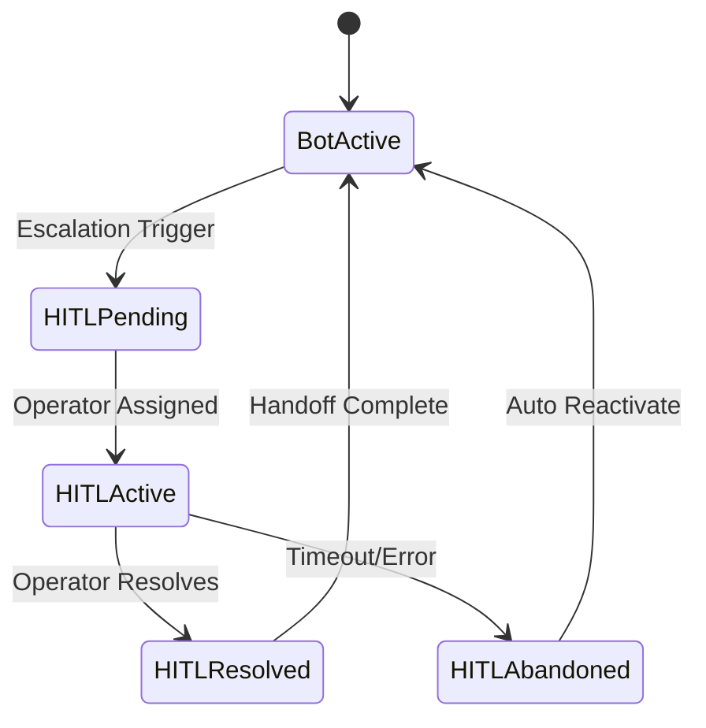

# ADR-004: HITL (Human-in-the-Loop) Real-time Architecture

## Status
**ACCEPTED** - 2025-01-28

## Context

NeurAnt requiere un sistema robusto de Human-in-the-Loop (HITL) que permita:

- **Escalación automática**: Cuando el bot no puede responder adecuadamente
- **Chat en tiempo real**: Comunicación instantánea entre operador y cliente final
- **Gestión de sesiones**: Asignación y seguimiento de conversaciones HITL
- **Notificaciones**: Alertas inmediatas a operadores disponibles
- **Historial completo**: Acceso a toda la conversación previa con el bot
- **Resolución y handoff**: Transferir control de vuelta al bot

Consideraciones técnicas:
- **Real-time requirements**: Latencia < 500ms para mensajes
- **Concurrency**: Múltiples operadores, múltiples conversaciones simultáneas
- **Reliability**: No se pueden perder mensajes en handoff
- **Scalability**: Support para 25+ sesiones HITL concurrentes (Enterprise plan)

## Decision

Adoptamos **Supabase Realtime + PostgreSQL** con las siguientes características:

### Arquitectura Elegida
- **Supabase Realtime** para WebSocket connections y real-time updates
- **PostgreSQL subscriptions** para event-driven architecture
- **State machine pattern** para gestión de estados HITL
- **Message queuing** con database-based approach para reliability

### HITL State Machine


### Database Schema for HITL
```sql
-- Extend conversations table for HITL state
ALTER TABLE conversations ADD COLUMN IF NOT EXISTS 
    is_hitl_active BOOLEAN NOT NULL DEFAULT false,
    assigned_operator_id UUID REFERENCES users(id),
    hitl_activated_at TIMESTAMPTZ,
    hitl_reason TEXT,
    hitl_resolved_at TIMESTAMPTZ,
    hitl_resolution_notes TEXT;

-- HITL Sessions for detailed tracking
CREATE TABLE hitl_sessions (
    id UUID PRIMARY KEY DEFAULT gen_random_uuid(),
    company_id UUID NOT NULL REFERENCES companies(id),
    conversation_id UUID NOT NULL REFERENCES conversations(id),
    
    -- Assignment
    assigned_operator_id UUID NOT NULL REFERENCES users(id),
    assigned_at TIMESTAMPTZ NOT NULL DEFAULT NOW(),
    assigned_by_trigger hitl_trigger_enum NOT NULL,
    
    -- Status
    status hitl_status_enum NOT NULL DEFAULT 'active',
    started_at TIMESTAMPTZ NOT NULL DEFAULT NOW(),
    resolved_at TIMESTAMPTZ,
    
    -- Metrics
    first_response_time_seconds INTEGER,
    total_operator_messages INTEGER DEFAULT 0,
    resolution_time_seconds INTEGER,
    
    -- Resolution
    resolution_type hitl_resolution_enum,
    resolution_notes TEXT,
    handoff_successful BOOLEAN DEFAULT false,
    
    -- Quality
    customer_satisfaction_rating INTEGER CHECK (customer_satisfaction_rating BETWEEN 1 AND 5),
    
    created_at TIMESTAMPTZ NOT NULL DEFAULT NOW(),
    updated_at TIMESTAMPTZ NOT NULL DEFAULT NOW()
);

-- Enums for HITL
CREATE TYPE hitl_trigger_enum AS ENUM (
    'manual_request', 'bot_confidence_low', 'keyword_trigger', 
    'escalation_timeout', 'operator_escalated'
);

CREATE TYPE hitl_status_enum AS ENUM (
    'pending', 'active', 'resolved', 'abandoned', 'timeout'
);

CREATE TYPE hitl_resolution_enum AS ENUM (
    'resolved_by_operator', 'escalated_further', 'customer_left', 
    'operator_timeout', 'system_handoff'
);
```

### Real-time Implementation

#### Frontend Real-time Subscriptions
```typescript
// Hook for HITL real-time updates
const useHITLRealtime = (operatorId: string) => {
  const [activeConversations, setActiveConversations] = useState<HITLConversation[]>([]);
  const [newMessages, setNewMessages] = useState<Message[]>([]);

  useEffect(() => {
    // Subscribe to HITL assignments for this operator
    const assignmentSubscription = supabase
      .channel('hitl-assignments')
      .on('postgres_changes', {
        event: 'INSERT',
        schema: 'public',
        table: 'hitl_sessions',
        filter: `assigned_operator_id=eq.${operatorId}`
      }, (payload) => {
        // New HITL session assigned
        handleNewAssignment(payload.new as HITLSession);
        showNotification('Nueva conversación asignada');
      })
      .subscribe();

    // Subscribe to new messages in active HITL conversations
    const messageSubscription = supabase
      .channel('hitl-messages')
      .on('postgres_changes', {
        event: 'INSERT',
        schema: 'public',
        table: 'messages',
        filter: `conversation_id=in.(${activeConversations.map(c => c.id).join(',')})`
      }, (payload) => {
        const newMessage = payload.new as Message;
        if (newMessage.sender_type === 'end_user') {
          setNewMessages(prev => [...prev, newMessage]);
          playNotificationSound();
        }
      })
      .subscribe();

    return () => {
      supabase.removeChannel(assignmentSubscription);
      supabase.removeChannel(messageSubscription);
    };
  }, [operatorId, activeConversations]);

  return { activeConversations, newMessages };
};
```

#### HITL Service Implementation
```typescript
class HITLService {
  
  // Escalate conversation to HITL
  async escalateToHITL(
    conversationId: string, 
    trigger: HITLTrigger,
    reason?: string
  ): Promise<HITLSession> {
    
    const { data: conversation, error } = await supabase
      .from('conversations')
      .select('*, chatbot:chatbots(*), company:companies(*)')
      .eq('id', conversationId)
      .single();

    if (error) throw error;

    // Find available operator
    const operator = await this.findAvailableOperator(
      conversation.company_id,
      conversation.chatbot_id
    );

    if (!operator) {
      throw new Error('No operators available');
    }

    // Create HITL session
    const { data: session, error: sessionError } = await supabase
      .from('hitl_sessions')
      .insert({
        conversation_id: conversationId,
        company_id: conversation.company_id,
        assigned_operator_id: operator.id,
        assigned_by_trigger: trigger,
        status: 'active'
      })
      .select()
      .single();

    if (sessionError) throw sessionError;

    // Update conversation status
    await supabase
      .from('conversations')
      .update({
        is_hitl_active: true,
        assigned_operator_id: operator.id,
        hitl_activated_at: new Date().toISOString(),
        hitl_reason: reason
      })
      .eq('id', conversationId);

    // Notify operator via real-time
    await this.notifyOperator(operator.id, session);

    return session;
  }

  // Find available operator using round-robin
  private async findAvailableOperator(
    companyId: string,
    chatbotId: string
  ): Promise<User | null> {
    
    // Get operators assigned to this chatbot or with general permissions
    const { data: operators } = await supabase
      .from('users')
      .select(`
        id, email, first_name, last_name,
        operator_assignments:chatbot_operators(chatbot_id)
      `)
      .eq('company_id', companyId)
      .eq('role', 'operador')
      .eq('is_active', true);

    if (!operators?.length) return null;

    // Filter operators assigned to this chatbot
    const assignedOperators = operators.filter(op => 
      op.operator_assignments.some(assignment => 
        assignment.chatbot_id === chatbotId
      )
    );

    const eligibleOperators = assignedOperators.length > 0 
      ? assignedOperators 
      : operators;

    // Get current HITL load for each operator
    const operatorLoads = await Promise.all(
      eligibleOperators.map(async (op) => {
        const { count } = await supabase
          .from('hitl_sessions')
          .select('*', { count: 'exact', head: true })
          .eq('assigned_operator_id', op.id)
          .eq('status', 'active');

        return { operator: op, load: count || 0 };
      })
    );

    // Sort by load (round-robin)
    operatorLoads.sort((a, b) => a.load - b.load);
    
    return operatorLoads[0]?.operator || null;
  }

  // Send message from operator to end user
  async sendOperatorMessage(
    sessionId: string,
    message: string,
    operatorId: string
  ): Promise<Message> {
    
    const { data: session } = await supabase
      .from('hitl_sessions')
      .select('*, conversation:conversations(*)')
      .eq('id', sessionId)
      .eq('assigned_operator_id', operatorId)
      .single();

    if (!session) {
      throw new Error('HITL session not found or not assigned to operator');
    }

    // Store message in database
    const { data: messageRecord, error } = await supabase
      .from('messages')  
      .insert({
        conversation_id: session.conversation_id,
        company_id: session.company_id,
        content: message,
        sender_type: 'human',
        sender_id: operatorId,
        status: 'sent'
      })
      .select()
      .single();

    if (error) throw error;

    // Send via n8n webhook to end user
    await this.sendToEndUser(session.conversation, message);

    // Update session metrics
    await this.updateSessionMetrics(sessionId);

    return messageRecord;
  }

  // Resolve HITL session and handoff back to bot
  async resolveHITL(
    sessionId: string,
    operatorId: string,
    resolutionNotes?: string,
    handoffToBotImmediately: boolean = true
  ): Promise<void> {
    
    const resolvedAt = new Date().toISOString();

    // Update HITL session
    const { data: session } = await supabase
      .from('hitl_sessions')
      .update({
        status: 'resolved',
        resolved_at: resolvedAt,
        resolution_type: 'resolved_by_operator',
        resolution_notes: resolutionNotes,
        handoff_successful: handoffToBotImmediately
      })
      .eq('id', sessionId)
      .eq('assigned_operator_id', operatorId)
      .select('conversation_id')
      .single();

    if (!session) {
      throw new Error('HITL session not found');
    }

    // Update conversation status
    await supabase
      .from('conversations')
      .update({
        is_hitl_active: false,
        assigned_operator_id: null,
        hitl_resolved_at: resolvedAt,
        status: handoffToBotImmediately ? 'active' : 'resolved'
      })
      .eq('id', session.conversation_id);

    // If handoff to bot, send system message
    if (handoffToBotImmediately) {
      await this.sendSystemMessage(
        session.conversation_id,
        'La conversación ha sido resuelta por un operador. El bot está ahora activo para nuevas consultas.'
      );
    }
  }

  // Notify operator of new assignment
  private async notifyOperator(operatorId: string, session: HITLSession): Promise<void> {
    // Real-time notification is handled by Supabase subscription
    // Additional push notification could be sent here if needed
    
    // Log assignment for analytics
    await supabase
      .from('audit_logs')
      .insert({
        company_id: session.company_id,
        user_id: operatorId,
        action: 'hitl_assigned',
        resource_type: 'hitl_session',
        resource_id: session.id,
        details: { conversation_id: session.conversation_id }
      });
  }

  // Send message to end user via n8n
  private async sendToEndUser(conversation: Conversation, message: string): Promise<void> {
    const n8nWebhook = `${process.env.N8N_WEBHOOK_URL}/hitl-response`;
    
    await fetch(n8nWebhook, {
      method: 'POST',
      headers: { 'Content-Type': 'application/json' },
      body: JSON.stringify({
        conversation_id: conversation.id,
        channel: conversation.channel,
        end_user_id: conversation.end_user_id,
        message: message,
        sender_type: 'human'
      })
    });
  }
}
```

### Operator Dashboard Interface
```typescript
// HITL Dashboard Component
const HITLDashboard: React.FC = () => {
  const { user } = useAuth();
  const { activeConversations, newMessages } = useHITLRealtime(user.id);
  const [selectedConversation, setSelectedConversation] = useState<string | null>(null);

  return (
    <div className="flex h-screen">
      {/* Active Conversations Sidebar */}
      <div className="w-1/3 border-r">
        <div className="p-4 border-b">
          <h2 className="text-lg font-semibold">
            Conversaciones Activas ({activeConversations.length})
          </h2>
        </div>
        
        <div className="overflow-y-auto">
          {activeConversations.map(conversation => (
            <ConversationCard
              key={conversation.id}
              conversation={conversation}
              hasNewMessages={newMessages.some(m => m.conversation_id === conversation.id)}
              onClick={() => setSelectedConversation(conversation.id)}
              isSelected={selectedConversation === conversation.id}
            />
          ))}
        </div>
      </div>

      {/* Chat Interface */}
      <div className="flex-1 flex flex-col">
        {selectedConversation ? (
          <HITLChatInterface 
            conversationId={selectedConversation}
            onResolve={handleResolveConversation}
          />
        ) : (
          <div className="flex-1 flex items-center justify-center text-gray-500">
            Selecciona una conversación para comenzar
          </div>
        )}
      </div>
    </div>
  );
};
```

## Alternatives Considered

### 1. Custom WebSocket Server
- **Pros**: Full control, optimización específica, no vendor lock-in
- **Cons**: Complejidad alta, scaling issues, maintenance overhead
- **Reason rejected**: Over-engineering, team no tiene expertise en WebSocket scaling

### 2. Socket.io + Redis
- **Pros**: Proven solution, good scaling, rich features
- **Cons**: Additional infrastructure, complexity, hosting costs
- **Reason rejected**: Additional moving parts, operational complexity

### 3. Server-Sent Events (SSE)
- **Pros**: Simple HTTP-based, no special infrastructure
- **Cons**: Unidirectional, browser connection limits, menos features
- **Reason rejected**: Limited functionality for bi-directional chat

### 4. Pusher/Ably (Third-party real-time)
- **Pros**: Managed service, scaling handled, rich features
- **Cons**: External dependency, recurring costs, vendor lock-in
- **Reason rejected**: Additional costs, already using Supabase

## Consequences

### Positive
- ✅ **Integrated solution**: Uses existing Supabase infrastructure
- ✅ **Cost effective**: No additional real-time service costs
- ✅ **Data consistency**: Same database for messages y real-time
- ✅ **Multi-tenant ready**: RLS policies work with real-time subscriptions
- ✅ **Reliable**: PostgreSQL-backed, ACID compliance
- ✅ **Simple architecture**: Single service handles all real-time needs

### Negative
- ❌ **Supabase dependency**: Locked into Supabase real-time implementation
- ❌ **Scaling limitations**: PostgreSQL connection limits affect concurrent users
- ❌ **Feature limitations**: Less rich than specialized real-time platforms
- ❌ **Performance concerns**: Database-based approach may have latency

### Neutral
- 🔄 **Learning curve**: Team needs to learn Supabase Realtime patterns
- 🔄 **Debugging complexity**: Real-time issues harder to debug than REST

## Implementation Plan

### Phase 1: Core HITL (Month 3-4)
1. Setup database schema for HITL sessions
2. Implement basic escalation triggers
3. Create operator assignment logic
4. Basic real-time message passing
5. Simple operator dashboard

### Phase 2: Enhanced Features (Month 4-5)
1. Advanced operator routing (skills, availability)
2. Rich real-time notifications
3. Conversation history integration
4. Resolution workflows
5. Performance analytics

### Phase 3: Scale & Polish (Month 5-6)  
1. Load testing with multiple concurrent sessions
2. Performance optimization
3. Advanced operator features
4. Mobile-responsive interface
5. Integration with reporting

## Monitoring & Success Metrics

### Performance Metrics
- **Message latency**: Real-time messages < 500ms p95
- **Connection stability**: < 1% connection drops per session
- **Operator response time**: First response < 2 minutes average
- **Handoff success rate**: > 95% successful bot handoffs

### Business Metrics
- **HITL escalation rate**: < 10% of total conversations
- **Resolution time**: Average < 15 minutes per HITL session
- **Customer satisfaction**: > 4.0/5.0 rating for HITL interactions
- **Operator efficiency**: > 3 concurrent conversations per operator

### Technical Metrics
- **WebSocket connections**: Support 100+ concurrent connections
- **Database performance**: HITL queries < 50ms p95
- **Memory usage**: < 50MB per active HITL session
- **Error rate**: < 0.1% message delivery failures

## Error Handling & Reliability

### Connection Recovery
```typescript
const useReliableRealtime = (channelName: string) => {
  const [connectionStatus, setConnectionStatus] = useState<'connected' | 'disconnected' | 'reconnecting'>('disconnected');
  
  useEffect(() => {
    let retryCount = 0;
    const maxRetries = 5;
    
    const connectWithRetry = () => {
      const channel = supabase.channel(channelName)
        .on('postgres_changes', { ... }, handleMessage)
        .subscribe((status) => {
          if (status === 'SUBSCRIBED') {
            setConnectionStatus('connected');
            retryCount = 0;
          } else if (status === 'CHANNEL_ERROR') {
            setConnectionStatus('disconnected');
            
            if (retryCount < maxRetries) {
              setTimeout(() => {
                setConnectionStatus('reconnecting');
                connectWithRetry();
                retryCount++;
              }, Math.pow(2, retryCount) * 1000);
            }
          }
        });
    };
    
    connectWithRetry();
  }, [channelName]);
  
  return connectionStatus;
};
```

### Message Queuing for Reliability
```sql
-- Message queue for failed deliveries
CREATE TABLE message_queue (
    id UUID PRIMARY KEY DEFAULT gen_random_uuid(),
    conversation_id UUID NOT NULL,
    message TEXT NOT NULL,
    recipient_type VARCHAR(20) NOT NULL, -- 'end_user' | 'operator'
    recipient_id VARCHAR(255) NOT NULL,
    attempts INTEGER NOT NULL DEFAULT 0,
    max_attempts INTEGER NOT NULL DEFAULT 3,
    scheduled_at TIMESTAMPTZ NOT NULL DEFAULT NOW(),
    last_attempted_at TIMESTAMPTZ,
    error_message TEXT,
    status VARCHAR(20) NOT NULL DEFAULT 'pending', -- 'pending' | 'sent' | 'failed'
    created_at TIMESTAMPTZ NOT NULL DEFAULT NOW()
);
```

## Future Enhancements

### Advanced Features Roadmap
1. **Operator skills routing**: Route based on operator expertise
2. **Queue management**: Advanced queueing with priority
3. **Video/voice support**: Upgrade HITL to multimedia
4. **AI assist for operators**: Suggested responses for operators
5. **Sentiment analysis**: Detect customer frustration for escalation

### Scaling Considerations
```typescript
// Potential partitioning strategy for high scale
CREATE TABLE hitl_sessions_partitioned (
    LIKE hitl_sessions INCLUDING ALL
) PARTITION BY RANGE (created_at);

// Monthly partitions for performance
CREATE TABLE hitl_sessions_2025_01 PARTITION OF hitl_sessions_partitioned
    FOR VALUES FROM ('2025-01-01') TO ('2025-02-01');
```

## Revision History

| Date | Change | Reason |
|------|--------|--------|
| 2025-01-28 | Initial decision | Architecture planning |

## Related ADRs
- ADR-001: Multi-Tenant Architecture Strategy
- ADR-002: Messaging Architecture with n8n  
- ADR-003: RAG Implementation