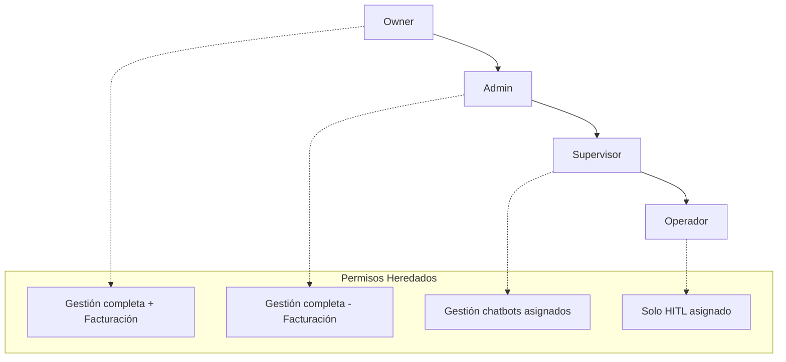
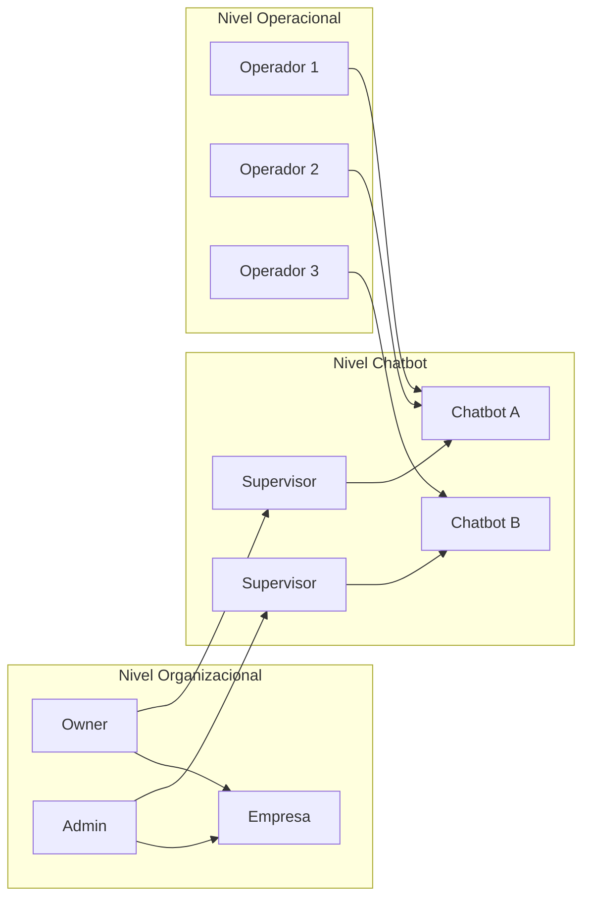
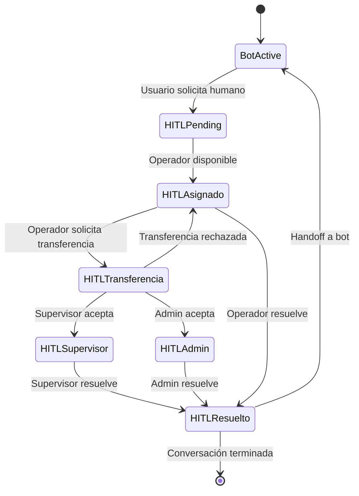
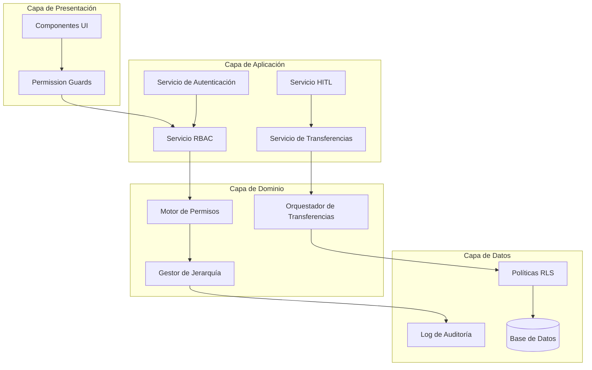

# ADR-005: Sistema RBAC Avanzado con HITL Integrado

## Status
**ACCEPTED** - 2025-01-29

## Context

NeurAnt requiere un sistema de Control de Acceso Basado en Roles (RBAC) robusto que integre completamente el módulo Human-in-the-Loop (HITL) con una jerarquía clara de responsabilidades. El sistema actual tiene roles básicos pero necesita refinamiento para soportar:

### Requerimientos Funcionales
- **Jerarquía de roles estricta**: Owner → Admin → Supervisor → Operador
- **Herencia de permisos**: Roles superiores heredan capacidades de roles inferiores
- **Asignación granular**: Un único Supervisor por chatbot, múltiples Operadores por Supervisor
- **Transferencias HITL**: Escalamiento de sesiones entre roles con aprobación
- **Separación de responsabilidades**: Tareas críticas limitadas a Owner/Admin

### Requerimientos No Funcionales
- **Principio de mínimo privilegio**: Cada rol solo tiene permisos estrictamente necesarios
- **Auditabilidad completa**: Registro detallado de todas las acciones RBAC e HITL
- **Rendimiento**: Evaluación de permisos < 50ms para operaciones críticas
- **Escalabilidad**: Soporte para 100+ operadores simultáneos por empresa

### Restricciones Técnicas
- Compatibilidad con arquitectura multi-tenant existente
- Integración con Row Level Security (RLS) de PostgreSQL
- Compatibilidad con sistema HITL real-time existente
- Mantenimiento de API backward compatibility

## Decision

Adoptamos un **Sistema RBAC Jerárquico con HITL Integrado** basado en los siguientes principios arquitectónicos:

### 1. Arquitectura de Roles Jerárquica



### 2. Modelo de Asignación de Responsabilidades



### 3. Flujo de Transferencia HITL Extendido



## Architectural Patterns Adopted

### 1. **Hierarchical RBAC Pattern**
- **Ventajas**: Herencia natural de permisos, gestión simplificada
- **Aplicación**: Owner > Admin > Supervisor > Operador
- **Principio**: Cada nivel superior puede realizar todas las acciones del inferior

### 2. **Resource-Scoped Authorization Pattern**
- **Ventajas**: Aislamiento granular, principio de mínimo privilegio
- **Aplicación**: Supervisores limitados a chatbots asignados
- **Principio**: Acceso basado en asignación explícita de recursos

### 3. **Event-Driven Transfer Pattern**
- **Ventajas**: Desacoplamiento, auditabilidad, escalabilidad
- **Aplicación**: Transferencias HITL como eventos con estado
- **Principio**: Estado mutable con eventos inmutables

### 4. **Policy-Based Security Pattern**
- **Ventajas**: Centralización de reglas, mantenibilidad
- **Aplicación**: Políticas RLS que reflejan jerarquía RBAC
- **Principio**: Base de datos como autoridad de autorización

## Especificaciones Técnicas de Alto Nivel

### 1. Matriz de Permisos por Rol

| Capacidad | Owner | Admin | Supervisor | Operador |
|-----------|-------|-------|------------|-----------|
| **Gestión de Empresa** |
| Gestionar facturación | ✅ | ❌ | ❌ | ❌ |
| Configurar planes | ✅ | ❌ | ❌ | ❌ |
| Auditar todo el sistema | ✅ | ❌ | ❌ | ❌ |
| **Gestión de Usuarios** |
| Asignar rol Owner | ✅ | ❌ | ❌ | ❌ |
| Gestionar Admins | ✅ | ❌ | ❌ | ❌ |
| Gestionar Supervisores | ✅ | ✅ | ❌ | ❌ |
| Gestionar Operadores | ✅ | ✅ | ✅ | ❌ |
| **Gestión de Chatbots** |
| Crear/Eliminar chatbots | ✅ | ✅ | ❌ | ❌ |
| Asignar Supervisores | ✅ | ✅ | ❌ | ❌ |
| Configurar chatbots asignados | ✅ | ✅ | ✅ | ❌ |
| Subir documentos | ✅ | ✅ | ✅ | ❌ |
| **Gestión HITL** |
| Ver todas las colas HITL | ✅ | ✅ | ❌* | ❌* |
| Asignar Operadores | ✅ | ✅ | ✅ | ❌ |
| Atender sesiones HITL | ✅ | ✅ | ✅ | ✅ |
| Transferir sesiones | ✅ | ✅ | ✅ | ✅** |
| Resolver transferencias | ✅ | ✅ | ✅ | ❌ |

*Solo chatbots asignados  
**Solo hacia niveles superiores

### 2. Arquitectura de Componentes RBAC



### 3. Modelo de Datos Conceptual Extendido

#### Entidades Principales RBAC
```
Companies (Existente)
├── Users (Extendido)
│   ├── role: enum('owner', 'administrador', 'supervisor', 'operador')
│   ├── is_owner: boolean
│   ├── permissions_cache: jsonb
│   └── last_permission_update: timestamp
│
├── Chatbot_Supervisors (Nueva)
│   ├── chatbot_id: uuid (FK, unique)
│   ├── supervisor_id: uuid (FK)
│   ├── assigned_by: uuid (FK)
│   └── assigned_at: timestamp
│
└── Chatbot_Operators (Existente, extendido)
    ├── chatbot_id: uuid (FK)
    ├── operator_id: uuid (FK)
    ├── assigned_by_supervisor: uuid (FK)
    └── can_transfer_to: uuid[] (FKs)
```

#### Entidades HITL Extendidas
```
HITL_Sessions (Extendido)
├── assigned_operator_id: uuid (FK)
├── current_handler_id: uuid (FK)
├── transfer_pending: boolean
├── transfer_requested_at: timestamp
└── transfer_notes: text

HITL_Transfers (Nueva)
├── session_id: uuid (FK)
├── from_user_id: uuid (FK)
├── to_user_id: uuid (FK)
├── transfer_reason: text
├── status: enum('pending', 'accepted', 'rejected')
├── requested_at: timestamp
├── resolved_at: timestamp
└── resolution_notes: text
```

### 4. Contratos de API Principales

#### Servicio RBAC
```typescript
interface RBACService {
  // Gestión de permisos
  checkPermission(userId: string, resource: string, action: string): Promise<boolean>
  getUserPermissions(userId: string): Promise<PermissionSet>
  
  // Gestión de asignaciones
  assignSupervisor(chatbotId: string, supervisorId: string): Promise<void>
  assignOperators(chatbotId: string, operatorIds: string[]): Promise<void>
  
  // Auditoría
  logAction(userId: string, action: string, resourceId: string): Promise<void>
}
```

#### Servicio de Transferencias HITL
```typescript
interface HITLTransferService {
  // Transferencias
  requestTransfer(sessionId: string, targetUserId: string, reason: string): Promise<Transfer>
  acceptTransfer(transferId: string, userId: string): Promise<void>
  rejectTransfer(transferId: string, userId: string, reason: string): Promise<void>
  
  // Consultas
  getPendingTransfers(userId: string): Promise<Transfer[]>
  getTransferHistory(sessionId: string): Promise<Transfer[]>
}
```

## Security Architecture Patterns

### 1. **Defense in Depth Pattern**
```
Nivel 1: Autenticación (Supabase Auth)
Nivel 2: Autorización de aplicación (RBAC Service)
Nivel 3: Políticas de base de datos (RLS)
Nivel 4: Auditoría y monitoreo (Audit Service)
```

### 2. **Principle of Least Privilege**
- Permisos mínimos por defecto
- Escalación explícita de privilegios
- Tiempo limitado para permisos elevados
- Auditoría de acceso a recursos críticos

### 3. **Separation of Duties Pattern**
```
Creación de recursos: Owner/Admin únicamente
Configuración operacional: Supervisor en scope asignado
Operación diaria: Operador en sesiones asignadas
Auditoría: Owner con visibilidad completa
```

## Monitoring & Observability

### Métricas de Rendimiento RBAC
- **Latencia de evaluación de permisos**: < 50ms p95
- **Cache hit ratio de permisos**: > 95%
- **Transferencias HITL por hora**: trending
- **Tiempo de resolución de transferencias**: < 2 minutos promedio

### Métricas de Seguridad
- **Intentos de acceso denegado**: < 1% de requests totales
- **Escalaciones de privilegios**: 0 intentos exitosos no autorizados
- **Violaciones de separación de responsabilidades**: 0 incidentes
- **Tiempo de detección de anomalías**: < 5 minutos

### Eventos de Auditoría Críticos
```
- Cambios de rol de usuario
- Asignaciones de supervisor/operador
- Transferencias HITL (todas)
- Accesos denegados (patrón sospechoso)
- Modificaciones de permisos críticos
```

## Migration Strategy

### Fase 1: Base RBAC (Sprint 1-2)
- Implementación de jerarquía de roles
- Motor de permisos base
- Políticas RLS actualizadas
- Sistema de auditoría básico

### Fase 2: Asignaciones (Sprint 3)
- Tabla chatbot_supervisors
- Lógica de asignación granular
- API de gestión de asignaciones
- UI de administración

### Fase 3: Transferencias HITL (Sprint 4-5)
- Sistema de transferencias completo
- Notificaciones real-time
- Dashboard de gestión
- Métricas y reportes

### Fase 4: Optimización (Sprint 6)
- Cache de permisos
- Optimización de rendimiento
- Testing de carga
- Documentación final

## Risk Mitigation

### Riesgos Identificados y Mitigaciones

| Riesgo | Probabilidad | Impacto | Mitigación |
|--------|-------------|---------|------------|
| **Escalación de privilegios no autorizada** | Baja | Alto | Auditoría completa + RLS enforced |
| **Degradación de rendimiento por permisos** | Media | Medio | Cache inteligente + optimización consultas |
| **Transferencias HITL perdidas** | Baja | Alto | Estado persistente + retry automático |
| **Complejidad operacional alta** | Alta | Medio | UI intuitiva + documentación clara |
| **Conflictos de asignación de supervisores** | Media | Medio | Constraint unique + validación aplicación |

### Controles de Seguridad
- **Principio de falla segura**: Denegar acceso por defecto
- **Validación en múltiples capas**: App + DB + UI
- **Monitoreo continuo**: Alertas automáticas de anomalías
- **Revisión periódica**: Audit de permisos mensual

## Alternatives Considered

### 1. **RBAC Plano (Single-Level)**
- **Pros**: Simplicidad, menor overhead
- **Cons**: No escalable, no refleja jerarquía organizacional
- **Rechazado**: No cumple requerimientos de negocio

### 2. **ABAC (Attribute-Based Access Control)**
- **Pros**: Extrema flexibilidad, granularidad
- **Cons**: Complejidad alta, curva de aprendizaje
- **Rechazado**: Over-engineering para casos de uso actuales

### 3. **ACL (Access Control Lists)**
- **Pros**: Control granular por recurso
- **Cons**: Escalabilidad pobre, gestión compleja
- **Rechazado**: No escalable para multi-tenant

### 4. **Hybrid RBAC + Context-Based**
- **Pros**: Flexibilidad con estructura
- **Cons**: Complejidad de implementación
- **Considerado**: Posible evolución futura

## Consequences

### Positive
- ✅ **Seguridad robusta**: Múltiples capas de protección
- ✅ **Escalabilidad**: Jerárquico escala naturalmente
- ✅ **Auditabilidad**: Rastro completo de acciones
- ✅ **Usabilidad**: Mapeo natural a estructura organizacional
- ✅ **Mantenibilidad**: Patrones claros y documentados
- ✅ **Compliance**: Cumple SOC2, ISO27001 requirements

### Negative
- ❌ **Complejidad inicial**: Más complejo que sistema actual
- ❌ **Performance overhead**: Evaluación de permisos adicional
- ❌ **Rigidez**: Jerarquía fija puede limitar casos edge
- ❌ **Dependencia de RLS**: Acoplado a capacidades PostgreSQL

### Neutral
- 🔄 **Curva de aprendizaje**: Equipo necesita entender nuevos patrones
- 🔄 **Testing complexity**: Casos de prueba más elaborados
- 🔄 **Documentation overhead**: Mantenimiento de especificaciones

## Implementation Guidelines

### Principios de Desarrollo
1. **Permission-First Design**: Validar permisos antes de lógica de negocio
2. **Fail-Safe Defaults**: Denegar acceso por defecto
3. **Audit Everything**: Log todas las acciones de autorización
4. **Test Security**: Casos de prueba para cada combinación de rol-acción
5. **Performance Aware**: Cache permisos, optimizar consultas RLS

### Patrones Recomendados
```typescript
// Patrón de verificación de permisos
async function secureAction(userId: string, resource: string, action: string) {
  if (!await rbac.checkPermission(userId, resource, action)) {
    await audit.log(userId, 'ACCESS_DENIED', resource, action)
    throw new ForbiddenError()
  }
  
  // Ejecutar acción
  const result = await businessLogic()
  await audit.log(userId, 'ACTION_SUCCESS', resource, action)
  return result
}
```

### Testing Strategy
- **Unit Tests**: Cada función de permisos
- **Integration Tests**: Flujos completos RBAC-HITL
- **Security Tests**: Intentos de escalación de privilegios
- **Performance Tests**: Latencia de evaluación bajo carga

## Success Metrics

### Métricas Técnicas
- **Availability**: 99.9% para operaciones de autorización
- **Latencia**: < 50ms p95 para verificación de permisos
- **Throughput**: > 1000 operaciones RBAC/segundo
- **Error Rate**: < 0.1% para operaciones autorizadas

### Métricas de Negocio
- **Tiempo de onboarding**: < 10 minutos para nuevo operador
- **Transferencias HITL exitosas**: > 95% de casos
- **Violaciones de seguridad**: 0 incidentes críticos
- **Satisfacción del usuario**: > 4.5/5 para interfaz de permisos

### Métricas de Auditoría
- **Cobertura de logging**: 100% de acciones críticas
- **Tiempo de detección de anomalías**: < 5 minutos
- **Compliance readiness**: 100% de controles implementados

## Revision History

| Date | Change | Reason | Author |
|------|--------|--------|--------|
| 2025-01-29 | Initial decision | RBAC refinement requirement | Senior Software Architect |

## Related ADRs
- ADR-001: Multi-Tenant Architecture Strategy
- ADR-002: Messaging Architecture with n8n  
- ADR-003: RAG Implementation
- ADR-004: HITL Real-time Architecture

## Next Steps

1. **Validación con stakeholders**: Revisar matriz de permisos con equipos de negocio
2. **Prototipo de transferencias**: Implementar flujo básico de transferencia HITL
3. **Testing de RLS**: Validar políticas de seguridad con casos edge
4. **Diseño de UI**: Wireframes para interfaces de gestión RBAC
5. **Plan de migración**: Estrategia detallada para migración sin downtime